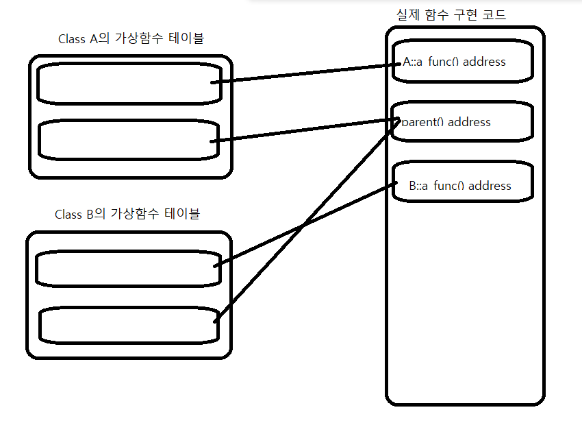

# C++ vtable gdb로 살펴보기

### 개론

C++의 상속관계에서 다형성을 구현하기 위해서는 Virtual 함수를 사용하여 구현한다.   
이를 gdb를 통해서 어떤식으로 구성하는지 알아보자.

```cpp
#include <iostream> 

class A
{
	public:
		virtual void a_func()
		{
			std::cout<<"HELLO A"<<std::endl;
		}
		virtual void parent()
		{
			std::cout<<"Parent"<<std::endl;
		}
};

class B : public A
{
	public:
		virtual void a_func()
		{
			std::cout<<"HELLO B"<<std::endl;
		}
};

int main(void)
{
	B b;
	A a; 
	A* ptr = nullptr;

	ptr = &a; 
	ptr->parent(); 
	ptr->a_func();

	ptr = &b; 
	ptr->a_func();
	return 0;
}
```

위의 코드의 결과는 아래와 같다. 

즉, 타입이 아닌 가리키는 객체에 포함된 함수가 실행되는 것을 볼 수 있다. 

```bash
➜  vtable ./a.out
Parent
HELLO A
HELLO B
```

그렇다면 왜 이런현상이 발생하는 것인지 가상함수 테이블을 어떻게 참조하는 것인지 GDB를 통해서 알아볼 예정이다. 

### 컴파일

위의 코드를 단순히 아래와 같이 컴파일하면 

```cpp
g++ test.cpp 
```

최적화, PIC, stack canary등의 여러 보호기법때문에 코드가 복잡해지거나 간략화되는 경우가 많기 때문에 분석을 위해 여러 옵션을 넣고 컴파일 하여야 한다

어셈블리단에서 좀 더 자세히 알아보기 위해 -g 디버깅 옵션을 뺐다. 

```cpp
g++ -fno-stack-protector -mpreferred-stack-boundary=4 -z execstack -no-pie -O0 test.cpp
```

### GDB

일단 먼저 동적 디버깅전에 main함수에 대해 C 코드로 변환작업을 진행하여 추후 디버깅시 알아보기 쉽게하도록하자.

좀 더 직관적인 UI를 사용하기 위해 일반 gdb가 아닌 pwndbg를 사용했다. 

[https://github.com/pwndbg/pwndbg](https://github.com/pwndbg/pwndbg)

main에 breakpoint를 걸어 디버깅을 진행한다. 

보이는 어셈블리 순서로 해석하면서 vtable의 접근을 확인해보는 방향으로 진행한다. 

```nasm
b* main 
run 
```

가장 먼저 나오는 유의미한 코드를 보자. 

[rip+0x2bff]의 메모리 주소값을 RAX 레지스터에 넣고 이를 [rbp-0x10]에 대입한다. 

이는 b의 객체를 생성하는 것인데 b의 객체(메모리공간)에 Class B의 가상함수 테이블의 주소를 대입한다. 

```nasm
=> B b;
0x00000000004011a2 <+12>:    lea    rax,[rip+0x2bff]        # 0x403da8 <_ZTV1B+16>
0x00000000004011a9 <+19>:    mov    QWORD PTR [rbp-0x10],rax 
```

이 때 RAX레지스터의 값(Class B의 가상함수 테이블 메모리 주소)은 0x403da8이다. 

( 해당 주소는 .data.rel.ro 섹션에 구현되어 있다. )

이는 _ZTV1B+16의 주소이다. _ZTV1B는 gcc 컴파일 과정에서 생긴 맹글링된 네임이며 가상함수 테이블의 가상함수 포인터를 가리키는 심볼이다. 즉,  실질적인 가상함수들의 주소를 가지고 있는 포인터 배열이다. 

_ZTV1B의 주소가 아닌 _ZTV1B+16의 주소를 가지는 이유에 대해서 알 필요가 있다. 

_ZTV1B 주소에는 가상함수들의 주소들만 있는 것이 아닌 2개의 .quad(8 Byte)를 값을 추가적으로 지닌다. 

첫 번째 .quad값은 다중 상속 관련 값이고 

두 번 째 .quad 값은 RTTI로 Run-Time Type Information이다. 

그리고 다음 .quad값 부터 가상함수들의 실제 주소, 소멸자 주소들로 포인터 배열이 구성된다. 

+16을 하는 이유는 위의 구현사항 떄문인것으로 알 수 있다. 

다시 본론으로 돌아와서 객체 b를 선언(할당)할 떄 객체 b내에 vptr(포인터 변수)가 하나 할당된다.

그리고 이 vptr에 클래스 B에 대한 가상함수 테이블의 주소가 대입된다. 

GDB로 해당 주소를 확인해보자. 

```nasm
pwndbg> p/x $rax
$7 = 0x403da8

pwndbg> x/x $rax
0x403da8 <_ZTV1B+16>:   0x0000000000401300

pwndbg> x/20i *$rax
0x401300 <_ZN1B6a_funcEv>:   endbr64
0x401304 <_ZN1B6a_funcEv+4>: push   rbp
0x401305 <_ZN1B6a_funcEv+5>: mov    rbp,rsp
0x401308 <_ZN1B6a_funcEv+8>: sub    rsp,0x10
0x40130c <_ZN1B6a_funcEv+12>:        mov    QWORD PTR [rbp-0x8],rdi
0x401310 <_ZN1B6a_funcEv+16>:        lea    rax,[rip+0xcfc]        # 0x402013
0x401317 <_ZN1B6a_funcEv+23>:        mov    rsi,rax
0x40131a <_ZN1B6a_funcEv+26>:        lea    rax,[rip+0x2d5f]        # 0x404080 <_ZSt4cout@GLIBCXX_3.4>
0x401321 <_ZN1B6a_funcEv+33>:        mov    rdi,rax
0x401324 <_ZN1B6a_funcEv+36>:        call   0x401080 <_ZStlsISt11char_traitsIcEERSt13basic_ostreamIcT_ES5_PKc@plt>
0x401329 <_ZN1B6a_funcEv+41>:        mov    rdx,QWORD PTR [rip+0x2cb0]        # 0x403fe0
0x401330 <_ZN1B6a_funcEv+48>:        mov    rsi,rdx
0x401333 <_ZN1B6a_funcEv+51>:        mov    rdi,rax
0x401336 <_ZN1B6a_funcEv+54>:        call   0x401090 <_ZNSolsEPFRSoS_E@plt>
0x40133b <_ZN1B6a_funcEv+59>:        nop
0x40133c <_ZN1B6a_funcEv+60>:        leave
0x40133d <_ZN1B6a_funcEv+61>:        ret
0x40133e:    add    BYTE PTR [rax],al
0x401340 <_fini>:    endbr64
0x401344 <_fini+4>:  sub    rsp,0x8
```

$rax 레지스터에 가상함수 테이블의 주소가 들어갔고 해당 메모리 주소를 “x/x” 명령어로 덤프뜨면 가상함수의 실제 주소가 보여진다. 이 주소를 “x/i” 명령어로 instruction으로 덤프뜨면 함수의 내용을 볼 수 있다.  

즉, 여기까지 흐름을 본다면 가상함수를 지닌 클래스가 메모리에 할당된다면 객체내부에 vptr이라는 가상함수 테이블의 주소를 가리키는 변수가 할당되고 이를 통해 실제 가상함수에 접근할 수 있다. 

클래스 A에대한 인스턴스 a를 선언하는 것도 이전과 같다. 

클래스 B에 대해 b를 선언하는 것과 같이  vptr에 Class A에 대한 가상함수 테이블의 주소를 대입한다. 

```nasm
=> A a;
0x00000000004011ad <+23>:    lea    rax,[rip+0x2c14]        # 0x403dc8 <_ZTV1A+16>
0x4011b4 <main+30>    mov    qword ptr [rbp - 0x18], rax
```

Class A에 대한 가상함수 테이블을 살펴보자. 

```nasm
pwndbg> p/x $rax
$9 = 0x403dc8

pwndbg> x/x $rax
0x403dc8 <_ZTV1A+16>:   0x0000000000401284

pwndbg> x/40i 0x401284
0x401284 <_ZN1A6a_funcEv>:   endbr64
0x401288 <_ZN1A6a_funcEv+4>: push   rbp
0x401289 <_ZN1A6a_funcEv+5>: mov    rbp,rsp
0x40128c <_ZN1A6a_funcEv+8>: sub    rsp,0x10
0x401290 <_ZN1A6a_funcEv+12>:        mov    QWORD PTR [rbp-0x8],rdi
0x401294 <_ZN1A6a_funcEv+16>:        lea    rax,[rip+0xd69]        # 0x402004
0x40129b <_ZN1A6a_funcEv+23>:        mov    rsi,rax
0x40129e <_ZN1A6a_funcEv+26>:        lea    rax,[rip+0x2ddb]        # 0x404080 <_ZSt4cout@GLIBCXX_3.4>
0x4012a5 <_ZN1A6a_funcEv+33>:        mov    rdi,rax
0x4012a8 <_ZN1A6a_funcEv+36>:        call   0x401080 <_ZStlsISt11char_traitsIcEERSt13basic_ostreamIcT_ES5_PKc@plt>
0x4012ad <_ZN1A6a_funcEv+41>:        mov    rdx,QWORD PTR [rip+0x2d2c]        # 0x403fe0
0x4012b4 <_ZN1A6a_funcEv+48>:        mov    rsi,rdx
0x4012b7 <_ZN1A6a_funcEv+51>:        mov    rdi,rax
0x4012ba <_ZN1A6a_funcEv+54>:        call   0x401090 <_ZNSolsEPFRSoS_E@plt>
0x4012bf <_ZN1A6a_funcEv+59>:        nop
0x4012c0 <_ZN1A6a_funcEv+60>:        leave
0x4012c1 <_ZN1A6a_funcEv+61>:        ret
0x4012c2 <_ZN1A6parentEv>:   endbr64

0x4012c6 <_ZN1A6parentEv+4>: push   rbp
0x4012c7 <_ZN1A6parentEv+5>: mov    rbp,rsp
0x4012ca <_ZN1A6parentEv+8>: sub    rsp,0x10
0x4012ce <_ZN1A6parentEv+12>:        mov    QWORD PTR [rbp-0x8],rdi
0x4012d2 <_ZN1A6parentEv+16>:        lea    rax,[rip+0xd33]        # 0x40200c
0x4012d9 <_ZN1A6parentEv+23>:        mov    rsi,rax
0x4012dc <_ZN1A6parentEv+26>:        lea    rax,[rip+0x2d9d]        # 0x404080 <_ZSt4cout@GLIBCXX_3.4>
0x4012e3 <_ZN1A6parentEv+33>:        mov    rdi,rax
0x4012e6 <_ZN1A6parentEv+36>:        call   0x401080 <_ZStlsISt11char_traitsIcEERSt13basic_ostreamIcT_ES5_PKc@plt>
0x4012eb <_ZN1A6parentEv+41>:        mov    rdx,QWORD PTR [rip+0x2cee]        # 0x403fe0
0x4012f2 <_ZN1A6parentEv+48>:        mov    rsi,rdx
0x4012f5 <_ZN1A6parentEv+51>:        mov    rdi,rax
0x4012f8 <_ZN1A6parentEv+54>:        call   0x401090 <_ZNSolsEPFRSoS_E@plt>
0x4012fd <_ZN1A6parentEv+59>:        nop
0x4012fe <_ZN1A6parentEv+60>:        leave
0x4012ff <_ZN1A6parentEv+61>:        ret
```

위 처럼 Class A에 대한 가상함수 테이블을 참조하면 가상함수들의 실제 구현을 덤프뜰 수 있다. 

이제 Class A에 대한 포인터 변수 ptr를 선언하고 이전에 선언한 a의 주소값을 가리키도록 한다. 

```nasm
=> A *ptr = nullptr;
0x00000000004011b8 <+34>:    mov    QWORD PTR [rbp-0x8],0x0

=> ptr = &a;
0x00000000004011c0 <+42>:    lea    rax,[rbp-0x18]
0x00000000004011c4 <+46>:    mov    QWORD PTR [rbp-0x8],rax
```

그리고 parent()함수를 호출하는 어셈블리 코드인데 좀 더 세부적으로 분해를 해보자. 

```nasm
=> ptr->parent();
0x00000000004011c8 <+50>:    mov    rax,QWORD PTR [rbp-0x8]
; ptr에 대입되어있는 a객체에 대한 메모리 주소를 rax 레지스터에 대입한다. 

0x00000000004011cc <+54>:    mov    rax,QWORD PTR [rax]
; a객체에 대한 메모리 주소에 참조한 값을 다시 rax에 담는다. 
; 이 때 [] 연산자는 안에 선언된 값에 참조한다는 뜻이다. 

0x00000000004011cf <+57>:    add    rax,0x8
; 위에서 언급한 Class A에 대한 parent함수의 구현체는 a_func함수보다 아래 선언되어 있다. 
; 그렇기에 포인터 배열에서 64bit 환경에서의 포인터 크기(8 바이트)만큼 더해준다. 

0x00000000004011d3 <+61>:    mov    rdx,QWORD PTR [rax]
; 8바이트를 더해준 값은 parent함수의 코드 주소를 가리킨다. 이를 []연산자로 참조하여 값을 가지고와 rdx에 대입한다. 

0x00000000004011d6 <+64>:    mov    rax,QWORD PTR [rbp-0x8]
0x00000000004011da <+68>:    mov    rdi,rax
0x00000000004011dd <+71>:    call   rdx
```

여담으로 vtable과는 상관없지만 클래스에 선언된 값을 조작할 때 어셈블리코드로 표현하면 Class A에 선언된 Parent함수를 호출할 때 Class A의 인스턴스 a에 대한 메모리주소값을 같이 인자로 전달한다. 

즉, parent함수내부에서 인자로 전달된 a에 대한 메모리주소에 접근하여 값을 수정한다. 이것이 어셈블리단에서 객체지향을 흉내낼 때 쓰는 방법이라고 생각한다. 

이를 C코드로 표현하면 아래와 비슷하다. 

(C코드의 함수포인터를 안쓴지 오래되어 문법상으로 틀릴 수 있으나 대충 아래와 같음) 

```nasm
struct A; 

struct A{
	int a; 
	void (*fp)(struct A* a); 
};

int main(void)
{
	struct A a; 
  a.fp(&a); 
}
```

다시 본론으로 돌아와서 이제는 Class B에 대한 인스턴스 b의 메모리 객체를 ptr이 가리키게 하고 오버라이드된 함수 a_func()함수를 호출하는 코드이다. 

```nasm
=> ptr = &b; 
0x00000000004011f2 <+92>:    lea    rax,[rbp-0x10]
0x00000000004011f6 <+96>:    mov    QWORD PTR [rbp-0x8],rax

=> ptr->a_func();
0x00000000004011fa <+100>:   mov    rax,QWORD PTR [rbp-0x8]
0x00000000004011fe <+104>:   mov    rax,QWORD PTR [rax]
0x0000000000401201 <+107>:   mov    rdx,QWORD PTR [rax]
0x0000000000401204 <+110>:   mov    rax,QWORD PTR [rbp-0x8]
0x0000000000401208 <+114>:   mov    rdi,rax
0x000000000040120b <+117>:   call   rdx
```

위에서 언급한것과 똑같은 코드이다. ptr에 b의 메모리주소값을 대입하고 Class B의 가상함수 테이블의 주소에 참조하여 오버라이드돤 함수 a_func함수의 주소를 rdx 레지스터에 넣고 이를 call한다. 

아래는 gdb에서 보는 어셈코드이다. 

```nasm
► 0x40120d <main+119>                                                 call   rdx                           <B::a_func()>
rdi: 0x7fffffffdea0 —▸ 0x403da8 (vtable for B+16) —▸ 0x40130e (B::a_func()) ◂— endbr64
rsi: 0x0
rdx: 0x40130e (B::a_func()) ◂— endbr64
rcx: 0xc00

0x40120f <main+121>                                                 mov    eax, 0
0x401214 <main+126>                                                 leave
0x401215 <main+127>                                                 ret
```

Call하려는 rdx값의 instruction을 뽑아내면 아래와 같다. 

```nasm
pwndbg> x/20i $rdx
0x40130e <_ZN1B6a_funcEv>:   endbr64
0x401312 <_ZN1B6a_funcEv+4>: push   rbp
0x401313 <_ZN1B6a_funcEv+5>: mov    rbp,rsp
0x401316 <_ZN1B6a_funcEv+8>: sub    rsp,0x10
0x40131a <_ZN1B6a_funcEv+12>:        mov    QWORD PTR [rbp-0x8],rdi
0x40131e <_ZN1B6a_funcEv+16>:        lea    rax,[rip+0xcee]        # 0x402013
0x401325 <_ZN1B6a_funcEv+23>:        mov    rsi,rax
0x401328 <_ZN1B6a_funcEv+26>:        lea    rax,[rip+0x2d51]        # 0x404080 <_ZSt4cout@GLIBCXX_3.4>
0x40132f <_ZN1B6a_funcEv+33>:        mov    rdi,rax
0x401332 <_ZN1B6a_funcEv+36>:        call   0x401080 <_ZStlsISt11char_traitsIcEERSt13basic_ostreamIcT_ES5_PKc@plt>
0x401337 <_ZN1B6a_funcEv+41>:        mov    rdx,QWORD PTR [rip+0x2ca2]        # 0x403fe0
0x40133e <_ZN1B6a_funcEv+48>:        mov    rsi,rdx
0x401341 <_ZN1B6a_funcEv+51>:        mov    rdi,rax
0x401344 <_ZN1B6a_funcEv+54>:        call   0x401090 <_ZNSolsEPFRSoS_E@plt>
0x401349 <_ZN1B6a_funcEv+59>:        nop
0x40134a <_ZN1B6a_funcEv+60>:        leave
0x40134b <_ZN1B6a_funcEv+61>:        ret
```

여기까지 가상함수가 포함된 바이너리의 디버깅을 보았다. 

아래 그림은 디버깅을 통해서 알아본 vtable의 구조를 그림으로 그렸다. 



### 순수가상함수는?

컴파일러마다 구현사항이 다르겠지만 대부분의 컴파일러는 가상함수가 구현된 클래스는 vptr를 두어 가상함수 테이블을 할당한다. 

만약 Class A에 선언된 가상함수를 사용하지 않는 함수라면 이는 낭비로 보여질 수 있다. 그렇다면 Class A의 a_func함수를 순수가상함수로 선언하면 vptr에 대한 할당이 이루어지지 않는다. 

순수가상함수를 사용한 코드 

```nasm
Disassembly of section .data.rel.ro:

0000000000403dc0 <_ZTV1B>:
        ...
  403dc8:       d8 3d 40 00 00 00       fdivr  DWORD PTR [rip+0x40]        # 403e0e <_DYNAMIC+0xe>
  403dce:       00 00                   add    BYTE PTR [rax],al
  403dd0:       46 12 40 00             rex.RX adc r8b,BYTE PTR [rax+0x0]
  403dd4:       00 00                   add    BYTE PTR [rax],al
        ...

0000000000403dd8 <_ZTI1B>:
        ...
  403de0:       0c 20                   or     al,0x20
  403de2:       40 00 00                rex add BYTE PTR [rax],al
  403de5:       00 00                   add    BYTE PTR [rax],al
  403de7:       00 f0                   add    al,dh
  403de9:       3d 40 00 00 00          cmp    eax,0x40
        ...

0000000000403df0 <_ZTI1A>:
        ...
  403df8:       0f 20 40                mov    rax,cr0
  403dfb:       00 00                   add    BYTE PTR [rax],al
  403dfd:       00 00                   add    BYTE PTR [rax],al
```

(업데이트 : gcc 컴파일러 테스트 결과 순수 가상함수로 선언되어 있지 않더라도 인스턴스화 되지 않는다면 코드를 선언하지 않는것 같음) 

### 요약

놀랍게도 vtable에 대한 내용은 C++의 표준이 아니기때문에 컴파일러마다 가상함수 디스패치를 구현하기 위해 vtable을 사용할것을 요구하지 않는다. 

하지만 대부분의 컴파일러가 vtable을 구성한다.