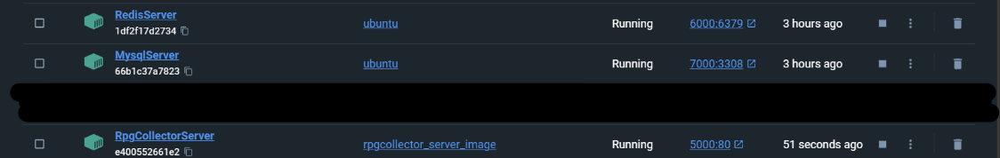

# ASP.NET Core 7.0 도커로 배포

### ASP.NET Core 7.0을 도커로 배포하기

**계획**

Windows 11 호스트에 도커 3개를 띄워 서버를 운영할 계획이다. 

1번 도커 : ASP.NET Core 웹서버 

2번 도커 : Redis 서버 

3번 도커 : Mysql 서버 

**사용하는 서비스 확인하기** 

1. ASP.NET Core 7.0 
2. Mysql
3. Redis 

### Redis 도커 만들기

1. Docker를 통해 최신 Ubuntu Image pull하기 
2. 해당 ubuntu image를 바탕으로 컨테이너 생성
3. local bindind 진행

```jsx
docker run -it --name RedisServer -p 127.0.0.1:6000:6379 ubuntu
```

주의) 기존에 개발서버로 Redis를 이미 운영하고 있다면 포트포워딩을 해준다. 

1. 내부터미널로 접속하여 Redis를 설치한다. 

```jsx
# apt update 
# apt install redis 
# redis-server & 
# redis-cli 
```

1. redis-cli에서 아래와 같은 명령어 기입(해당 명령어를 쓰지않으면 asp.net에서 접근이 되지 않는 현상이 발생하여 원인 확인중) 

```jsx
CONFIG SET protected-mode no
```

1. 다른 도커에서 접속테스트 

```jsx
redis-cli -h [IP] -p 6000
```

Redis를 성공적으로 도커에 올렸다. 

### Mysql 도커 만들기

1. Docker를 통해 최신 Ubuntu Image pull하기 
2. pull한 ubuntu image를 기반으로 컨테이너 생성 

```jsx
docker run -it -p 7000:3308 --name MysqlServer ubuntu
```

이 또한 이미 기존 mysql를 사용하고 있기때문에 포트포워딩을 해주었으며 mysql이 사용하는 포트번호를 바꿔주었다. 

1. mysql port번호 변경 및 외부접속 허용 

```jsx
vi /etc/mysql/mysql.conf.d/mysqld.conf
```

```jsx
[mysqld] 
port = 3308 
bind-address = 0.0.0.0
mysqlx-bind-address = 0.0.0.0 
```

사실 Windows 11를 호스트로 도커 3개를 동일한 호스트에서 돌리기때문에 bind-address쪽은 수정할 필요가 없을거 같은데 추후 **테스트 예정** 

mysql를 재실행한다. 

```jsx
/etc/init.d/mysql restart 
```

1. 데이터베이스 만들기 

```jsx
CREATE DATABASE [ACCOUNT DB] 
CREATE DATABASE [GAME DB] 
```

1. 데이터베이스 계정만들기 

```jsx
CREATE USER '계정'@'%' identified by '비밀번호'; 
```

1. 데이터베이스 계정 권한 추가하기 

```jsx
grant all privileges on *.* to 계정@'%';
flush privileges;
```

1. 기존 개발서버에 있는 데이터베이스 sql파일을 도커로 전송한다. 

```jsx
docker cp ./어카운트디비.sql MysqlServer:/root 
docker cp ./게임디비.sql MysqlServer:/root
```

1. 해당 데이터베이스 sql파일을 import한다.

```jsx
mysql mysql -u 계정 -p --database 어카운트디비 < 어카운트디비.sql
mysql mysql -u 계정 -p --database 게임디비 < 게임디비.sql
```

### ASP.NET Core Docker Image생성

빌드전 appsetting.json에서 IP 및 Port를 설정한다. (ConnectionString) 

1. Program.cs 파일이 있는 곳에서 아래 명령어를 작성하여 앱을 개시한다.

```jsx
dotnet publish -c Release -o published
```

그럼 published폴더안에 [자신의 프로젝트이름].dll이 있는데 아래와 같이 명령어를 치면 실행된다. 

하지만 도커로의 배포가 목적이기에 패스

```jsx
dotent run [자신의 프로젝트이름].dll
```

1. Dockerfile을 생성한다.  - [Program.cs 파일이 있는 곳]

```jsx
FROM mcr.microsoft.com/dotnet/sdk:7.0 AS build-env
WORKDIR /App

# Copy everything
COPY . ./
# Restore as distinct layers
RUN dotnet restore
# Build and publish a release
RUN dotnet publish -c Release -o out

# Build runtime image
FROM mcr.microsoft.com/dotnet/aspnet:7.0
WORKDIR /App
COPY --from=build-env /App/out .
ENTRYPOINT ["dotnet", "[자신의 프로젝트이름].dll"]
```

이때 ENTRYPOINT의 .dll파일은 자신이 실행시키려는 .dll파일을 넣으면 된다.

1. Dockerfile을 이용하여 Image만들기 

```jsx
docker build -t [이미지 이름] -f Dockerfile .
```

1. Image를 컨테이너로 실행 

```jsx
docker run -it -p 5000:80 --name [컨테이너 이름] [이미지 이름]
```

이 또한 도커에서 80번 포트로 접근이 가능하도록 5000번으로 포트포워딩을 진행한다. 

### 마무리

그렇다면 아래와 같이 3개의 도커가 실행되게 된다. 



Postman이나 자신이 만든 클라이언트로 실행을 해보면 잘 될것이다. 


### 트러블 슈팅

1. appsetting.json에 ip를 써야하는데 하나의 호스트내에 도커에서 도커로 접속하는 것이라 IP를 어떤것을 써야하는지 애매한데 그냥 Windows 11의 호스트 IP(사설 IP)를 입력하면 된다. 

[https://learn.microsoft.com/ko-kr/dotnet/core/docker/build-container?tabs=windows](https://learn.microsoft.com/ko-kr/dotnet/core/docker/build-container?tabs=windows)