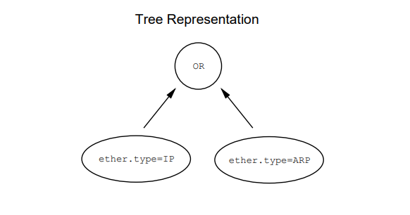
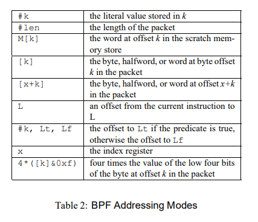

# BPF는 무엇인가

### 개론

네트워크 패킷 모니터링을 하기 위해서는 네트워크 인터페이스에서 들어오는 패킷을 사용자가 원하는 패킷만 필터링하고 나머지 패킷은 `Reject`하여 `Accept`되는 패킷만을 `Userspace의 Application`으로 패킷을 복사해주는 개념이다.

기존의 `Unix Packet Filter` 시스템은 `CSPF(CMU/Stanform Packet Filter)` 모델을 사용했었다. 하지만 `CSPF`는 메모리 스택기반의 `Tree` 모델을 사용했기 때문에 CPU와 메모리간의 병목현상이 자주 발생하는 성능적인 이슈와 중복파싱에 대한 이슈이 존재했었다. 

위의 단점들을 극복하고 나온것이 `BPF(BSD Packet Filter)`이다. 

초기 `BPF`는 `Tcpdump`에 주로 쓰였으나 오늘날 리눅스의 여러분야에서도 광범위하게 쓰이고 있다. 

ex) `SECCOMP-BPF` 

### BPF(BSD Packet Filter)란?

`BPF`의 기본적인 개념은 사용자가 정의한 룰을 컴파일하여 `BPF Bytecode`로 만들어 내고 네트워크 인터페이스로 부터오는 패킷을 `BPF Bytecode`가 동작하는 `BPF Machine`으로부터 패킷 필터링을 진행한다. 패킷을 인자로 주어지는 `BPF`의 필터링하는 함수가 `True(non-zero)`값을 반환값으로 도출되면 이는 `ACCEPT`되는 패킷으로 `userspace의 application`으로 전달하지만 `False`값이 반환된다면 이는 `REJECT`되는 패킷으로 그자리에서 폐기처리를 진행한다. 

```bash
**Example)**
# tcpdump -i eth0 "dst host 192.168.1.0" -d
(000) ldh      [12]
(001) jeq      #0x800           jt 2    jf 4
(002) ld       [30]
(003) jeq      #0xc0a80100      jt 8    jf 9
(004) jeq      #0x806           jt 6    jf 5
(005) jeq      #0x8035          jt 6    jf 9
(006) ld       [38]
(007) jeq      #0xc0a80100      jt 8    jf 9
(008) ret      #262144
(009) ret      #0
```

`BPF`의 목적 중 하나는 페기해야할 패킷은 다른곳(버퍼)로 복사하지말고 그자리에서 처리하여 CPU 사이클 횟수등을 줄여 성능을 높이는 것이다. 

### The CSPF Tree Model

패킷을 필터링하는 모델의 경우 2가지의 접근법이 존재한다.

1. `CSPF`가 사용한 `boolean expression tree`구조 
2. `BPF`가 사용한 `CFG(control flow graph)`구조 

먼저 `CSPF`의 `Tree 모델`에서는 각 각의 노드가 패킷 필드로 표현되고 각 각의 `Edge`(노드를 연결하는 선)은 연산자 피연산자 관계를 지닌다. `(operator-operand)`



`Tree Model`의 경우 구성된 트리를 계산하기 위해 `Stack Machine Code`에 식을 대입하고 계산을 진행한다. 

명령어는 스택에 패킷 데이터를 Push하거나 2개의 Top 요소에 대해 비트연산이나 binary boolean 계산을 진행한다. 

이렇게 필터 프로그램이 순차적으로 명령어 리스트를 전부를 실행하고나서 스택의 top이 `non-zero` 값이나 `stack`이 비어져있다면 해당 패킷은 `ACCEPT`되나 그렇지 않는 경우에는 `REJECT`된다. 

이러한 구현을 가진 `CSPF`는 2가지의 결점을 가진다. 

1. 해당 스택은 메모리에 로드되어 시뮬레이션 되는데 이는 메모리병목현상을 불러일으켜 성능적인 저하를 불러온다. 
2. 트리연산은 종종 불필요한다. 
3. 가변길이 헤더에 대해 파싱이 불가능하다. 
4. 단일 16비트 데이터 타입으로 제한되어 있기에 `32bit` 작업인 `IP`나 `TCP Sequence Number`같은 경우 두배의 작업을 요구한다.

2번이 CSPF의 핵심 결점이라고 생각한다. 위의 사진에서 보는 것 처럼 IP패킷 또는 ARP패킷을 필터링하고 싶을 때 트리연산의 경우 ether.type이 IP인가 계산하고 또 ether.type이 ARP인지 확인하고 이를 계산하는 방식을 지닌다. 한번만 하면 되는 계산을 두번의 계산을 진행하는데 이는 불필요한 연산이다.

즉, 구문분석을 위해 불필요한 파싱이 동반된다. 

또한 `CSPF`의 경우 고정된 `offset`을 기반으로 파싱을 진행하기 때문에 가변 길이로 이루어지는 `IP Header`로 인하여 `TC`P나 `UDP`와 같은 상위 프로토콜의 분석이 제한된다. 

하지만 이러한 `CSPF`는 단점만 있는 것이 아닌 패킷 필터링의 일반화를 제공했다. 그 중 가장 핵심인 것은 패킷을 프로토콜로부터 완전 독립적으로 계산한다는 것이다. 

이것이 무슨말이냐하면 패킷을 프로토콜로 처리하는 것이 아닌 패킷을 배열로 `offset` 기반으로 값을 꺼내어 처리한다는 것이다. 

이러한 장점을 후술할 `BPF`의 파싱방식에 영감을 줬다고 봐도 된다. 

### The BPF CFG Model

`BPF Model`은 `CSPF`의 단점을 극복하고 장점을 취한 방식인 `register based`의 `CFG Model`을 채택했다. 


`BPF`는 위의 사진에서 보이는 거처럼 `true or false`로 구성된 `2개의 branch`를 가지며 각 노드에 맞게 계산되어 최종적으로 `true or false`로 결과값을 지닌다. 만약 해당 필터의 흐름의 결과값이 `true(non-zero`)라면 `ACCEPT`, `false`라면 `REJECT`을 의미한다.

앞서 제시한 예시처럼 `IP패킷` 또는 `ARP패킷`을 필터링하고 싶을 때 `CSPF`의 `Tree모델`은 `IP`인지 확인하고 `ARP`인지 확인하고 2번의 계산을 가졌는데 `CFG모델`에서는 먼저 `ether.type`이 `IP`인지 확인하고 맞다면 `true branch`를 취하여 그대로 `ACCEPT`된다. 

즉, 불필요한 연산을 하지않고 한번의 연산만으로 필터링이 완료됨을 알 수 있다. 


위 사진은 `host`가 `foo`인것에 대해서 확인하는 `BPF CFG`이다.  이런식으로 각 노드마다 명령어 셋이 존재하게 되고 명령어에 따라 패킷을 확인하고 해당 값에 따라 점프하여 노드가 분기되어 결론적으로 `false or true`에 도달하게 된다. 

이러한 `CFG`의 경우 가장 긴 비교 횟수는 5번이고 평균 3번의 비교만으로 대부분의 필터링을 수행할 수 있어 성능적으로 엄청난 이점을 가진다. 

이러한 `BPF`를 구현하기 위해서는 5가지의 제약을 동반한다. 

(영어 해석능력이 좋지 않아 해당 내용은 틀릴 수 있음)

- 프로토콜에 완전히 독립적이여 한다.
    - `CSPF`에서 선보였던 패킷을 Byte Array로 접근
- 반드시 일반적이여야 한다. (명령어 세트와 어셈블리에서 사용하는 주소지정모드)
- 패킷 데이터의 참조는 적어야 한다.
- 명령어 디코딩형식은 `Single Address Instruction`을 사용한다.
    - mov R0, 1이 아닌 load [1] 형식 - (1-address instruction)
- 추상머신 레지스터는 물리적인 레지스터 옆에 있어야 한다.

### BPF Machine

`BPF`의 패킷 처리과정을 간락하게 살펴보았다면 이제는 `BPF 머신`이 실제로 어떻게 구성되는지 알아볼예정이다. 

`BPF머신`은 아래 4가지로 구성된다.   
  
**Element          Description**  
  
**A                32 bit wide accumulator  
X                32 bit wide X register    
M[]             16 x 32 bit wide misc registers aka "scratch memory store", addressable from 0 to 15**  
  
**Program Counter**  
  
그리고 머신의 명령어 셋은 아래의 카테고리를 포함한다. 

- **`Load Instruction`**

값을 Accumulator또는 Index Register에 복사한다. 

이때 복사되는 값은 Immediate value, packet 고정(가변) 오프셋, scratch memory store가 된다. 

- **`Store Instruction`**

Accumulator 또는 Index Register의 값을 scratch memory store에 저장한다. 

- **`ALU Instruction`**

산술, 논리 연산을 수행한다. accumulator register에 있는 값을 상수값이나 index register에 있는 값과 연산을 시도하고 해당 연산의 결과값은 다시 accumulator에 저장된다. 

- **`Branch Instruction`**

제어 흐름으 변경한다. 상수값이나 index register(x) 또는 accumulator의 값에 따라서 현재의 분기를 변경한다. 

- **`Return Instruction`**

필터를 종료시킨다. 그리고 저장할 패킷의 길이를 표시한다. 만약 return 값이 true(non-zero)라면 ACCEPT, false라면 패킷을 폐기한다. 

명령어의 구조는 총 8바이트로 구성되며 아래와 같다. 


여기서 `JT, JF필드는 조건부 점프 명령`에 사용되며, 해당 값은 `다음 명령까지의 offset`을 나타낸다. 

만약 3번 라인의 명령어 형식이 {15, 0, 3, 800) 일 때 `JT`의 값대로 분기를 한다는 상황이라면 

4번 라인을 가리키게 되고 `JF`의 값대로 진행한다면 5번라인을 가리키게 된다. 


위는 실제 `BPF` 머신에서 사용하는 명령어 셋이다.

ldb, ldh, ld와 같은 `load 명령어`는 단순히 가리키는 값을 `accumulator`로 복사하고 ldx로 `index register`로 복사한다. 

`tax명령어`를 통해서 `accumulator`에 저장된 값을 `index register`로 복사하는 것이 가능하다. 

ldx명령어는 주로 IP Header의 Length를 파싱하는데 주로 쓰인다. 

add, sub, mul와 같은 `ALU 명령어`는 `accumulator`의 값을 사용해서 연산하고 다시 `accumulator`에 저장한다. 

jeq, jgt와 같은 `jump 명령어`는 `accumulator`와 상수와 비교한 다음 결과값이 `true(non-zero)`라면 `true branch`로, `false`라면 `false branch`로 분기한다. 

이떄 반대의 비교명령어인 jne나 jle가 없는데 이는 jeq와 jgt로 충분히 구현해낼 수 있기에 따로 추가하지 않는 것으로 추정된다.( 아닐 수 있음 )

`return 명령어`는 프로그램을 `accept`할 패킷의 바이트 크기를 결정한다. 

만약 amount가 0이라면 해당 패킷은 전체적으로 페기된다. 

다음은 명령어 옆에 어드레싱모드라고 표현했는데 각 각의 표현들을 실제로 어떻게 쓰는지 보여준다. 


그럼 실제로 명령어를 어떻게 읽는지 예제를 보면서 확인해보자

1. IP 패킷을 필터링하는 명령어

```bash
L0:
	ldh [12]
	jeq #ETHERTYPE_IP, L1, L2
L1: 
	ret #RTRUE
L2: 
	ret #0
```

간단하게 설명하자면 프로그램은 위에서 부터 아래로 실행된다. 

먼저 `ldh [12]` 는 수신된 패킷의 12번째 `offset`에서 2바이트만큼 불러온다는 뜻이다. 

패킷의 구조를 보면 `Ethernet Header`와 `IP Header` 가 존재하는데 `Ethernet Header`에는 `Source Mac(6 Byte)`, `Destination Mac(6 Byte)`, `Ethernet Type(2 Byte)`가 존재한다. 이때 `[12]` 는 `Ethernet Type`의 값을 불러와서 `Accumulator`에 저장하는 것으로 알 수 있다.  

그리고 `jep #ETHERTYPE_IP, L1, L2` 의 명령어를 통해서 `Accumulator`의 값이 `#ETHERTYPE_IP`의 값과 동일하다면 `L1 노드` 로 분기, 아니라면 `L2 노드`로 분기하는 것을 알 수 있다. 

마지막으로 `L1노드`는 `ret #RTRUE`의 값을 가지고 `L2노드`는 `ret #0`이라는 값을 가지는데 L2에 도달할 시 페기됨을 알 수 있다.   

1. IP 패킷에 대해 128.3.112 또는 128.3.254에 대해서 필터링을 원할 때

```bash
L0:
	ldh [12]
	jeq #ETHERTYPE IP, L1, L4
L1: 
	ld [26]
	and #0xffffff00
	jeq #0x80037000, L4, L2
L2: 
	jeq #0x8003fe00, L4, L3
L3: 
	ret #TRUE
L4: 
	ret #0
```

우와 같이 표현이 가능하다. `Packet`의 26번째 `offset`에는 `host`의 정보가 담겨져 있다. 

또한 32비트 전체의 `IP Address`에 대해서 확인하는 것이 아닌 24비트만 확인하는 것이니 불러온 값에 대해 비트마스킹을 진행한다. 

1. 가변길이 패킷 파싱을 통해 TCP Destination Port확인하기

1번과 2번의 예제는 `IP Header`의 길이가 고정되어 있다는 가정하에 파싱을 진행핬다. `IPv4`는 고정된 40바이트의 헤더길이를 가지는 `IPv6`와 다르게 가번길이 구조를 지닌다. (대부분은 20바이트지만) 

그렇기에 `Packet Byte Array`에서 `IP Header`의 `IHL 필드`를 뽑아와서 값을 `Accumulator`에 저장해야 한다. 

```bash
ldb [14]
and #0xf
lsh #2
```

`Ethernet Header`가 14바이트이고 `IP Header`에서 `IHL의 필드(4bit)`는 `Version(4bit)`과 함께 있으므로 `0xf`로 Version부분을 0으로 비트마스킹을 통해 만들어준다. 그리고 `IHL`의 값에 4를 곱해야 `IP Header`의 `Length`가 나오기에 `lsh`명령어로 비트를 왼쪽으로 2번 옮겨준다. 

이제 `IP Header`의 `Length`를 확인했으니 길이를 기반으로 `TCP Header`의 `Destination Port`에 대한 `offset`을 지정할 수 있다. 

```bash
L0:
	ldb [14]
	and #0xf
	lsh #2
	tax  		    => tax 명령어로 구한 IHL의 값을 index register로 옮긴다. 
	ldh [x+16]	=> 여기서 IHL, 16은 이더넷 길이 14랑 tcp 목적지 포트는 2바이트 뒤에 있으니 합치면 16
	jeq #N, L1, L2	=> N은 주어진 목적지 포트
L1:
	ret #TRUE
L2: 
	ret #0
```

BPF에서 IP Header의 Length를 구하는 것은 일반적으로 많기 때문에 BPF는 다음과 같은 주소지정모드를 추가로 구현했다.  ⇒ `ldx 4*([14]&0xf)`

실제로는 `TCP Header`를 파싱하기 위해서는 `TCP Header`가 있음을 확인하는 루틴을 추가해야한다. 

```bash
L0:
	ldh [12]
	jeq #ETHERPROTO IP, L1, L5
L1: 
	ldb [23]
	jeq #IPPROTO TCP, L2, L5
L2: 
	ldh [20]
	jset #0x1fff, L5, L3
L3: 
	ldx 4*([14]&0xf)
	ldh [x+16]
	jeq #N, L4, L5
L4: 
	ret #TRUE
L5: 
	ret #0
```

여기까지 `BPF`에대한 설명과 `BPF머신`이 어떤식으로 구현되고 처리하는지 알아봤다. 

`BPF Bytecode`를 실제 `C언어`에서 한번 사용해볼 예정이다. 

### 패킷 필터링 간단 예제

`BPF`를 실제 프로그래밍단에서 사용하기 위해서는 `tcpdump`를 예시로 하여 사용자가 원하는 필터코드를 작성하면 `tcpdump`는 사용자 정의 필터를 컴파일하여 `bpf bytecode`를 만들어내고 해당 `bpf프로그램`을 실행하다록 커널에 요청한다. 

필터 구조체

```c
#include <sys/socket.h>
#include <sys/types.h>
#include <arpa/inet.h>
#include <linux/if_ether.h>
#include <linux/filter.h>

struct sock_filter {	/* Filter block */
	__u16	code;   /* Actual filter code */
	__u8	jt;	/* Jump true */
	__u8	jf;	/* Jump false */
	__u32	k;      /* Generic multiuse field */
};

struct sock_fprog {			/* Required for SO_ATTACH_FILTER. */
	unsigned short		   len;	/* Number of filter blocks */
	struct sock_filter __user *filter;
};
```

소켓 만들기 

```c
sock = socket(PF_PACKET, SOCK_RAW, htons(ETH_P_ALL));
```

BPF Bytecode를 socket에 붙이기 

```c
ret = setsockopt(sock, SOL_SOCKET, SO_ATTACH_FILTER, &bpf, sizeof(bpf));
```

이 때 붙여진 필터는 한개만 적용이 가능하며 다른 필터를 SO_ATTACH_FILTER하였을 떄는 기존꺼는 삭제되고 새로운 필터를 부착한다. 

만약 코드상으로 구현하고 싶다면 `SO_DETACH_FILTER` 옵션을 사용하면 되고 만약 변경하기를 원치않는다면 `SO_LOCK_FILTER` 옵션을 설정하면 된다. 

tcpdump로 BPF Instruction 뽑아내기 

```bash
➜  ~ sudo tcpdump -i eth0 "ip and tcp and dst port 50000" -d
(000) ldh      [12]
(001) jeq      #0x800           jt 2    jf 10
(002) ldb      [23]
(003) jeq      #0x6             jt 4    jf 10
(004) ldh      [20]
(005) jset     #0x1fff          jt 10   jf 6
(006) ldxb     4*([14]&0xf)
(007) ldh      [x + 16]
(008) jeq      #0xc350          jt 9    jf 10
(009) ret      #262144
(010) ret      #0
```

tcpdump로 C언어에서 사용할 수 있게 구조체형식으로 뽑아내기 

```bash
➜  ~ sudo tcpdump -i eth0 "ip and tcp and dst port 50000" -dd
{ 0x28, 0, 0, 0x0000000c },
{ 0x15, 0, 8, 0x00000800 },
{ 0x30, 0, 0, 0x00000017 },
{ 0x15, 0, 6, 0x00000006 },
{ 0x28, 0, 0, 0x00000014 },
{ 0x45, 4, 0, 0x00001fff },
{ 0xb1, 0, 0, 0x0000000e },
{ 0x48, 0, 0, 0x00000010 },
{ 0x15, 0, 1, 0x0000c350 },
{ 0x6, 0, 0, 0x00040000 },
{ 0x6, 0, 0, 0x00000000 },
```

소켓 필터 프로그래밍 C언어로 구현하기 

```c
#include <sys/socket.h>
#include <sys/types.h>
#include <arpa/inet.h>
#include <linux/if_ether.h>
#include <stdio.h>
#include <ctype.h>
#include <unistd.h>
#include <linux/filter.h>
 
#define HEXDUMP_COLS 16
#define PACKET_SIZE 4096

#define	ARRAY_SIZE(x)	( sizeof((x))/sizeof((x)[0]) ) // 배열 길이

// ip and dst port 50000
struct sock_filter code[] = {
    { 0x28, 0, 0, 0x0000000c },
    { 0x15, 0, 10, 0x00000800 },
    { 0x30, 0, 0, 0x00000017 },
    { 0x15, 2, 0, 0x00000084 },
    { 0x15, 1, 0, 0x00000006 },
    { 0x15, 0, 6, 0x00000011 },
    { 0x28, 0, 0, 0x00000014 },
    { 0x45, 4, 0, 0x00001fff },
    { 0xb1, 0, 0, 0x0000000e },
    { 0x48, 0, 0, 0x00000010 },
    { 0x15, 0, 1, 0x0000c350 },
    { 0x6, 0, 0, 0x00040000 },
    { 0x6, 0, 0, 0x00000000 },
};

struct sock_fprog bpf = {
    .len = ARRAY_SIZE(code),
    .filter = code,
};

int main(void)
{
    int sock = socket(PF_PACKET, SOCK_RAW, htons(ETH_P_ALL));
    if(sock < 0)
    {
        perror("socket() Error");
        return 1;
    }

    int ret = setsockopt(sock, SOL_SOCKET, SO_ATTACH_FILTER, &bpf, sizeof(bpf)); 
    if(ret < 0)
    {
        perror("setsockopt() Error");
        close(sock);
        return 1;
    }

    while(1)
    {
        struct sockaddr_in src_addr; 
        socklen_t addrlen = sizeof(src_addr);
        unsigned char packet[PACKET_SIZE] = {0, };
        int recv_len = recvfrom(sock, packet, PACKET_SIZE, 0, (struct sockaddr*)&src_addr, &addrlen);
        if(recv_len < 0)
        {
            perror("recvfrom() Error");
            close(sock);
            return 1;
        }
        //hexdump(packet, recv_len);
    }
    
    close(sock);

    return 0;
}
```

위 코드를 컴파일하고 관리자 권한으로 실행한 상태에서 `TCP Port 50000`을 사용하는 서버를 열고 접근하면 패킷이 필터링되어 모니터링되는 것을 확인할 수 있다. 

### 요약

`tcpdump`가 내뱉는 `BPF`는 옛날 버전의 `cBPF`고 현재는 커널에서 요청한 `cBPF`를 `eBPF`로 변환하는 과정을 거친다. 

지금까지 설명한것은 `BPF`의 처음버전이며 `cBPF`의 형태이다. 

현재의 `eBPF`는 `socket`뿐만 아니라 엄청나게 넓은 범위에서 쓰인다.  

### 레퍼런스

The BSD Packet Filter: A New Architecture for User-level Packet Capture

[https://www.tcpdump.org/papers/bpf-usenix93.pdf](https://www.tcpdump.org/papers/bpf-usenix93.pdf)

Linux Socket Filtering aka Berkeley Packet Filter (BPF)

[https://www.kernel.org/doc/Documentation/networking/filter.txt](https://www.kernel.org/doc/Documentation/networking/filter.txt)

Understanding of BPF

[https://unix.stackexchange.com/questions/699500/understanding-of-bpf](https://unix.stackexchange.com/questions/699500/understanding-of-bpf)
