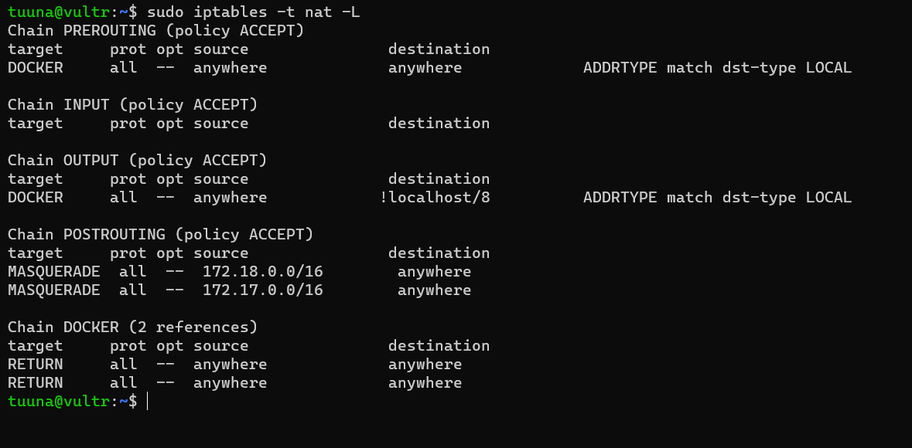

# Docker Iptables

### 개론

호스트에서 ufw를 사용한다고 해서 호스트 내부 docker의 네트워크에 영향을 끼치는 것은 아니다. 

docker또한 DOCKER chain, DOCKER-USER chain 이라는 커스텀 iptables chain을 소유하고 있기 때문에 방화벽에 어떤 구성을 하든 DOCKER chain과 DOCKER-USER chain이 우선권을 가지게 된다. 

즉, 외부에서 들어오는 패킷에 대해서 해당 체인이 가장 먼저 검사를 진행한다. 

또한, Docker는 기본적으로 아래 사진과 같이 외부의 모든 주소에 대해 허용하는 정책을 지닌다. 



만약 자신의 룰을 적용하고 싶다면 DOCKER-USER chain에 룰을 작성해야 한다. 도커는 기본적으로 DOCKER chain을 실시간으로 룰을 작성하는 작업을 진행한다. 

DOCKER-USER chain에 rule을 작성하게 되면 자동으로 생성된 도커 rule보다 먼저 적용이 된다. 

### 시나리오 적용

ubutnu 22.04가 호스트인 서버에서 docker 컨터네이로 redis 서버가 실행되고 있다 redis 서버는 아래와 같이 생성되었다. 

```jsx
sudo docker run -it -p 6379:6379 --name redis ubuntu:22.04
```

이때 도커는 Docker chain을 아래와 같이 구성한다. 

즉, 모든 외부주소에 접근을 허용한다. 


하지만 redis서버는 로컬에서만 접근이 가능해야한다. 그러기 위해서는 외부에서 오는 목적지가 6379포트를 막아야 한다. 

아래의 명령어로 DOCKER-USER chain에 넣어서 적용이 가능하다. 

```jsx
sudo iptables -I DOCKER-USER -p tcp --dport 6379 -j DROP
```

DOCKER-USER chain에 정상적으로 들어간것을 볼 수 있다. 


이제 외부에서 접근이 불가능해짐을 알 수 있다. 

만약 Docker가 iptables의 조작을 금지하게 설정하기 위해서는  아래와 같이 설정하면 되나 도커간 네트워크 통신에 영향을 끼치기에 권장하지 않는다. 

```jsx
/etc/docker/daemon.js - iptables = false 
```

추가적으로 IP제한을 걸기 위해서는 아래의 명령어가 따른다. 

```jsx
iptables -I DOCKER-USER -i ext_if(인터페이스 이름) ! -s 192.168.1.1 -j DROP 

iptables -I DOCKER-USER -i ext_if ! -s 192.168.1.0/24 -j DROP

iptables -I DOCKER-USER -m iprange -i ext_if ! --src-range 192.168.1.1-192.168.1.3 -j DROP
```

### 비하인드

사실 저런식으로 iptables을 구성할 필요가 없이

외부 방화벽을 사용하거나 docker 컨테이너 생성시 포트맵핑을 로컬에만 바인드 하면 위의 작업이 필요없으나 연구용으로 끄젹여봅니다. 

```jsx
-p 127.0.0.1:6379:6379
```

### 결론

ufw와 docker간의 iptables를 협의를 잘하자