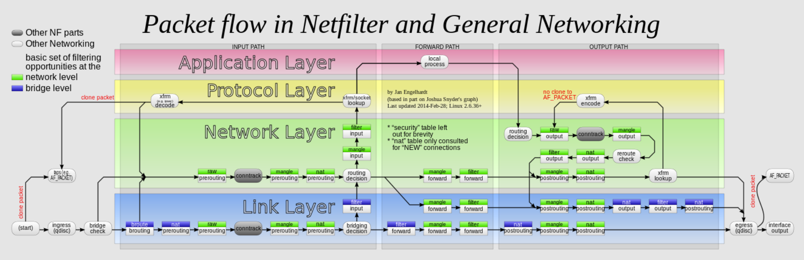

# Docker With IPTables

### 개론

리눅스 호스트에서 동작하는 도커 컨테이너에 Redis가 돌아가고 있으며 포트맵핑으로 6379번 포트를 10000번으로 포트포워딩 했다. 그리고 DOCKER-USER Chain에 아래와 같이 명령어로 10000번 포트에 대해 DROP을 하였지만 동작하지 않아 그 이유를 알아내기 위한 포스팅이다. 

**(개인 공부 목적이기에 틀린 내용이 있을 수 있음)**

```jsx
sudo iptables -I DOCKER-USER -p tcp --dport 10000 -j DROP
```

### Iptables?

iptables란 호스트내에서 방화벽역할로 주로 사용되는데 각 netfilter hook에 걸린것을 처리하는 역할을 지닌다.  netfilter에는 5개의 Hook Point가 존재한다. 

- **PREROUTING HOOK**

네트워크 인터페이스에 패킷이 도착하게 되면 콜백되는 훅이다. 이는 주로 nat변환 역할을 진행한다. 

- **INPUT HOOK**

PREROUTING HOOK을 통해 호스트에서 동작하는 내부 어플리케이션으로 향하는 패킷일 경우 해당 훅이 트리거 된다. 

- **FORWARD HOOK**

호스트 내부 어플리케이션에 도달하려는 패킷이 아닌 다른 시스템에서 필요로 하는 패킷을 경우 해당 훅이 트리거 된다. 

- **OUTPUT HOOK**

호스트 내부 어플리케이션이 다른 호스트 시스템 어플리케이션으로 패킷을 보낼 때 트리거되는 훅이다. 

- **POSTROUTING HOOK**

다른 호스트 시스템 어플리케이션으로 패킷이 전송될 때 출발지의 IP를 SNAT를 통해 변경한다. 

패킷이 해당 호스트 네트워크 인터페이스에 도착하게 된다면 아래와 같은 패킷 흐름을 타게 된다. 



iptables에는 Table과 Chain이라는 개념이 있다. 

Table의 종류로는 FIlter, Nat, Mangle, Raw, Security 5개의 테이블이 존재한다. 관심 가지는 테이블로는 Filter와 Nat가 있다. 

Filter 테이블의 주 목적은 해당 패킷에 대해서 어떻게 처리할 것인가이다. (ACCPET or DROP) 

NAT 테이블의 주 목적은 해당 패킷에 대해서 어떻게 네트워크 주소로 변환할것이가 이다. (SNAT, DNAT) 예를들어 외부에서 공인IP로 요청을 했을 때 내부에서 돌아가는 사설IP로 변환하는 역할을 지닌다. 

Chain이란 각 테이블에 존재하는 룰의 집합이라고 생각하면 된다. Chain의 종류로는 PREROUTING Chain, INPUT Chain, FORWARD Chain, OUTPUT Chain, POSTROUTING Chain과 사용자 정의 Chain이 존재한다. 

주로 Chain들은 Netfilter Hook에 의해 트리거 되는데 이때 Hook에 해당하는 Chain을 테이블에서 참조하여 트리거한다. 

예를 들어 로컬시스템에 동작하는 어플리케이션에 대해서 패킷이 전송된다고 했을 때 트리거 되는 Netfilter Hook은 PREROUTING Hook과 INPUT Hook이 트리거 된다. 

즉, Chain이 호출되는 순서는 아래와 같으며 각 Chain이 실행될 때 하위 룰 집합또한 같이 실행된다. 

1. Raw 테이블의 PREROUTING Chain 실행
2. Mangle 테이블의 PREROUTING Chain 실행
3. NAT 테이블의 PREROUTING Chain 실행 
4. Mangle 테이블의 INPUT Chain 실행 
5. Filter 테이블의 INPUT Chain 실행 

그리고 그 다음에 오는 연속되는 패킷은 Raw 테이블의 PREROUTING Chain을 통해 연결정보(conntrrack)가 남아있기 때문에 곧바로 INPUT Chain을 타게 된다. 

### Docker 네트워크 흐름도

일반적으로 Docker또한 호스트 시스템에서 돌아가니까 도커 컨테이너 내에서 실행중인 어플리케이션에 패킷을 전달하면 PREROUTING Chain → INPUT Chain을 거칠것이라고 생각할 수 있다. 하지만 DOCKER Chain과 DOCKER-USER Chain은 INPUT Chain을 타지않고 PREROUTING Chain →  FORWARD Chain → POSTROUTING Chain을 타고 도커 네트워크 인터페이스에 패킷을 전송한다. 


아래는 iptables rule이다.  각 각의 table에 존재하는 chain에 log action을 설정하여 로깅을 남겨보도록 하고 docker 내의 10000:6379로 동작중인 redis서버를 실행해보기로 했다. 

```bash
tuuna@vultr:~$ sudo iptables -t nat -nL
Chain PREROUTING (policy ACCEPT)
target     prot opt source               destination
LOG        all  --  0.0.0.0/0            0.0.0.0/0            LOG flags 0 level 4 prefix "BEFORE PREROUTING: "
DOCKER     all  --  0.0.0.0/0            0.0.0.0/0            ADDRTYPE match dst-type LOCAL
LOG        all  --  0.0.0.0/0            0.0.0.0/0            LOG flags 0 level 4 prefix "AFTER PREROUTING: "

Chain POSTROUTING (policy ACCEPT)
target     prot opt source               destination
LOG        all  --  0.0.0.0/0            0.0.0.0/0            LOG flags 0 level 4 prefix "BEFORE POSTROUTING: "
MASQUERADE  all  --  172.17.0.0/16        0.0.0.0/0
LOG        all  --  0.0.0.0/0            0.0.0.0/0            LOG flags 0 level 4 prefix "AFTER POSTROUTING: "
MASQUERADE  tcp  --  172.17.0.2           172.17.0.2           tcp dpt:6379

Chain DOCKER (2 references)
target     prot opt source               destination
RETURN     all  --  0.0.0.0/0            0.0.0.0/0
DNAT       tcp  --  0.0.0.0/0            0.0.0.0/0            tcp dpt:10000 to:172.17.0.2:6379
```

```bash
tuuna@vultr:~$ sudo iptables -nL FORWARD
Chain FORWARD (policy DROP)
target     prot opt source               destination
LOG        all  --  0.0.0.0/0            0.0.0.0/0            LOG flags 0 level 4 prefix "BEFORE FORWARD: "
DOCKER-USER  all  --  0.0.0.0/0            0.0.0.0/0
DOCKER     all  --  0.0.0.0/0            0.0.0.0/0
LOG        all  --  0.0.0.0/0            0.0.0.0/0            LOG flags 0 level 4 prefix "AFTER FORWARD: "
```

로그 활성법은 아래와 같다 

```bash
sudo iptables -t nat -I POSTROUTING -j LOG --log-prefix "BEFORE POSTROUTING: " --log-level 4
sudo iptables -t nat -A POSTROUTING -j LOG --log-prefix "AFTER POSTROUTING: " --log-level 4

sudo iptables -t nat -I PREROUTING -j LOG --log-prefix "BEFORE PREROUTING: " --log-level 4
sudo iptables -t nat -A PREROUTING -j LOG --log-prefix "AFTER PREROUTING: " --log-level 4

sudo iptables -t filter -I FORWARD -j LOG --log-prefix "BEFORE FORWARD: " --log-level 4
sudo iptables -t filter -A FORWARD -j LOG --log-prefix "AFTER FORWARD: " --log-level 4
```

외부에서 해당 redis서버로 접속을 시도하면 아래의 로그가 남게 된다.

```bash
sudo dmesg
```

```bash
BEFORE PREROUTING: IN=enp1s0 OUT= SRC=출발지IP DST=호스트목적지IP DPT=10000
```

위의 NAT테이블의 PREROUTING Chain을 통해 목적지 IP와 포트포워딩한 포트가 docker container에 사용하고 있는 실제 docker IP와 port로 변환이 진행되고 forward chain을 타게 된다. 

```bash
BEFORE FORWARD: IN=enp1s0 OUT=docker0 SRC=출발지IP DST=도커IP DPT=6379
```

변환된 IP와 Port로 도커 네트워크 인터페이스(docker0)에 패킷을 라우팅한다. (POSTROUTING) 

```bash
BEFORE POSTROUTING: IN=enp1s0 OUT=docker0 SRC=출발지IP DST=도커IP DPT=6379

AFTER POSTROUTING: IN=enp1s0 OUT=docker0 SRC=출발지IP DST=도커IP DPT=6379 
```

이때 원하는 패킷 필터링을 하고 싶다면 FORWARD Chain의 DOCKER-USER Chain에 Rule을 넣으면 필터링이 진행되는 원리이다. 

이 때 INPUT Chain(일반적인 방화벽 구성)에 아무리 어떤값을 넣어도 반응이 없는 이유이다. 

### 결론

앞서 개론에언급한 문제가 발생했던 이유는 아래와 같다. 

외부에서 docker container(10000:6379)로 패킷을 보낼 때 아래와 같은 루틴을 탐

```bash
1.  nat 테이블의 prerouting chain을 통해 목적지 IP(외부주소)를 docker container IP로 수정 및 포트번호도 10000에서 6379로 변경

2. filter 테이블의 forward chain을 통해 변경된 docker container IP와 포트로 패킷 포워딩

3. nat 테이블의 postrouting chain을 통해 변경된 docker container IP와 포트로 docker network interface로 패킷 전송.
즉, DOCKER-USER chain에 10000번 포트를 DROP한다고 해서 되는것이 아님 
```

**FORWARD chain에 걸쳐있는 DOCKER-USER chain 이전에 PREROUTING chain에서 변경이 되었기에 해당 포트 차단이 상관 없음**

### Iptables 자주 쓰는 명령어

해당 테이블에 존재하는 chain 확인

```bash
iptables -t [Table Name] -nL <Chain Name> --line-numbers
```

규칙 삭제 

```bash
iptables -t [Table Name] -D [Chain Name] [line number]
```

규칙 추가 

-A : 해당 Chain의 맨 뒤에 적용

-I : 해당 Chain의 맨 앞에 적용

```bash
iptables -t [Table Name] {[-A] or {-I}} [Chain Name] rule ...
```

### 비하인드

conntrack -L 명령어를  통해서 연결정보를 확인하는데 일반적인 간단한 Echo Socket 서버의 경우 연결정보가 ESTABLISHED로 되어 있는데 Redis의 경우 CLOSE로 되어 있음 왜 그런지 확인필요 다음 포스팅으로 예상 Redis가 연결을 맺을 때와 명령어를 보낼 떄 어떤 루틴을 타는지 확인 필요