# 쿠버네티스 Pod and Node 트레이싱하기
쿠버네티스 클러스터상에 배포된 pod를 디버깅하기 위해서는 pod가 내밭는 로그를 확인하거나 디버기용 pod를 배포하여 해당 pod에 접근하는 등의 방법이 존재합니다. 2가지 방식 모두 장단점을 지니지만 대상 pod에 대하여 어플리케이션의 `특정 함수 호출시에 들어간 인자값은 무엇이었는가`, `특정 함수가 내뱉은  반환 값은 무엇이었는가`는 확인하기 제한적입니다. 

이번에 소개할 bpftrace(eBPF) 코드를 기반으로 쿠버네티스 클러스터에 존재하는 pod를 트레이싱할 수 있는 도구인 `kubectl trace`도구는 위의 2가지를 가능케 합니다. 

또한 특정 pod가 syscall을 호출하는 것 또한 탐지할 수 있습니다. 예를들어 간단한 웹 어플리케이션의 경우 syscall의 경우 write 또는 read 종류의 syscall을 호출할 것을 기대할 수 있습니다. 하지만 write, read 종류가 아닌 웹 어플리케이션에서 호출되면 안되는 syscall을 호출하였을 때 탐지가 가능합니다. bpftrace를 기반으로 하는 `kubectl trace`는 디버깅, 보안체크로만 사용되는 것은 아닙니다. eBPF는 그 외에도 소프트웨어, 커널함수, 하드웨어등을 트레이싱하여 특정 스레드의 컨텍스트 스위치 횟수, 특정 스레드의 CPU 점유 시간등을 트레이싱 할 수 있습니다. `kubectl trace`는 IOVISOR에서 제작하여 배포한 프로그램으로 아래 링크에서 확인할 수 있습니다.   
## [kubectl trace](https://github.com/iovisor/kubectl-trace)

`kubectl trace`는 쿠버네티스 클러스터를 대상으로 bpftrace 스크립트를 동작시키며 kubectl trace는 쿠버네티스의 CLI 도구인 kubectl의 플러그인 형태로 동작합니다.

제한적으로 해당 플러그인은 arm에서는 동작하지 않으며 x86이나 amd에서만 동작합니다. 또한 커널의 bpf기능을 사용하는 것이므로 cgroup v2가 아닌 시스템을 쓰는 경우 pod에 대한 트레이싱이 정상적으로 동작하지 않습니다.     
### 관련 ISSU  
[Document usage with cgroups v2](https://github.com/bpftrace/bpftrace/issues/329#issuecomment-460493732)  
[Filter tasks by pid namespace](https://github.com/iovisor/kubectl-trace/issues/57)

### Kubectl trace Architecture
`kubectl trace`의 architecture를 살펴보겠습니다.  
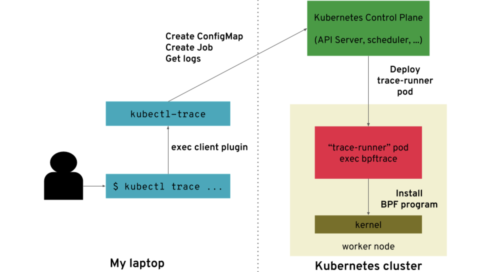
kubectl trace는 새로운 pod를 생성하고 해당 pod에서 bpftrace 스크립트를 실행합니다. 그리고 해당 pod는 pod가 설치된 node의 커널에 BPF 프로그램을 설치합니다. (지금부터 언급되는 BPF는 eBPF입니다. 옛날 BPF를 cBPF라고 명칭하겠습니다.)
커널에 설치된 BPF는 아래의 구조도를 지니며 동작하게 됩니다.  
> [!CAUTION]  
> 아래는 bpf에 대한 설명입니다. kubectl trace 실습예제로 바로 넘어가려면 [kubectl trace 활용하기](#실습)를 클릭해주세요.

### eBPF
이제부터 BPF라는 단어가 굉장히 많은 빈도로 언급될 예정이니 eBPF(BPF)가 무엇인지부터 잠시 살펴보도록 하겠습니다. eBPF에 대한 문서는 아래를 레퍼런스 참고 부탁드립니다.  

eBPF를 알기위해서는 eBPF가 어디로부터 왔는가를 확인하는 것은 중요합니다. BPF는 사실 시스템의 성능을 트레이싱하는 목적으로 등장하지 않샀습니다. 단지 네트워크에서 패킷을 필터링하기위해 등장했을 뿐입니다. BPF의 이름에서 알 수 있듯이 BPF는 BSD(Berkele) Packet Filter의 약자입니다. 즉, BPF는 기존 CSPF의 문제점을 보완하고 더 나아가 패킷필터의 새로운 패러다임을 제시했습니다. 즉, 패킷을 BPF라는 구성된 명령어 셋을 기반으로 처리하는 것이며 기존보다 빠른 속도로 처리가 가능했습니다. 해당 내용은 이 문서에서 다루지 않기에 아래 링크를 첨부하겠습니다.   
[The BSD Packet Filter: A New Architecture for User-level Packet Capture](https://www.tcpdump.org/papers/bpf-usenix93.pdf)  
그러다가 2013년 알렉세이 스타로보이토프와 대니얼 보크먼에 의해 개발되면서 2014년에 리눅스 커널에 포함되게 됩니다. 이를 계기로 BPF가 패킷 필터뿐만 아니라 고급 성능 분석 도구에 이용되는 등 다양한 분야에 사용가능한 범용 엔진이 되었습니다. 
즉, BPF는 다양한 커널과 어플리케이션 이벤트상에서 미니 프로그램을 실행할 수 있는 방법을 제공합니다.
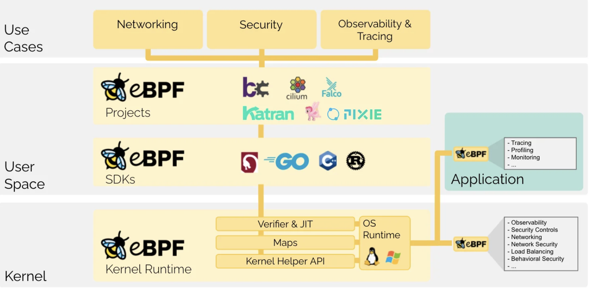
사진에서 보는 것과 같이 BPF는 user space, kernel space등의 매우 광범위한 부분에 BPF 프로그램을 설치하여 이벤트를 트레이싱할 수 있습니다. 즉, 엄청난 관찰 가능성을 확보하거나 시스템을 분석하여 성능적인 이슈를 트래킹할 수 있습니다. 
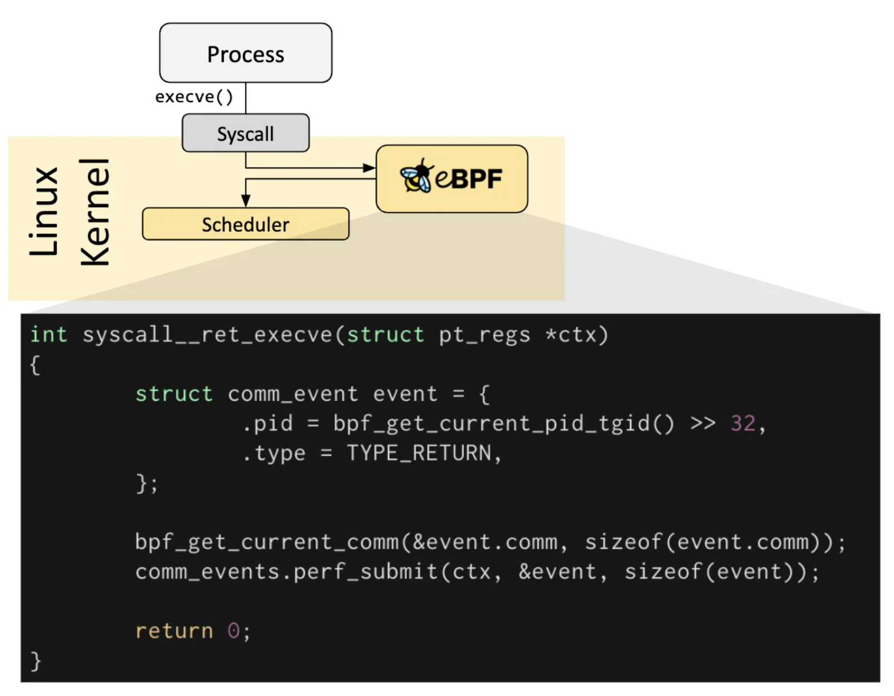
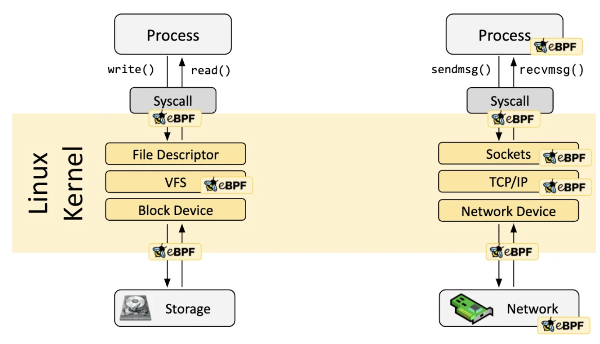

### BPF 프로그램의 실행과정 
이쯤되면 BPF가 어떻게 동작하는지 궁금증이 생깁니다. 더 나아가 커널에 설치하는 것 만큼 위험하지 않은가 등의 의문이 생길 수 있습니다. 아래는 BPF의 아키텍쳐입니다. 
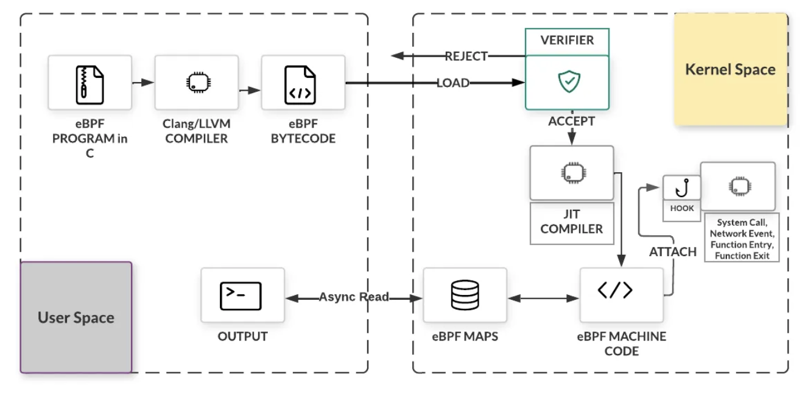
먼저 C로 작성된 eBPF 프로그램을 clang의 LLVM을 이용하요 eBPF bytecode로 컴파일합니다. 
컴파일된 eBPF bytecode는 커널공간에 존재하는 BPF 검사기를 통해 프로그램의 안정성을 확인합니다. 확인이 완료되면 JIT 컴파일 단계를 거쳐 CPU에 맞는 Native machine code를 기반으로 실행되게 됩니다. 안정성을 엄격하게 수행하는 만큼 BPF 프로그램에서 사용할 수 있는 함수는 BPF 헬퍼함수뿐이며 반복문도 무한루프의 가능성으로 인하여 제한적으로 동작하게 됩니다. 
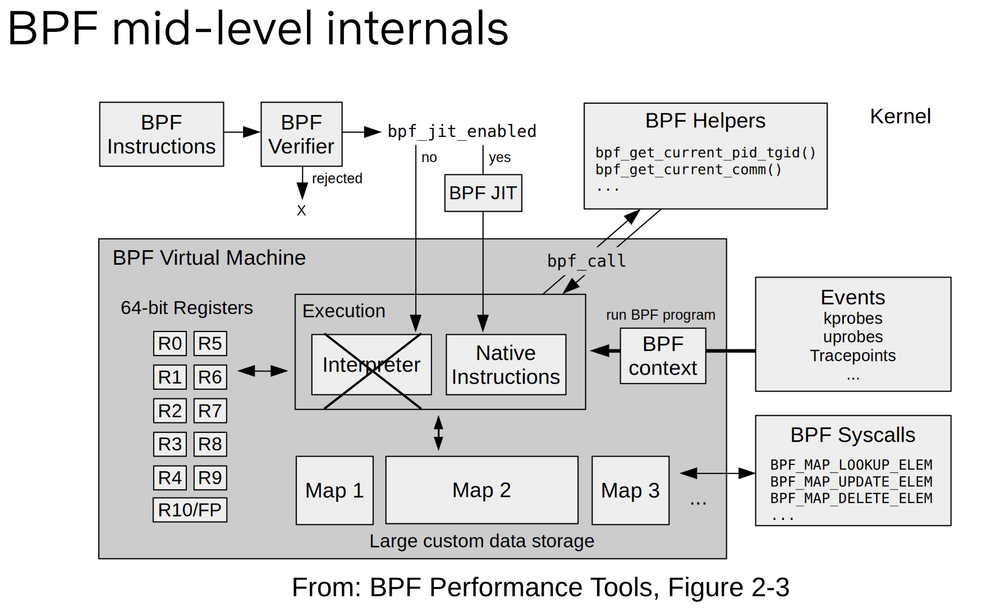
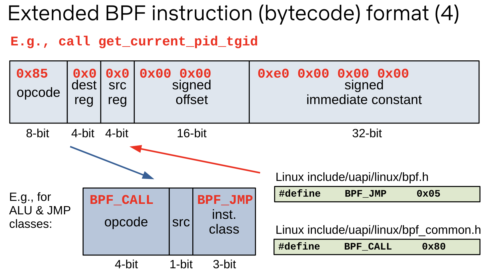
BPF bytecode라고 해서 전혀 새로울 것이 아닙니다. 그냥 기존의 x86, x64등의 명령어셋과 닮았다고 생각하면 편합니다. 아래는 커널에서 수행되는 JIT 컴파일러의 일부 코드입니다. BPF Instruction인 BPF_CALL을 실제 x86 아키텍쳐의 call instruction으로 컴파일 하는 과정입니다. 
[Linux Kernel JIT Compile Source code](https://elixir.bootlin.com/linux/latest/source/arch/x86/net/bpf_jit_comp.c#L1269)  
```C
static int do_jit(struct bpf_prog *bpf_prog, int *addrs, u8 *image, u8 *rw_image,
		  int oldproglen, struct jit_context *ctx, bool jmp_padding)
{
[...]
        case BPF_JMP | BPF_CALL: {
			u8 *ip = image + addrs[i - 1];

			func = (u8 *) __bpf_call_base + imm32;
			if (tail_call_reachable) {
				RESTORE_TAIL_CALL_CNT(bpf_prog->aux->stack_depth);
				ip += 7;
			}
			if (!imm32)
				return -EINVAL;
			ip += x86_call_depth_emit_accounting(&prog, func, ip);
			if (emit_call(&prog, func, ip))
				return -EINVAL;
			break;
		}
[...]
```
```C
static int emit_call(u8 **pprog, void *func, void *ip)
{
	return emit_patch(pprog, func, ip, 0xE8);
}
```
```C
static int emit_patch(u8 **pprog, void *func, void *ip, u8 opcode)
{
[...]
	offset = func - (ip + X86_PATCH_SIZE);
[...]
	EMIT1_off32(opcode, offset);
	*pprog = prog;
	return 0;
}
```
JIT 컴파일러는 BPF_CALL이라는 Instruction을 만나면 x86의 syscall인 0xE8즉, CALL Instruction으로 대체합니다. 
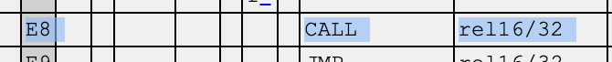
[x86 opcode table](http://ref.x86asm.net/coder32.html#xE8) 
이런식으로 BPF bytecode는 JIT 컴파일러에 의해 native machine code가 형성되고 CPU에 의해 실행됩니다. 그리고 각종 이벤트 소스로부터 발생하는 이벤트를 출력채널을 통해 BPF 프로그램에게 전달합니다. 
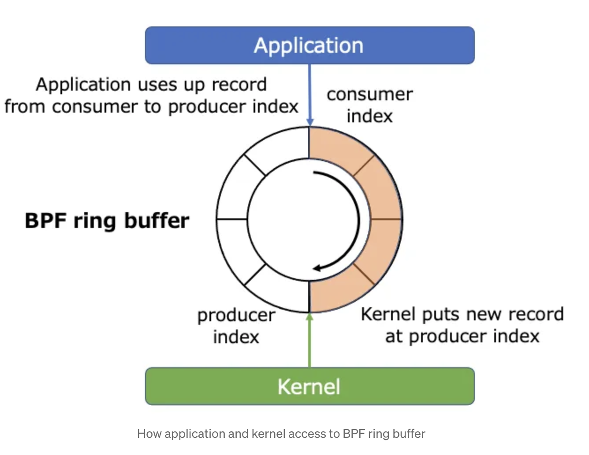
BPF가 부착된 이벤트 소스로부터 얻는 이벤트는 출력채널을 통해 유저스페이스 공간에 전달됩니다. 커널에서 직접 복사하는 형태가 아닌 링버퍼를 통해 구현됩니다. 이후 말하겠지만 BPF는 현재 매우 활발히 연구되고 있는 분야이므로 몇 몇 동작들은 최신 커널버전에서만 동작이 가능합니다. 그렇기에 방금 말함 BPF 링 버퍼 또한 커널 5.7버전 이후에서만 수행이 가능합니다. 5.7 이전의 버전에서는 perf buffer를 사용합니다. 링 버퍼를 사용함으로서 얻는 장점은 크게 2가지가 존재합니다. 
1. CPU 전체에서 링 버퍼를 공유하여 효율적인 메모리 활용합니다. 
2. 여러 CPU를 사용하더라도 순차적으로 발생한 이벤트에 대해 순번을 유지합니다. 

자세한 내용은 아래 링크를 첨부하겠습니다.  
[BPF Ring buffer](https://www.kernel.org/doc/html/next/bpf/ringbuf.html) 

### BPF 프로그램 작성
BPF 프로그램을 작성하는 방법에는 기본적으로 BPF Bytecode를 작성, libbpf 라이브러리 사용, clang의 LLVM 컴파일러를 이용하여 BPF 프로그램을 작성등이 존재합니다. BPF Bytecode를 이용하여 작성하는 것은 프로그램을 기계어 또는 어셈블리어로 작성하라는 뜻과 같습니다. libbpf 라이브러리를 이용한 프로그램은 아래 링크를 첨부하겠습니다. [libbpf example/c](https://github.com/libbpf/libbpf-bootstrap/tree/master/examples/c)

또한 python, go와 같은 좀 더 모던한 언어로 bpf 프로그램을 작성하자는 의미에서 bcc(bpf compiler collection)이 나오게 됩니다.

```python
from bcc import BPF
from bcc.utils import printb
# define BPF program
prog = """
int hello(void *ctx) {
    bpf_trace_printk("Hello, World!\\n");
    return 0;
}
"""
# load BPF program
b = BPF(text=prog)
b.attach_kprobe(event=b.get_syscall_fnname("clone"), fn_name="hello")
# header
print("%-18s %-16s %-6s %s" % ("TIME(s)", "COMM", "PID", "MESSAGE"))
# format output
while 1:
    try:
        (task, pid, cpu, flags, ts, msg) = b.trace_fields()
    except ValueError:
        continue
    except KeyboardInterrupt:
        exit()
    printb(b"%-18.9f %-16s %-6d %s" % (ts, task, pid, msg))
```

한술 더 떠서 bpftrace는 아래와 같이 매우 간단한 스크립트로 BPF 프로그램을 작성할 수 있습니다. 
```bpftrace
# 프로세스에 의해 파일이 열였을 때 파일의 이름
bpftrace -e 'tracepoint:syscalls:sys_enter_open { printf("%s %s\n", comm, str(args->filename)); }'

# 프로그램이 호출한 syscall의 누적 횟수 집계
bpftrace -e 'tracepoint:raw_syscalls:sys_enter { @[comm] = count(); }'
```

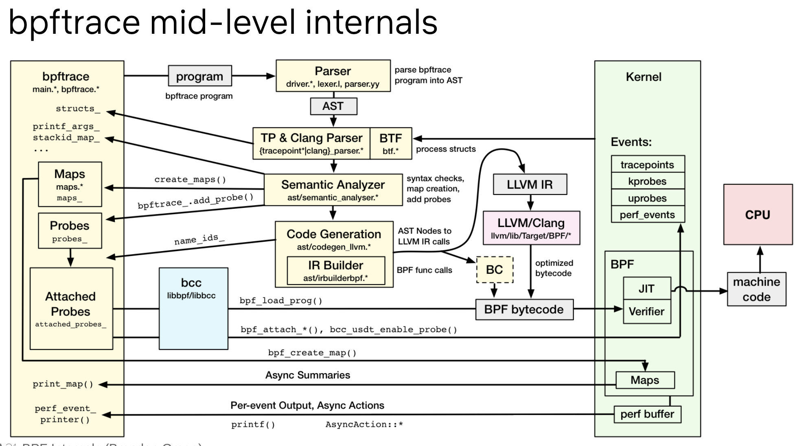
위는 bpftrace의 전반적인 디자인입니다.

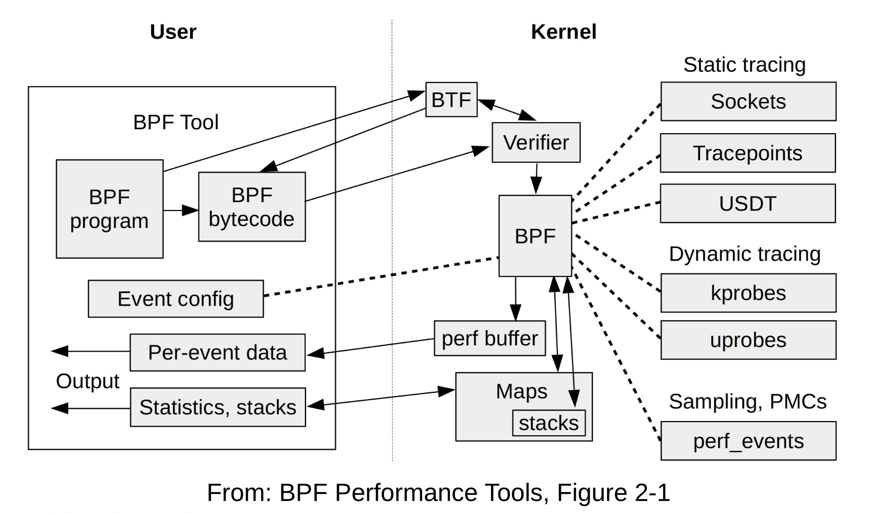
위는 bpf의 전반적인 아키텍쳐입니다.

마지막으로 bcc의 tools를 통해서 관찰가능한 이벤트소스는 아래와 같습니다. 
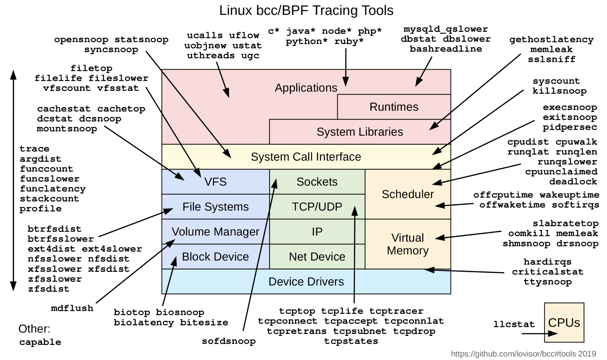

### [실습](#kubectl-trace)
우리는 ebpf의 동작과정에 대해서 얕게 확인하였습니다. 이제는 본론으로 돌아가서 맨 처음 언급한 쿠버네티스의 클러스터에 동작하는 pod 또는 node에 대해서 트레이싱을 진행하겠습니다. 몇 가지의 테스트 케이스를 기반으로 진행하겠습니다. 

#### 의존성 설치 
kubectl trace는 krew를 통해 kubectl-trace 플러그인 설치가 가능합니다. 또한, 테스트 용으로 kind와 helm을 사용하고 있기에 kind, helm, kubectl의 설치가 필요합니다.

- install kind for linux amd64
```bash
Copy
# For AMD64 / x86_64
[ $(uname -m) = x86_64 ] && curl -Lo ./kind https://kind.sigs.k8s.io/dl/v0.23.0/kind-linux-amd64
chmod +x ./kind
sudo mv ./kind /usr/local/bin/kind
```

- install kubectl for linux amd64
```bash
 curl -LO "https://dl.k8s.io/release/$(curl -L -s https://dl.k8s.io/release/stable.txt)/bin/linux/amd64/kubectl"

 sudo install -o root -g root -m 0755 kubectl /usr/local/bin/kubectl
```

- install helm for linux amd64
```bash
curl -fsSL -o get_helm.sh https://raw.githubusercontent.com/helm/helm/main/scripts/get-helm-3
chmod 700 get_helm.sh
./get_helm.sh
```

- install krew for linux amd64
```bash 
(
  set -x; cd "$(mktemp -d)" &&
  OS="$(uname | tr '[:upper:]' '[:lower:]')" &&
  ARCH="$(uname -m | sed -e 's/x86_64/amd64/' -e 's/\(arm\)\(64\)\?.*/\1\2/' -e 's/aarch64$/arm64/')" &&
  KREW="krew-${OS}_${ARCH}" &&
  curl -fsSLO "https://github.com/kubernetes-sigs/krew/releases/latest/download/${KREW}.tar.gz" &&
  tar zxvf "${KREW}.tar.gz" &&
  ./"${KREW}" install krew
)
```
- install kubectl-trace for linux amd64
```bash
kubectl krew install trace
export PATH="${KREW_ROOT:-$HOME/.krew}/bin:$PATH"
```
- Test for kubectl trace
```bash
kubectl trace
```

### Nginx 트레이싱하기 

#### 기본 환경 세팅
이번 실습으로는 pod에서 동작중인 nginx를 kubectl-trace를 이용하여 트레이싱할것입니다. 실습이 가능하도록 아래 링크에서 소스코드를 클론해주세요. 
```bash 
git clone https://github.com/txuna/ebpf-trace-tutorial.git
cd ebpf-trace-tutorial 
chmod a+x kind-local-cluster.sh
./kind-local-cluster.sh
helm upgrade --install nginx nginx


kubectl port-forward svc/nginx 9000:80
# 다른 터미널에서 
curl localhost:9000
```
curl 명령어를 통해 nginx 페이지가 출력된다면 정상적으로 배포가 된것이다. 

#### nginx에 접근 요청 이벤트가 올 때 마다 출력하기
아래와 같이 bpf 프로그램을 작성합니다. 
```bash
tuuna@vultr:~/ebpf-trace-tutorial$ cat print.bt
uprobe:/proc/$container_pid/exe:ngx_event_accept
{
	printf("new client request!\n");
} 
```
nginx_event_accept함수는 클라이언트의 접속 요청이 왔을 때 `accept`이나 `accept4` syscall을 호출하는 함수입니다. 

이제 bpf program을 로드하겠습니다. 
```bash
tuuna@vultr:~/ebpf-trace-tutorial$ kubectl trace run -f print.bt pod/nginx-bbb8c4694-dv2xz -a
trace 83863f22-5178-4fe2-9da5-4e27eabab354 created
```
bpf 프로그램이 로드가 된다면 터미널에서 위와 같이 뜨게 됩니다. 여기서 pod/ 옆은 pod의 이름입니다. 일반적으로 bpf 이벤트형태로 kprobe와 uprobe가 있습니다. uprobe의 경우 어플리케이션 레벨을 트레이싱하는 것이기에 일반적으로 pod에 대해서 처리합니다. 반면 kprobe는 커널 레벨을 트레이싱하는 것이기에 node단위로 처리합니다. 
이제 포트포워딩한 nginx에 curl을 이용하여 접속해보겠습니다. 
```bash
curl localhost:9000 
```
```bash
tuuna@vultr:~/ebpf-trace-tutorial$ kubectl trace run -f print.bt pod/nginx-bbb8c4694-dv2xz -a
trace 83863f22-5178-4fe2-9da5-4e27eabab354 created
new client request!
new client request!
new client request!
new client request!
new client request!
new client request!
new client request!
```
위와 같이 문자열이 출력된 것을 확인할 수 있습니다. 

#### nginx가 클라이언트로부터 읽은 바이트 수 출력하기
nginx가 클라이언트로부터 패킷을 read할 때 쓰는 함수는 `ngx_unix_recv`함수입니다. 이 함수의 리턴값을 확인하면 패킷의 읽은 크기입니다. 그럼 bpf 프로그램을 아래와 같이 수정하겠습니다. 
```bash 
tuuna@vultr:~/ebpf-trace-tutorial$ cat print.bt
uretprobe:/proc/$container_pid/exe:ngx_unix_recv
{
	printf("read bytes: %d\n", retval);
}
```

```bash
tuuna@vultr:~/ebpf-trace-tutorial$ kubectl trace run -f print.bt pod/nginx-bbb8c4694-gmp6t -a
trace 2032a8b8-2849-4d4a-a358-78bfdb736d89 created
read bytes: 77
read bytes: 101
read bytes: 101
read bytes: 0
read bytes: 77
read bytes: 0
read bytes: 101
read bytes: 101
```

#### nginx가 읽은 바이트 비율 만들기 
좀 더 가시성을 높여보겠습니다. 
```bash
tuuna@vultr:~/ebpf-trace-tutorial$ cat print.bt
uretprobe:/proc/$container_pid/exe:ngx_unix_recv
{
	@val[retval] = count();
}
```

```bash 
tuuna@vultr:~/ebpf-trace-tutorial$ kubectl trace run -f print.bt pod/nginx-bbb8c4694-gmp6t -a
trace 3723603d-9ed9-4f20-828c-d81c44c93f5e created
^C
first SIGINT received, now if your program had maps and did not free them it should print them out

@val[101]: 4
@val[77]: 1168
@val[0]: 1168
```
ngx_unit_recv 함수의 리턴값을 맵형태로 출력을 합니다.

#### 
마지막으로 kprobe를 사용해서 pod이 아닌 node에 대해 트레이싱을 해보겠습니다. 
이번에는 bpftrace의 syscall count 에제를 가져왔습니다. 
```bash
BEGIN
{
	printf("Counting syscalls... Hit Ctrl-C to end.\n");
}

tracepoint:raw_syscalls:sys_enter
{
	@syscall[args.id] = count();
	@process[comm] = count();
}

END
{
	printf("\nTop 10 syscalls IDs:\n");
	print(@syscall, 10);
	clear(@syscall);

	printf("\nTop 10 processes:\n");
	print(@process, 10);
	clear(@process);
} 
```
kprobe관련 커널 로드시 몇몇의 헤더가 필요할 수 있습니다. 이때 --fetch-headers 옵션을 통해 해결할 수 있습니다. 

```bash
kubectl trace run --fetch-headers ebpf-cluster-control-planene -f print.bt -a
```
일반적으로 kprobe는 pod이 아닌 node에대해 트레이싱을 합니다. 
현재 저의 잘못된 세팅으로 pod에서 외부네트워크로 트래픽이 전달되지 않아 헤더를 설치하지 확인을 못했습니다. 그래서 다른 클러스터로 테스트를 했습니다. 만약 통신이 된다면 --fetch-headers 옵션을 넣으면 initContainer가 생성되어 필요한 헤더를 설치합니다. 
```bash
$ kubectl trace run --help 

--fetch-headers               Whether to fetch linux headers or not
```
```bash 
tuuna@vultr:~/ebpf-trace-tutorial$ kubectl trace run --fetch-headers aegis-worker2 -f print.bt -a
trace 3d989c76-6064-455c-8dac-7f0269fdaee0 created
Attaching 3 probes...
Counting syscalls... Hit Ctrl-C to end.
^C
first SIGINT received, now if your program had maps and did not free them it should print them out

Top 10 syscalls IDs:
@syscall[262]: 11349
@syscall[257]: 12896
@syscall[3]: 13884
@syscall[1]: 15978
@syscall[13]: 16303
@syscall[72]: 20314
@syscall[0]: 30035
@syscall[35]: 52399
@syscall[202]: 77371
@syscall[281]: 146482

Top 10 processes:
@process[sshd]: 6566
@process[containerd-shim]: 9805
@process[iptables]: 12414
@process[ipset]: 17031
@process[kube-proxy]: 34057
@process[etcd]: 36828
@process[kube-controller]: 39756
@process[kubelet]: 83904
@process[kube-apiserver]: 94038
@process[containerd]: 103143
```
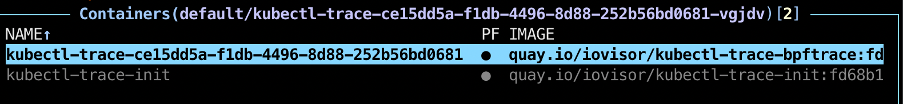
initContainer가 생성된 것을 확인할 수 있습니다. 

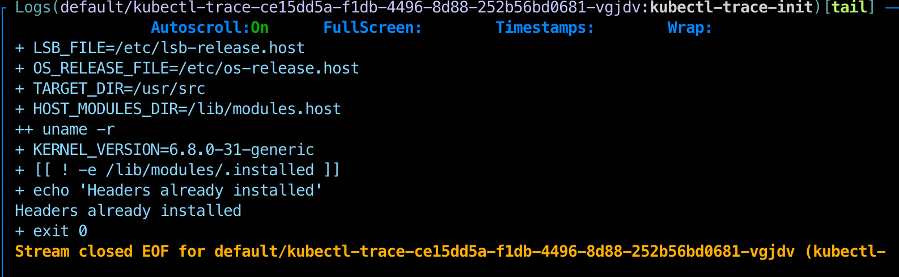
헤더를 설치한 것을 확인할 수 있습니다.

- 클러스터 정리하기
```bash 
kind delete cluster -n ebpf-cluster 
```

### 코멘트 
여기까지 kubectl trace에 대한 간단한 소개였으며 ebpf의 동작과정을 아주 얕게 살펴보았습니다. 이 문서로는 ebpf를 제대로 이해할 수 없으며 이해하기 쉽게 좋은 문서들을 중간 중간 참고로 걸어놨습니다. 또한 nginx의 경우 C 언어로 되어있기 때문에 인자파싱이 비교적 쉽습니다. (헤더파일만 있으면 됩니다.) 하지만 golang, php, java같은 경우에는 인자가 기본 타입이 아닌 클래스, 복잡한 구조체등이 들어온다면 디스어셈블해서 스택에서 처리를 해야하거나 그의 언어 사양에 맞게 처리를 해야할거 같습니다. (추측) 또한, 쿠버네티스 클러스터에 사용하기에는 약간 실험적이지만 ebpf의 장점을 쿠버네티스에서도 적용할 수 있다 정도로만 보면 좋을거 같습니다. 


### 앞으로 살펴볼 내용 
모니터링 프로그램으로 사용되는 그라파나와 프로메테우스에 실험적으로 eBPF를 적용할 수 있습니다. 즉, eBPF로 수집한 내용을 exporter로서 프로메테우스에게 전달이 가능합니다. 이를 cloudflare의 epbf exporter라는 도구를 통해 구현이 가능합니다. 하지만 eBPF exporter는 uprobe를 지원하지 않아 사용자 영역에서 동작하는 어플리케이션을 트레이싱하기에는 매우 부적합니다.    

또한, C 언어 이외의 프로그램의 경우 uprobe나 uretprobe를 사용하여 어플리케이션 계층에서 트레이싱을 하지 않았습니다. 특히 golang의 경우 uretprobe시 몇몇의 이슈가 있습니다.
> [!CAUTION]   
> It is important to note that for uretprobe s to work the kernel runs a special helper on user-space function entry which overrides the return address on the stack. This can cause issues with languages that have their own runtime like Golang: 
```go
func myprint(s string) {
  fmt.Printf("Input: %s\n", s)
}

func main() {
  ss := []string{"a", "b", "c"}
  for _, s := range ss {
    go myprint(s)
  }
  time.Sleep(1*time.Second)
}
```

```bpftrace
# bpftrace -e 'uretprobe:./test:main.myprint { @=count(); }' -c ./test
runtime: unexpected return pc for main.myprint called from 0x7fffffffe000
stack: frame={sp:0xc00008cf60, fp:0xc00008cfd0} stack=[0xc00008c000,0xc00008d000)
fatal error: unknown caller pc
```
golang에서 uretprobe를 사용하는 것은 때때로 오류가 발생할 수 있습니다. 그렇기 때문에 uprobe+offset으로 충분히 해결할 수 있습니다. (다만 조금 불편합니다.)  

다음 문서에는 다른 언어로 작성된 바이너리로도 어플리케이션 계층에서의 인자값과 리턴값을 확인할 수 있는 코드를 추가할 예정입니다. 

추가) 쿠버네티스 노드에서 `ps auxf` 명령어를 쳤을 때 아래와 같은 컨테이너 구조를 볼 수 있습니다.
```bash
root        8232  0.0  0.1 722392 14056 ?        Sl   16:04   0:00 /usr/local/bin/containerd-shim-runc-v2 -namespace k8s.io -
65535       8252  0.0  0.0    996   640 ?        Ss   16:04   0:00  \_ /pause
root        8281  0.0  0.0  32660  5632 ?        Ss   16:04   0:00  \_ nginx: master process nginx -g daemon off;
statd       8299  0.0  0.0  33116  3568 ?        S    16:04   0:00      \_ nginx: worker process
```
containerd-shim-runc-v2와, pause 등을 볼 수 있습니다. 다음번에는 이것을 분석하는 것으로 ~.~

#### 레퍼런스
- [What is the eBPF](https://ebpf.io/what-is-ebpf/)  
- [BPF Compiler Colliection](https://github.com/iovisor/bcc)  
- [eBPF landscape](https://ebpf.io/infrastructure/) 
- [eBPF Internals](https://www.usenix.org/system/files/lisa21_slides_gregg_bpf.pdf)  
- [Tracing golang with bpftrace](https://mechpen.github.io/posts/2022-10-30-golang-bpf/)
- [Challenges of BPF Tracing Go](https://blog.0x74696d.com/posts/challenges-of-bpf-tracing-go/)
- [bpftrace tools](https://github.com/bpftrace/bpftrace/tree/master/tools)