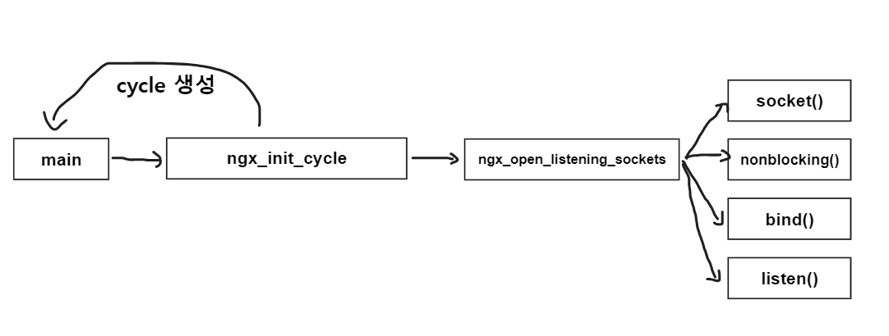

# Nginx Event Loop Architecture

### 개론

`nginx` 이전의 웹서버들은 클라이언트의 접속에 대해 `procss or thread`를 생성하여 대처했다. 하지만 `nginx`는 `epoll event driven`을 통해서 한 스레드 내에서 여러 클라이언트의 접속을 처리하는 구조를 지닌다.

`nginx`의 내부구조는 공식자료로서 설명이 훌륭하지만 아래의 궁금증을 해결해주진 않는다.

- `**nginx`은 어떤식으로 이벤트루프를 구성했을까**

이러한 궁금증을 해결하기 위해서는 `nginx source code`를 직접적으로 봐야만 해결할 수 있기에 분석을 시도했다.

아래 `nginx` 공식 개발 문서이다. `nginx`에서 사용된 함수, 구조에 대해서 자세히 설명이 되어있음.

추가) [http://nginx.org/en/docs/dev/development_guide.html#event_loop](http://nginx.org/en/docs/dev/development_guide.html#event_loop) 

### 컴파일

`nginx` 분석을 진행하기 위해서는 `nginx`를 설치하는 것이 중요하다 하지만 `apt`로 `nginx`를 설치한다면 디버깅(`gdb`)가 매우 힘들지기 떄문에 컴파일전 사전 구성옵션에 `—with-debug` 옵션이 필요하다. 

그렇기에 `nginx source code`를 직접적으로 컴파일할 필요성이 있다. 

아래는 `nginx 1.24.0`을 기준으로 컴파일을 진행하였다. 

```c
# Download nginx 1.24.0 source code
wget http://nginx.org/download/nginx-1.24.0.tar.gz

# Install Pcre2 
wget github.com/PCRE2Project/pcre2/releases/download/pcre2-10.42/pcre2-10.42.tar.gz
tar -zxf pcre2-10.42.tar.gz
cd pcre2-10.42
./configure
make
sudo make install

# Install zlib
wget http://zlib.net/zlib-1.2.13.tar.gz
tar -zxf zlib-1.2.13.tar.gz
cd zlib-1.2.13
./configure
make
sudo make install

# Install openssl  
wget http://www.openssl.org/source/openssl-1.1.1t.tar.gz
tar -zxf openssl-1.1.1t.tar.gz
cd openssl-1.1.1t
./Configure darwin64-x86_64-cc --prefix=/usr
make
sudo make install

# Configuration nginx without any module  
./configure \
--sbin-path=/usr/local/nginx/nginx \
--conf-path=/usr/local/nginx/nginx.conf \
--pid-path=/usr/local/nginx/nginx.pid \
--with-http_ssl_module \
--with-stream \
--with-pcre=../pcre2-10.42 \
--with-zlib=../zlib-1.2.13 \
--without-http_empty_gif_module \
--with-debug

# Build and Install nginx
sudo make
sudo make install
cd /usr/local/nginx/
nginx -v
```

### 디버깅 포인트

대규모의 소스코드를 분석하기 앞서 `gdb`의 `callstack` 덤프를 통해서 함수의 호출과정을 살펴볼것이다.  그러기 위해서는 적절한 함수에 `breakpoint`를 걸어야하는데 감각적인 곳에 거는것이 중요하기에 추론해야 한다. 

`socket` 서버가 `socket`을 만들고 열기위해서는 `socket`함수, `bind`함수, `listen`함수를 필수적으로 사용한다. 그렇기에 3개의 함수에 우선적으로 `breakpoint`를 걸어 함수 호출과정을 살펴볼 예정이다. 

1. 소켓서버는 서버를 오픈하기 위해서는 `socket`, `bind`, `listen`함수를 호출할것이다. 
2. `epoll`을 사용한다면 `epoll_create`, `epoll_ctl`, `epoll_wait` 함수를 호출할것이다. 

### socket(), bind(), listen()

```c
➜  ~ sudo gdb /usr/local/nginx/nginx

pwndbg> b* socket
Breakpoint 1 at 0x237e0
pwndbg> b* bind
Breakpoint 2 at 0x236b0
pwndbg> b* listen
Breakpoint 3 at 0x24270
pwndbg> r
pwndbg> c 
... 
pwndbg> bt
#0  socket () at ../sysdeps/unix/syscall-template.S:120
#1  0x000055555558a893 in ngx_open_listening_sockets (cycle=cycle@entry=0x5555556fba30) at src/core/ngx_connection.c:490
#2  0x000055555558d509 in ngx_init_cycle (old_cycle=old_cycle@entry=0x7fffffffe2a0) at src/core/ngx_cycle.c:618
#3  0x000055555557a1f8 in main (argc=argc@entry=1, argv=argv@entry=0x7fffffffe678) at src/core/nginx.c:293
#4  0x00007ffff7894d90 in __libc_start_call_main (main=main@entry=0x55555557995f <main>, argc=argc@entry=1, argv=argv@entry=0x7fffffffe678) at ../sysdeps/nptl/libc_start_call_main.h:58
#5  0x00007ffff7894e40 in __libc_start_main_impl (main=0x55555557995f <main>, argc=1, argv=0x7fffffffe678, init=<optimized out>, fini=<optimized out>, rtld_fini=<optimized out>, stack_end=0x7fffffffe668) at ../csu/libc-start.c:392
#6  0x0000555555578b95 in _start ()
```

맨 처음 걸리는 `bp`에 걸리는 `socket`함수는 콜스택을 보면 알겠지만 `nscd`관련 즉, 네임서비스 관련작업이므로 패스할것이다. 가감히 `continue`를 입력하여 패스하면 느낌있는 이름을 가진 함수 `ngx_open_listening_sockets`가 호출되고 이 함수를 통해 `socket`이 만들어지고 `bind`, `listen`이 진행된다. 

```c
// nginx.c 
int ngx_cdecl
main(int argc, char *const *argv)
{
...
cycle = ngx_init_cycle(&init_cycle);
    if (cycle == NULL) {
        if (ngx_test_config) {
            ngx_log_stderr(0, "configuration file %s test failed",
                           init_cycle.conf_file.data);
        }

        return 1;
    }
...
}
```

`main`함수에서는 `cycle` 초기화를 진행하기 위해 `ngx_init_cycle`함수를 호출한다.  

이 때 만들어지는 `cycle`은 `nginx runtime context`를 저장한다. 

```c
struct ngx_cycle_s {
    void                  ****conf_ctx;
    ngx_pool_t               *pool;

    ngx_log_t                *log;
    ngx_log_t                 new_log;

    ngx_uint_t                log_use_stderr;  /* unsigned  log_use_stderr:1; */

    ngx_connection_t        **files;
    ngx_connection_t         *free_connections;
    ngx_uint_t                free_connection_n;

    ngx_module_t            **modules;
    ngx_uint_t                modules_n;
    ngx_uint_t                modules_used;    /* unsigned  modules_used:1; */

    ngx_queue_t               reusable_connections_queue;
    ngx_uint_t                reusable_connections_n;
    time_t                    connections_reuse_time;

    ngx_array_t               listening;
    ngx_array_t               paths;

    ngx_array_t               config_dump;
    ngx_rbtree_t              config_dump_rbtree;
    ngx_rbtree_node_t         config_dump_sentinel;

    ngx_list_t                open_files;
    ngx_list_t                shared_memory;

    ngx_uint_t                connection_n;
    ngx_uint_t                files_n;

    ngx_connection_t         *connections;
    ngx_event_t              *read_events;
    ngx_event_t              *write_events;

    ngx_cycle_t              *old_cycle;

    ngx_str_t                 conf_file;
    ngx_str_t                 conf_param;
    ngx_str_t                 conf_prefix;
    ngx_str_t                 prefix;
    ngx_str_t                 error_log;
    ngx_str_t                 lock_file;
    ngx_str_t                 hostname;
};
```

```c
// ngx_cycle.c 
ngx_cycle_t *
ngx_init_cycle(ngx_cycle_t *old_cycle)
{
...
if (ngx_open_listening_sockets(cycle) != NGX_OK) {
        goto failed;
    }
...

return cycle;
}
```

`ngx_init_cycle`함수는 내부적으로 `ngx_open_listening_sockets`함수를 호출하여 설정을 진행한다. 

```c
// ngx_connection.c
ngx_int_t
ngx_open_listening_sockets(ngx_cycle_t *cycle)
{
...
	for (tries = 5; tries; tries--) {
		ls = cycle->listening.elts;
...
		s = ngx_socket(ls[i].sockaddr->sa_family, ls[i].type, 0);
	}
...
		if (setsockopt(s, SOL_SOCKET, SO_REUSEADDR, const void *) &reuseaddr, sizeof(int)) == -1)
		{
...
		}
...
		if (ngx_nonblocking(s) == -1) 
		{
...
		}
...
		if (bind(s, ls[i].sockaddr, ls[i].socklen) == -1)
		{
...
		}
...
		if (listen(s, ls[i].backlog) == -1)
		{
...
		}
...
		ls[i].listen = 1;
		ls[i].fd = s
...
}
```

해당 함수의 내용은 방대하지만 핵심적인 부분만 추려냈다. 

맨 처음 `for loop`문을 통해서 최대 5번까지의 설정 시도를 진행한다. 5번이 초과되면 프로그램은 종료된다. 종료예시는 아래와 같다. 

```c
➜  ~ sudo /usr/local/nginx/nginx
Nginx Start!
➜  ~ sudo /usr/local/nginx/nginx
Nginx Start!
nginx: [emerg] bind() to 0.0.0.0:80 failed (98: Address already in use)
nginx: [emerg] bind() to 0.0.0.0:80 failed (98: Address already in use)
nginx: [emerg] bind() to 0.0.0.0:80 failed (98: Address already in use)
nginx: [emerg] bind() to 0.0.0.0:80 failed (98: Address already in use)
nginx: [emerg] bind() to 0.0.0.0:80 failed (98: Address already in use)
nginx: [emerg] still could not bind()
```

`ngx_socket` 매크로 함수는 `#define ngx_socket socket`으로 정의되어 있으며 내부적으로 `socket`함수를 호출하여 `socket fd`를 반환받는다. 

그리고 해당 `socket`에 대해 `reuse` 옵션을 부여하여 (주소-포트)쌍으로 추후 사용이 가능하도록 설정을 진행한다. 

그리고 해당 `socket`에 대해 `non-blocking` 옵션을 부여하는데 해당 함수는 매크로 함수로 내부적으로 `fcntl`함수를 호출한다. 

```c
#define ngx_nonblocking(s)  fcntl(s, F_SETFL, fcntl(s, F_GETFL) | O_NONBLOCK)
```

그리고 보이는것처럼 `bind`, `listen`을 차례대로 진행하고 `ls[i]`에 `socket fd`를 대입한다. 

맨처음 `ls = cycle→listening→elts`에 대해서 `elts`는 `ngx_listening_s` 타입으로 아래와 같이 정의되어 있다. 

```c
struct ngx_listening_s {
    ngx_socket_t        fd;

    struct sockaddr    *sockaddr;
    socklen_t           socklen;    /* size of sockaddr */
    size_t              addr_text_max_len;
    ngx_str_t           addr_text;

    int                 type;

    int                 backlog;
    int                 rcvbuf;
    int                 sndbuf;
#if (NGX_HAVE_KEEPALIVE_TUNABLE)
    int                 keepidle;
    int                 keepintvl;
    int                 keepcnt;
#endif

    /* handler of accepted connection */
    ngx_connection_handler_pt   handler;

    void               *servers;  /* array of ngx_http_in_addr_t, for example */

    ngx_log_t           log;
    ngx_log_t          *logp;

    size_t              pool_size;
    /* should be here because of the AcceptEx() preread */
    size_t              post_accept_buffer_size;

    ngx_listening_t    *previous;
    ngx_connection_t   *connection;

    ngx_rbtree_t        rbtree;
    ngx_rbtree_node_t   sentinel;

    ngx_uint_t          worker;

    unsigned            open:1;
    unsigned            remain:1;
    unsigned            ignore:1;

    unsigned            bound:1;       /* already bound */
    unsigned            inherited:1;   /* inherited from previous process */
    unsigned            nonblocking_accept:1;
    unsigned            listen:1;
    unsigned            nonblocking:1;
    unsigned            shared:1;    /* shared between threads or processes */
    unsigned            addr_ntop:1;
    unsigned            wildcard:1;

#if (NGX_HAVE_INET6)
    unsigned            ipv6only:1;
#endif
    unsigned            reuseport:1;
    unsigned            add_reuseport:1;
    unsigned            keepalive:2;

    unsigned            deferred_accept:1;
    unsigned            delete_deferred:1;
    unsigned            add_deferred:1;
#if (NGX_HAVE_DEFERRED_ACCEPT && defined SO_ACCEPTFILTER)
    char               *accept_filter;
#endif
#if (NGX_HAVE_SETFIB)
    int                 setfib;
#endif

#if (NGX_HAVE_TCP_FASTOPEN)
    int                 fastopen;
#endif

};
```

해당 과정을 이미지로 보면 아래와 같다. 



### fork()

`epoll API`를 사용하기 위해서는 `epoll_create`로 `epoll fd`를 생성해야 한다. 그렇다면 `epoll_create` 함수에 `breakpoint`를 걸고 실행시켜 `callstack`을 확인해보자. 

```c
pwndbg> b* epoll_create
pwndbg> r
pwndbg> c
pwndbg> bt
#0  epoll_create () at ../sysdeps/unix/syscall-template.S:120
#1  0x00005555555a794d in ngx_epoll_init (cycle=0x5555556fba30, timer=<optimized out>) at src/event/modules/ngx_epoll_module.c:330
#2  0x000055555559be25 in ngx_event_process_init (cycle=0x5555556fba30) at src/event/ngx_event.c:672
#3  0x00005555555a59df in ngx_worker_process_init (cycle=cycle@entry=0x5555556fba30, worker=<optimized out>) at src/os/unix/ngx_process_cycle.c:893
#4  0x00005555555a5b30 in ngx_worker_process_cycle (cycle=0x5555556fba30, data=<optimized out>) at src/os/unix/ngx_process_cycle.c:706
#5  0x00005555555a4093 in ngx_spawn_process (cycle=cycle@entry=0x5555556fba30, proc=proc@entry=0x5555555a5b0a <ngx_worker_process_cycle>, data=data@entry=0x0, name=name@entry=0x55555565c3aa "worker process", respawn=respawn@entry=-3) at src/os/unix/ngx_process.c:199
#6  0x00005555555a536f in ngx_start_worker_processes (cycle=cycle@entry=0x5555556fba30, n=1, type=type@entry=-3) at src/os/unix/ngx_process_cycle.c:344
#7  0x00005555555a655e in ngx_master_process_cycle (cycle=cycle@entry=0x5555556fba30) at src/os/unix/ngx_process_cycle.c:130
#8  0x000055555557a509 in main (argc=argc@entry=1, argv=argv@entry=0x7fffffffe678) at src/core/nginx.c:384
```

맨 처음 실행시 걸리는 `epoll_create`는 소스코드 디버깅결과 “직감적”으로 `module`관련 세팅인거 같아서 PASS한다.(확실하지 않음)

다음 `continue`를 실행하여 걸리는 `callstack`을 확인해보면 함수이름에 `worker_process`라는 것을 확인할 수 있다. 

즉, `nginx`는 `master process`와 여러개의 `worker process`로 구성된다. 미리 말하자면 `master process`에는 설정파일을 읽어들이고 세팅을 진행하며 `worker process`에서 `events driven`을 진행한다.

아래는 `process list`를 뽑아본 결과이다. 

```c
➜  test ps -ef | grep nginx
root     23316     8  0 19:22 ?        00:00:00 nginx: master process /usr/local/nginx/nginx
nobody   24025 23316  0 19:26 ?        00:00:00 nginx: worker process
```

위의 결과대로 `process`를 생성하는 것을 알 수 있다. 그렇다면 내부적으로 `fork()` 함수를 사용한다는 것인데 바로 `breakpoint`를 설정하고 `run`해보자. 

**주의) `gdb`를 다시 실행하는 경우에는 이미 `socket`이 `bind`, `listen`을 진행했기 때문에 `nginx` `process`를 죽여야 정상적으로 디버깅이 가능합니다.** 

```c
pwndbg> b* fork
pwndbg> r
pwndbg> c
pwndbg> bt
#0  __libc_fork () at ./posix/fork.c:41
#1  0x00005555555a3b6c in ngx_spawn_process (cycle=cycle@entry=0x5555556fba30, proc=proc@entry=0x5555555a5b0a <ngx_worker_process_cycle>, data=data@entry=0x0, name=name@entry=0x55555565c3aa "worker process", respawn=respawn@entry=-3) at src/os/unix/ngx_process.c:186
#2  0x00005555555a536f in ngx_start_worker_processes (cycle=cycle@entry=0x5555556fba30, n=1, type=type@entry=-3) at src/os/unix/ngx_process_cycle.c:344
#3  0x00005555555a655e in ngx_master_process_cycle (cycle=cycle@entry=0x5555556fba30) at src/os/unix/ngx_process_cycle.c:130
#4  0x000055555557a509 in main (argc=argc@entry=1, argv=argv@entry=0x7fffffffe678) at src/core/nginx.c:384
```

맨 처음 걸리는 `bp`는 소스코드 분석결과 `ngx_daemon`관련이여서 패스(직감적)한다. 

두 번째 걸리는 `bp`에 대해서 `callstack`을 확인해보면 `ngx_master_process_cycle`이라는 함수를 호출한다. 

```c
// nginx.c 

int ngx_cdecl
main(int argc, char *const *argv)
{
...
	if (ngx_process == NGX_PROCESS_SINGLE) {
	      ngx_single_process_cycle(cycle);
	
	} else {
	    ngx_master_process_cycle(cycle);
	}
...
}
```

`NGX_PROCESS_SINGLE`은 공식문서에 따르면 아래와  같다. 

• `NGX_PROCESS_SINGLE` — The single process, which exists only in `master_process off` mode, and is the only process running in that mode. It creates cycles (like the master process does) and handles client connections (like the worker process does). Its cycle function is `ngx_single_process_cycle()`.

일반적인 상황에서는 `ngx_master_process_cycle`함수를 호출한다.

확실하진 않지만 코드를 보면 멀티 프로세스모드일 때와 동일하게 `epoll_create`하고 `client` 처리를 진행하는 것을 보면 `worker process`를 생성하지 않는 모드일 때 동작하는것 같다. 

`ngx_master_process_cycle`함수의 내부를 살펴보면 아래와 같다. 

```c
// nginx_process_cycle.c
void
ngx_master_process_cycle(ngx_cycle_t *cycle)
{
...
ngx_start_worker_processes(cycle, ccf->worker_processes,
                               NGX_PROCESS_RESPAWN);
...
sigsuspend(&set);
...
}
```

핵심적인것만 추렸을 때 위와 같다. 결론부터 말하자면 `ngx_start_worker_processes` 함수는 내부적으로 `fork` 함수를 호출하여 `worker process`를 생성하여 `worker process`들이 각 각의 `event driven`을 실행한다.  

그리고 부모 프로세스는 즉, `master process` 대부분의 남은 시간을 `sigsuspend`함수를 통해 시그널을 대기한다. 

`ngx_start_worker_processes`함수는 내부적으로 아래와 같다. 

```c
// ngx_process_cycle.c 
static void
ngx_start_worker_processes(ngx_cycle_t *cycle, ngx_int_t n, ngx_int_t type)
{
    ngx_int_t  i;

    ngx_log_error(NGX_LOG_NOTICE, cycle->log, 0, "start worker processes");

    for (i = 0; i < n; i++) {

        ngx_spawn_process(cycle, ngx_worker_process_cycle,
                          (void *) (intptr_t) i, "worker process", type);

        ngx_pass_open_channel(cycle);
    }
}
```

`nginx.conf` 설정파일을 확인하면 `worker process`를 몇개 만들 지 설정할 수 있는데 이 설정값을 참고하여 `ngx_spawn_process`함수를 호출하여 `worker process`를 생성한다. 

```c
// nginx_process_cycle.c 
ngx_pid_t
ngx_spawn_process(ngx_cycle_t *cycle, ngx_spawn_proc_pt proc, void *data,
    char *name, ngx_int_t respawn)
{
...
pid = fork();

switch (pid) {

case -1:
    ngx_log_error(NGX_LOG_ALERT, cycle->log, ngx_errno,
                  "fork() failed while spawning \"%s\"", name);
    ngx_close_channel(ngx_processes[s].channel, cycle->log);
    return NGX_INVALID_PID;

case 0:
    ngx_parent = ngx_pid;
    ngx_pid = ngx_getpid();
    proc(cycle, data);
    break;

default:
    break;
...
}
```

부모프로세스는 `break`문을 통해 이전에 언급한 `sigsuspend`함수를 호출하여 시그널을 대기한다. 

자식프로세스의 경우 `proc`라는 함수포인터를 호출하는데 해당 `proc`함수 포인터는 `ngx_spawn_process`함수를 호출할 때 인자로 주어진  `ngx_worker_process_cycle` 함수이다. 

지금까지의 내용을 그림으로 표현하면 아래와 같다.


### epoll_create, epoll_ctl, epoll_wait

지금까지의 정리는 `nginx Multi-Process`의 동작방식을 추구하며 `master process`는 각종 컨피그 파일 파싱 및 모듈 초기화 소켓 생성 및 바인드 진행을 한며 `worker process`에서 개별적인 `event driven`을 하는 것을 알 수 있다. 

좀 더  자세히 알기위해 `epoll_create`에 `breakpoint`을 걸고 `run`한다. 

```c
pwndbg> b* epoll_create
pwndbg> c
pwndbg> bt
#0  epoll_create () at ../sysdeps/unix/syscall-template.S:120
#1  0x00005555555a794d in ngx_epoll_init (cycle=0x5555556fba30, timer=<optimized out>) at src/event/modules/ngx_epoll_module.c:330
#2  0x000055555559be25 in ngx_event_process_init (cycle=0x5555556fba30) at src/event/ngx_event.c:672
#3  0x00005555555a59df in ngx_worker_process_init (cycle=cycle@entry=0x5555556fba30, worker=<optimized out>) at src/os/unix/ngx_process_cycle.c:893
#4  0x00005555555a5b30 in ngx_worker_process_cycle (cycle=0x5555556fba30, data=<optimized out>) at src/os/unix/ngx_process_cycle.c:706
#5  0x00005555555a4093 in ngx_spawn_process (cycle=cycle@entry=0x5555556fba30, proc=proc@entry=0x5555555a5b0a <ngx_worker_process_cycle>, data=data@entry=0x0, name=name@entry=0x55555565c3aa "worker process", respawn=respawn@entry=-3) at src/os/unix/ngx_process.c:199
#6  0x00005555555a536f in ngx_start_worker_processes (cycle=cycle@entry=0x5555556fba30, n=1, type=type@entry=-3) at src/os/unix/ngx_process_cycle.c:344
#7  0x00005555555a655e in ngx_master_process_cycle (cycle=cycle@entry=0x5555556fba30) at src/os/unix/ngx_process_cycle.c:130
#8  0x000055555557a509 in main (argc=argc@entry=1, argv=argv@entry=0x7fffffffe678) at src/core/nginx.c:384
```

`callstack`이 많아 보이지만 사실 `worker process`는 `ngx_worker_process_cycle`부터 실행되기에 여기서부터 보면 된다. 

```c
// nginx_process_cycle.c 
static void
ngx_worker_process_cycle(ngx_cycle_t *cycle, void *data)
{
...
ngx_worker_process_init(cycle, worker);
...
}
```

`ngx_worker_process_cycle`함수는 내부적으로 `ngx_worker_process_init`함수를 호출한다. 

해당 함수를 통해서 `process`의 각종 초기화 작업을 진행한다.  관심가질 부분은 `event` 초기화 부분이다. 

```c
static void
ngx_worker_process_init(ngx_cycle_t *cycle, ngx_int_t worker)
{
...
for (i = 0; cycle->modules[i]; i++) {
        if (cycle->modules[i]->init_process) {
            if (cycle->modules[i]->init_process(cycle) == NGX_ERROR) {
                /* fatal */
                exit(2);
            }
        }
    }
...
}
```

`module`들의 `init_process`를 호출하는데 모듈중에 `event driven`관련 모듈은 아래와 같이 정의되어있다. 

```c
// ngx_module.h
struct ngx_module_s {
    ngx_uint_t            ctx_index;
    ngx_uint_t            index;

    char                 *name;

    ngx_uint_t            spare0;
    ngx_uint_t            spare1;

    ngx_uint_t            version;
    const char           *signature;

    void                 *ctx;
    ngx_command_t        *commands;
    ngx_uint_t            type;

    ngx_int_t           (*init_master)(ngx_log_t *log);

    ngx_int_t           (*init_module)(ngx_cycle_t *cycle);

    ngx_int_t           (*init_process)(ngx_cycle_t *cycle);
    ngx_int_t           (*init_thread)(ngx_cycle_t *cycle);
    void                (*exit_thread)(ngx_cycle_t *cycle);
    void                (*exit_process)(ngx_cycle_t *cycle);

    void                (*exit_master)(ngx_cycle_t *cycle);

    uintptr_t             spare_hook0;
    uintptr_t             spare_hook1;
    uintptr_t             spare_hook2;
    uintptr_t             spare_hook3;
    uintptr_t             spare_hook4;
    uintptr_t             spare_hook5;
    uintptr_t             spare_hook6;
    uintptr_t             spare_hook7;
};

// ngx_event.c
ngx_module_t  ngx_event_core_module = {
    NGX_MODULE_V1,
    &ngx_event_core_module_ctx,            /* module context */
    ngx_event_core_commands,               /* module directives */
    NGX_EVENT_MODULE,                      /* module type */
    NULL,                                  /* init master */
    ngx_event_module_init,                 /* init module */
    ngx_event_process_init,                /* init process */
    NULL,                                  /* init thread */
    NULL,                                  /* exit thread */
    NULL,                                  /* exit process */
    NULL,                                  /* exit master */
    NGX_MODULE_V1_PADDING
};
```

즉 `init_process` 함수포인터는 `ngx_event_process_init`함수를 호출하는 것을 의미한다. 

```c
// nginx_event.c
static ngx_int_t
ngx_event_process_init(ngx_cycle_t *cycle)
{
...
module = cycle->modules[m]->ctx;

if (module->actions.init(cycle, ngx_timer_resolution) != NGX_OK) {
    /* fatal */
    exit(2);
}
...
rev = c->read;
...
rev->handler = (c->type == SOCK_STREAM) ? ngx_event_accept
                                                : ngx_event_recvmsg;
...
if (ngx_add_event(rev, NGX_READ_EVENT, 0) == NGX_ERROR) {
            return NGX_ERROR;
}
...
}
```

해당 함수 내부에는 `module→actions.init`를 호출하는데 이는 아래와 같이 정의되어있다. 

```c
// nginx_event.h
typedef struct {
    ngx_int_t  (*add)(ngx_event_t *ev, ngx_int_t event, ngx_uint_t flags);
    ngx_int_t  (*del)(ngx_event_t *ev, ngx_int_t event, ngx_uint_t flags);

    ngx_int_t  (*enable)(ngx_event_t *ev, ngx_int_t event, ngx_uint_t flags);
    ngx_int_t  (*disable)(ngx_event_t *ev, ngx_int_t event, ngx_uint_t flags);

    ngx_int_t  (*add_conn)(ngx_connection_t *c);
    ngx_int_t  (*del_conn)(ngx_connection_t *c, ngx_uint_t flags);

    ngx_int_t  (*notify)(ngx_event_handler_pt handler);

    ngx_int_t  (*process_events)(ngx_cycle_t *cycle, ngx_msec_t timer,
                                 ngx_uint_t flags);

    ngx_int_t  (*init)(ngx_cycle_t *cycle, ngx_msec_t timer);
    void       (*done)(ngx_cycle_t *cycle);
} ngx_event_actions_t;
```

각 함수포인터별로 어떤 함수들이 등록되어 있는지 `gdb`를 통해서 알 수 있다. 

```c
pwndbg> p *module
$1 = {
  name = 0x5555556ad9f0 <epoll_name>,
  create_conf = 0x5555555a8244 <ngx_epoll_create_conf>,
  init_conf = 0x5555555a7162 <ngx_epoll_init_conf>,
  actions = {
    add = 0x5555555a75bd <ngx_epoll_add_event>,
    del = 0x5555555a745c <ngx_epoll_del_event>,
    enable = 0x5555555a75bd <ngx_epoll_add_event>,
    disable = 0x5555555a745c <ngx_epoll_del_event>,
    add_conn = 0x5555555a7364 <ngx_epoll_add_connection>,
    del_conn = 0x5555555a7252 <ngx_epoll_del_connection>,
    notify = 0x5555555a81d0 <ngx_epoll_notify>,
    process_events = 0x5555555a7d83 <ngx_epoll_process_events>,
    init = 0x5555555a77f4 <ngx_epoll_init>,
    done = 0x5555555a718c <ngx_epoll_done>
  }
}
```

즉, `init`함수 포인터는 `ngx_epoll_init`함수를 호출하는 것을 알 수 있다. 

만약 `gdb`가 아닌 소스코드에서 찾고싶다면 아래와 같이 정의되어있다. 

```c
// nginx_epoll_module.c 
static ngx_event_module_t  ngx_epoll_module_ctx = {
    &epoll_name,
    ngx_epoll_create_conf,               /* create configuration */
    ngx_epoll_init_conf,                 /* init configuration */

    {
        ngx_epoll_add_event,             /* add an event */
        ngx_epoll_del_event,             /* delete an event */
        ngx_epoll_add_event,             /* enable an event */
        ngx_epoll_del_event,             /* disable an event */
        ngx_epoll_add_connection,        /* add an connection */
        ngx_epoll_del_connection,        /* delete an connection */
#if (NGX_HAVE_EVENTFD)
        ngx_epoll_notify,                /* trigger a notify */
#else
        NULL,                            /* trigger a notify */
#endif
        ngx_epoll_process_events,        /* process the events */
        ngx_epoll_init,                  /* init the events */
        ngx_epoll_done,                  /* done the events */
    }
};
```

```c
// nginx_epoll_module.c 
static ngx_int_t
ngx_epoll_init(ngx_cycle_t *cycle, ngx_msec_t timer)
{
...
ep = epoll_create(cycle->connection_n / 2);
...
if (ngx_epoll_notify_init(cycle->log) != NGX_OK) {
            ngx_epoll_module_ctx.actions.notify = NULL;
}
...
}
```

`ngx_epoll_init`함수는 내부적으로 `epoll_create`함수를 호출하여 `epoll instance`를 생성한다. 

이 때 `ep`는 해당 파일내에서 `static 변수`로서 선언되어있다. 

```c
// nginx_epoll_module.c 
static int                  ep = -1;
static struct epoll_event  *event_list;
static ngx_uint_t           nevents;
```

그리고 연이어 `ngx_epoll_notify_init`함수를 호출하는데 내부적으로 `eventfd`함수를 호출한다. 해당함수는 프로세스끼리 통신을 진행하는 `IPC`인데 왜 사용하는지 정확히 분석을 덜하였으나 추측으로는 `worker process`내에서도 `IO작업`을 발생하면 `thread pool`을 통해서 `thread`를 사용한다.  이 때 `thread` 제어를 위해 사용하는 것으로 추측하고 있다.

그리고 다시 `ngx_event_process_init`함수로 돌아와서  `rev→handler`에 클라이언트가 연결을 요청했을 때 어떤 함수를 실행시킬 지에 대한 함수포인터를 지정한다.  

즉, 클라이언트의 요청이 있다면 `ngx_event_accept`함수를 호출한다 만약 `UDP`라면 `ngx_event_recvmsg`함수를 호출한다. 

그리고 `ngx_event_process_init` 함수를 계속 진행하면 `ngx_add_evnet` 매크로 함수를 호출하는데 이는 아래와 같이 정의되어있다. 

```c
#define ngx_add_event        ngx_event_actions.add
```

이는 이전에 정의했던 `ngx_epoll_add_event`함수이다. 

그리고 인자를 순서대로 `rev`, `NGX_READ_EVENT`, `0` 이라는 값을 넘긴다.  순서대로 설명하자면 

- `rev` : `ngx_event_s` 구조체로 각종 이벤트에 대한 `true` `false`값을 가지고 있고 콜백함수가 등록되어있음
- `NGX_READ_EVENT` : `read event`에 대한 처리
- `0`  : `events` 플래그 뒤에 합산할 값이다. `0`은 `EPOLLLT` 값을 의미한다. 추후 `client socket fd`에 대해서는 `NGX_CLEAR_EVENT` 값을 넣는데 이는 `EPOLLET`의 값을 지닌다.

```c
// nginx_epoll_module.c 
static ngx_int_t
ngx_epoll_add_event(ngx_event_t *ev, ngx_int_t event, ngx_uint_t flags)
{
    int                  op;
    uint32_t             events, prev;
    ngx_event_t         *e;
    ngx_connection_t    *c;
    struct epoll_event   ee;

    c = ev->data;

    events = (uint32_t) event;

    if (event == NGX_READ_EVENT) {
        e = c->write;
        prev = EPOLLOUT;
#if (NGX_READ_EVENT != EPOLLIN|EPOLLRDHUP)
        events = EPOLLIN|EPOLLRDHUP;
#endif

    } else {
        e = c->read;
        prev = EPOLLIN|EPOLLRDHUP;
#if (NGX_WRITE_EVENT != EPOLLOUT)
        events = EPOLLOUT;
#endif
    }

    if (e->active) {
        op = EPOLL_CTL_MOD;
        events |= prev;

    } else {
        op = EPOLL_CTL_ADD;
    }

#if (NGX_HAVE_EPOLLEXCLUSIVE && NGX_HAVE_EPOLLRDHUP)
    if (flags & NGX_EXCLUSIVE_EVENT) {
        events &= ~EPOLLRDHUP;
    }
#endif

    ee.events = events | (uint32_t) flags;
    ee.data.ptr = (void *) ((uintptr_t) c | ev->instance);

    ngx_log_debug3(NGX_LOG_DEBUG_EVENT, ev->log, 0,
                   "epoll add event: fd:%d op:%d ev:%08XD",
                   c->fd, op, ee.events);

    if (epoll_ctl(ep, op, c->fd, &ee) == -1) {
        ngx_log_error(NGX_LOG_ALERT, ev->log, ngx_errno,
                      "epoll_ctl(%d, %d) failed", op, c->fd);
        return NGX_ERROR;
    }

    ev->active = 1;
#if 0
    ev->oneshot = (flags & NGX_ONESHOT_EVENT) ? 1 : 0;
#endif

    return NGX_OK;
}
```

내부적으로 `epoll_ctl`함수를 호출하여 이전에 `socket()`함수를 호출하여 만들어낸 `server socket fd`를 `관심FD`로 등록한다. 

재밋게도 `server socket fd`에 대해서는 즉, 연결 요청에대해서는 `Edge Trigger` 방식이 아닌 `Level-Trigger`방식을 채택한다. 

디버깅과정에서 `events`값을 찍어보면 `8193`이 나옴 `(EPOLLIN | EPOLLRDHUP )` 

오해할 수 있기에 지금 말하자면 `client socket fd`에 대해서만 `EPOLLET` 플래그를 넣은 `Edge Trigger` 방식을 채택한다. 

`server socket fd`를 `epoll_ctl`하는 과정에서 `events`값을 확인해보면 `8193`인데 `EPOLLET` 플래그가 포함되지 않은 값이다. 

```c
pwndbg> p ee
$8 = {
  events = 8193,
  data = {
    ptr = 0x7ffff77e1010,
    fd = -142733296,
    u32 = 4152234000,
    u64 = 140737345622032
  }
}
```

`client socket fd`를 `epoll_ctl`하는 과정에서 `events`값은 `2147491841`인데 이는 `EPOLLET` 플래그가 포함된 값이다. 

```c
pwndbg> p ee
$11 = {
  events = 2147491841,
  data = {
    ptr = 0x7ffff77e11e0,
    fd = -142732832,
    u32 = 4152234464,
    u64 = 140737345622496
  }
}
```

또 재밋는점은 `epoll_event structure`에서 `union`으로 둘러쌓인 `ptr`을 사용한다는 것이다. 

```c
ee.data.ptr = (void *) ((uintptr_t) c | ev->instance);
```

`ptr`에 `connection` 구조체 값을 넣어서 알림받은 특정 `fd`와 `ptr`에 담긴 데이터를 연결해서 핸들러함수를 호출하는 용도로 사용한다. 

마지막으로 `epoll_wait` 부분에 `breakpoint`을 찍어보면 아래와 같은 `callstack`이 생성된다. 

```c
pwndbg> b* epoll_wait 
pwndbg> r
pwndbg> c
pwndbg> bt
#0  epoll_wait (epfd=8, events=0x555555708a20, maxevents=512, timeout=timeout@entry=-1) at ../sysdeps/unix/sysv/linux/epoll_wait.c:28
#1  0x00005555555a7dc2 in ngx_epoll_process_events (cycle=0x5555556fba30, timer=18446744073709551615, flags=1) at src/event/modules/ngx_epoll_module.c:800
#2  0x000055555559c61e in ngx_process_events_and_timers (cycle=cycle@entry=0x5555556fba30) at src/event/ngx_event.c:248
#3  0x00005555555a5c26 in ngx_worker_process_cycle (cycle=0x5555556fba30, data=<optimized out>) at src/os/unix/ngx_process_cycle.c:721
#4  0x00005555555a4093 in ngx_spawn_process (cycle=cycle@entry=0x5555556fba30, proc=proc@entry=0x5555555a5b0a <ngx_worker_process_cycle>, data=data@entry=0x0, name=name@entry=0x55555565c3aa "worker process", respawn=respawn@entry=-3) at src/os/unix/ngx_process.c:199
#5  0x00005555555a536f in ngx_start_worker_processes (cycle=cycle@entry=0x5555556fba30, n=1, type=type@entry=-3) at src/os/unix/ngx_process_cycle.c:344
#6  0x00005555555a655e in ngx_master_process_cycle (cycle=cycle@entry=0x5555556fba30) at src/os/unix/ngx_process_cycle.c:130
#7  0x000055555557a509 in main (argc=argc@entry=1, argv=argv@entry=0x7fffffffe678) at src/core/nginx.c:384
```

`worker process`이니 `ngx_worker_process_cycle`부터 보면된다. 

```c
// nginx_process_cycle.c 
static void
ngx_worker_process_cycle(ngx_cycle_t *cycle, void *data)
{
...
ngx_process_events_and_timers(cycle);
...
}
```

내부적으로 `ngx_process_events_and_timers`함수를 호출하며 해당 함수는 `ngx_process_events` 매크로 함수를 호출한다. 

```c
// ngx_event.c 
void
ngx_process_events_and_timers(ngx_cycle_t *cycle)
{
...
(void) ngx_process_events(cycle, timer, flags);
...
}
```

매크로 함수의 정의는 아래와 같다. 

```c
#define ngx_process_events   ngx_event_actions.process_events
```

이는 이전에 정의한 함수포인터와 연결된다. 

즉, `ngx_epoll_process_events`함수를 호출하는 것을 알 수 있다. 

```c
// nginx_event_module.c 
static ngx_int_t
ngx_epoll_process_events(ngx_cycle_t *cycle, ngx_msec_t timer, ngx_uint_t flags)
{
...
events = epoll_wait(ep, event_list, (int) nevents, timer);
...
}
```

`ngx_epoll_process_events`함수는 내부적으로 `epoll_wait`함수를 호출하여 `관심FD`들의 반응을 대기한다. 이때 `timer`는 `무한`이다. 

지금까지의 과정을 그림으로 표현하면 아래와 같다. 


### accept(), read()

이제 마지막으로 해결해야할 부분은 2가지이다. 아래 두 가지의 경우를 파악한다면 nginx의 이벤트 처리 구조를 파악하는것과 같다. 

1. **알림받은 `fd`가 `server socket fd`라면?** 
2. **알림받은 `fd`가 `client socket fd`라면?** 

나열된 부분의 `entry point`는 `epoll_wait`에서 이벤트알림이 등록된 시점부터이다. 

```c
// ngx_epoll_module.c 
static ngx_int_t
ngx_epoll_process_events(ngx_cycle_t *cycle, ngx_msec_t timer, ngx_uint_t flags)
{
...
events = epoll_wait(ep, event_list, (int) nevents, timer);
...
for (i = 0; i < events; i++) {
    c = event_list[i].data.ptr;

    instance = (uintptr_t) c & 1;
    c = (ngx_connection_t *) ((uintptr_t) c & (uintptr_t) ~1);

    rev = c->read;
...
    revents = event_list[i].events;
...
    if ((revents & EPOLLIN) && rev->active) {
...
        rev->ready = 1;
        rev->available = -1;
...
        rev->handler(rev);
...
    }

    wev = c->write;

    if ((revents & EPOLLOUT) && wev->active) {
...
        wev->ready = 1;
#if (NGX_THREADS)
        wev->complete = 1;
#endif
...
		wev->handler(wev);
...
    }
}
...
}
```

해당 함수의 길이가 크기때문에 중요하지 않다고 판단한 부분은 잘라냈다.

클라이언트가 `wget` 명령어를 통해 서버에 접근을 했을 때 `events`값에 1이 반환될것이다. 그리고 처음 접속이라면 `connect`이기 때문에 `event_list`에는 `server socket fd`가 들어있을 것이다. 

```c
➜  test wget http://127.0.0.1:80
--2023-07-21 14:51:15--  (try: 2)  http://127.0.0.1/
Connecting to 127.0.0.1:80... connected.
HTTP request sent, awaiting response...
```

```c
pwndbg> p *(ngx_connection_t*)event_list->data->ptr
$11 = {
  data = 0x0,
  read = 0x555555721e10,
  write = 0x555555739e20,
  fd = 6,
  recv = 0x0,
  send = 0x0,
  recv_chain = 0x0,
  send_chain = 0x0,
  listening = 0x5555556fc0e8,
  type = 1,
  sockaddr = 0x0,
  socklen = 0,
  buffer = 0x0,
  queue = {
    prev = 0x0,
    next = 0x0
  },
  reusable = 0,
  close = 0,
  sendfile = 0,
}
```

이 때 `ptr`은 `epoll_ctl`하면서 등록한 `epoll_event.data.ptr`이다. 그렇게하면 `epoll_wait`를 통해 값이 반환될 때 등록된 `ptr`이 반환된다. 이 때 `ptr`의 값은 `ngx_connection_t` 구조체이다. 

`fd`의 값은 `server socket fd`인 `6`으로 세팅되어있다. 

또 `read` 포인터는 이전 `ngx_event_process_init`함수에서  설정을 진행했다. 어떤 값으로 세팅했는지 `gdb`에서 확인하기 위해서는 아래의 명령어가 필요하다. 

```c
pwndbg> set $x=(ngx_connection_t*)event_list->data->ptr
pwndbh> set $y = (ngx_event_t*)$x->read
pwndbg> p *$y
$14 = {
  data = 0x7ffff77e1010,
  write = 0,
  accept = 1,
  instance = 0,
  active = 1,
  disabled = 0,
  ready = 0,
  oneshot = 0,
  complete = 0,
  eof = 0,
  error = 0,
  deferred_accept = 0,
  pending_eof = 0,
  posted = 0,
  closed = 0,
  available = 0,
  handler = 0x55555559cffb <ngx_event_accept>,
  queue = {
    prev = 0x0,
    next = 0x0
  }
}
```

이전에 등록한 핸들러함수 `ngx_event_accept`이 등록되어 있는 것을 알 수 있다. 

이제 코드를 `gdb`의  `n` 명령어를 통해서 차례대로 실행을 진행해본다. 

```c
// ngx_epoll_module.c 
// ngx_epoll_process_events() 
c = event_list[i].data.ptr;

instance = (uintptr_t) c & 1;
c = (ngx_connection_t *) ((uintptr_t) c & (uintptr_t) ~1);

rev = c->read;
```

이부분에서 이전에 `epoll_ctl`로 등록한 `ptr(ngx_connection_t)` 구조체를 포인터 변수 `c`에 대입한다. 

그리고 포인터 변수 `rev에 c→read`값을 대입한다. 

```c
revents = event_list[i].events;
```

`revents`에 어떤 `event`가 발생했는 대입한다. 접속요청이므로 `EPOLLIN` 이벤트값이다. 값은 1이다. 

```c
pwndbg> p revents
$18 = 1
```

```c
if ((revents & EPOLLIN) && rev->active) {

#if (NGX_HAVE_EPOLLRDHUP)
            if (revents & EPOLLRDHUP) {
                rev->pending_eof = 1;
            }
#endif

            rev->ready = 1;
            rev->available = -1;

            if (flags & NGX_POST_EVENTS) {
                queue = rev->accept ? &ngx_posted_accept_events
                                    : &ngx_posted_events;

                ngx_post_event(rev, queue);

            } else {
                rev->handler(rev);
            }
        }
```

그럼 위와 같은 조건문을 통과하게 되고 등록된 `handler`인 `ngx_event_accept`함수를 호출한다. 

```c
// ngx_event_accept.c 
void
ngx_event_accept(ngx_event_t *ev)
{
...
lc = ev->data;
ls = lc->listening;
...
s = accept4(lc->fd, &sa.sockaddr, &socklen, SOCK_NONBLOCK);
...
ls->handler(c);
...
}
```

`ls`에 `ngx_listening_s` 구조체 타입인 `listening` 포인터를 대입한다. 그리고 `accept4`함수를 통해 클라이언트의 요청을 수락하고 `socket fd`를 반환하는데 이를 `NONBLOCK`으로 설정한다. 

그리고 `ls→handler`함수를 호출하는데 이는 아래와 같이 정의되어있다. 

```c
// ngx_http.c 
static ngx_listening_t *
ngx_http_add_listening(ngx_conf_t *cf, ngx_http_conf_addr_t *addr)
{
    ngx_listening_t           *ls;

    ls = ngx_create_listening(cf, addr->opt.sockaddr, addr->opt.socklen);
    if (ls == NULL) {
        return NULL;
    }

    ls->handler = ngx_http_init_connection;
...
}
```

즉, `ngx_http_init_connection`함수를 호출한다.  해당 함수는 클라이언트의 연결정보 및 세팅을 진행한다. 

```c
// ngx_http_request.c 
void
ngx_http_init_connection(ngx_connection_t *c)
{
...
rev = c->read;
rev->handler = ngx_http_wait_request_handler;
c->write->handler = ngx_http_empty_handler;
...
if (ngx_handle_read_event(rev, 0) != NGX_OK) {
    ngx_http_close_connection(c);
    return;
}
...
}
```

`EPOLLIN`인 이벤트 즉, 읽기 요청이 들어왔을 때 `rev→handler`에 `ngx_http_wait_request_handler`함수를 등록한다. 이는 `client socket fd`에 `EPOLLIN` 요청이 들어왔을 때 해당 함수를 호출하도록 한다. 

그리고 `ngx_handle_read_event` 함수 호출을 진행한다. 

```c
// ngx_event.c 
ngx_int_t
ngx_handle_read_event(ngx_event_t *rev, ngx_uint_t flags)
{
...
if (ngx_event_flags & NGX_USE_CLEAR_EVENT) {

  /* kqueue, epoll */

  if (!rev->active && !rev->ready) {
      if (ngx_add_event(rev, NGX_READ_EVENT, NGX_CLEAR_EVENT)
          == NGX_ERROR)
      {
          return NGX_ERROR;
      }
  }

  return NGX_OK;

}
...
}
```

`ngx_handle_read_event`함수는 내부적적으로 `ngx_add_event` 매크로 함수를 호출하는데 이는 이전에 정의한 `ngx_add_epoll_event`함수이다. `NGX_READ_EVENT`값을 넣어 `EPOLLIN` 이벤트를 설정하고 `NGX_CLEAR_EVENT` 매크로값을 넣는다. 이는 아래와 같이 정의되어있다. 

```c
// ngx_event.h
#define NGX_CLEAR_EVENT    EPOLLET
```

즉, `client socket fd`에 대해서는 `Edge-Trigger`모드를 적용한다. 

`server socket fd`에 `EPOLLIN` 이벤트가 감지되었을 때의 과정을 그림으로 표현하면 아래와 같다. 


### recv()

이제 정말로 마지막 단계인 `epoll_ctl`에 등록된 `client socket fd`의 `EPOLLIN` 이벤트를 어떻게 처리하냐이다. 

이전에 `wget`명령어로 서버의 접속 요청을 진행하고 클라이언트의 요청을 수락하고 호출할 핸들러함수까지 등록을 진행하였다.  그렇기에 `epoll_wait`함수를 통해 반환되는 `events`에 대해 `rev→handler`는 콜백으로 등록된 `ngx_http_wait_request_handler`함수를 호출한다. 

```c
pwndbg> p *rev
$5 = {
  data = 0x7ffff77e11e0,
  write = 0,
  accept = 0,
  active = 1,
  ready = 0,
  complete = 0,
  eof = 0,
  error = 0,
  pending_eof = 0,
  closed = 0,
  available = 0,
  handler = 0x5555555c4e33 <ngx_http_wait_request_handler>,
}
```

```c
// ngx_http_request.c 
static void
ngx_http_wait_request_handler(ngx_event_t *rev)
{
...
b = c->buffer;
if (b == NULL) {
    b = ngx_create_temp_buf(c->pool, size);
    if (b == NULL) {
        ngx_http_close_connection(c);
        return;
    }

    c->buffer = b;

}
...
n = c->recv(c, b->last, size);
...
rev->handler = ngx_http_process_request_line;
ngx_http_process_request_line(rev);
...
}
```

`ngx_http_wait_request_handler` 콜백함수는 버퍼를 생성하고 클라이언트의 요청 데이터를 읽고 읽은 값을 기반으로 `ngx_http_process_request_line`함수를 호출하여 처리한다. 

`c→recv`에 등록된 핸들러는 `ngx_unix_recv`함수이다. 

```c
pwndbg> p *c->recv
$6 = {ssize_t (ngx_connection_t *, u_char *, size_t)} 0x5555555a19fd <ngx_unix_recv>
```

`ngx_unix_recv`함수 내부는 아래와 같다. 

```c
// ngx_recv.c
ssize_t
ngx_unix_recv(ngx_connection_t *c, u_char *buf, size_t size)
{
...
do {
    n = recv(c->fd, buf, size, 0);

    ngx_log_debug3(NGX_LOG_DEBUG_EVENT, c->log, 0,
                   "recv: fd:%d %z of %uz", c->fd, n, size);

    if (n == 0) {
        rev->ready = 0;
        rev->eof = 1;

#if (NGX_HAVE_KQUEUE)

        /*
         * on FreeBSD recv() may return 0 on closed socket
         * even if kqueue reported about available data
         */

        if (ngx_event_flags & NGX_USE_KQUEUE_EVENT) {
            rev->available = 0;
        }

#endif

        return 0;
    }

    if (n > 0) {

#if (NGX_HAVE_FIONREAD)

        if (rev->available >= 0) {
            rev->available -= n;

            /*
             * negative rev->available means some additional bytes
             * were received between kernel notification and recv(),
             * and therefore ev->ready can be safely reset even for
             * edge-triggered event methods
             */

            if (rev->available < 0) {
                rev->available = 0;
                rev->ready = 0;
            }

            ngx_log_debug1(NGX_LOG_DEBUG_EVENT, c->log, 0,
                           "recv: avail:%d", rev->available);

        } else if ((size_t) n == size) {

            if (ngx_socket_nread(c->fd, &rev->available) == -1) {
                n = ngx_connection_error(c, ngx_socket_errno,
                                         ngx_socket_nread_n " failed");
                break;
            }

            ngx_log_debug1(NGX_LOG_DEBUG_EVENT, c->log, 0,
                           "recv: avail:%d", rev->available);
        }

#endif

#if (NGX_HAVE_EPOLLRDHUP)

        if ((ngx_event_flags & NGX_USE_EPOLL_EVENT)
            && ngx_use_epoll_rdhup)
        {
            if ((size_t) n < size) {
                if (!rev->pending_eof) {
                    rev->ready = 0;
                }

                rev->available = 0;
            }

            return n;
        }

#endif

        if ((size_t) n < size
            && !(ngx_event_flags & NGX_USE_GREEDY_EVENT))
        {
            rev->ready = 0;
        }

        return n;
    }

    err = ngx_socket_errno;

    if (err == NGX_EAGAIN || err == NGX_EINTR) {
        ngx_log_debug0(NGX_LOG_DEBUG_EVENT, c->log, err,
                       "recv() not ready");
        n = NGX_AGAIN;

    } else {
        n = ngx_connection_error(c, err, "recv() failed");
        break;
    }

} while (err == NGX_EINTR);
...
}
```

```c
 n = recv(c->fd, buf, size, 0);
```

부분에서 `client socket fd`로 부터 값을 size만큼 읽어들이는데 통상 `size` 값은 `1024`값이다. `level-trigger`라면 상관없지만 `edge-trigger`모드이기 때문에 모든 데이터를 다 읽어 들여야 하기때문에 `size`값을 `48`로 바꿔보았다.  통상적으로 `index.html`파일을 요청하는데 124바이트 정도 소모된다. 

```c
pwndbg> p size
$8 = 1024
pwndbg> set size=48
```

반환되는 `n`이 `size`보다 작다면 `client`의 모든 데이터를 다 읽었다고 봐도 된다. 하지만 `n`이 `size`와 같다면 두 가지의 생각이든다. 

첫 번째로는 정말로 `size`와 같은 요청길이일때 

두 번째로는 `size`만큼 읽었는데 뒤에 요청값이 더 있을 때 

이러한 경우의 수를 확인하기 위해 `ngxin`는 아래와 같은 루틴을 사용한다. 

```c
else if ((size_t) n == size) {

    if (ngx_socket_nread(c->fd, &rev->available) == -1) {
        n = ngx_connection_error(c, ngx_socket_errno,
                                 ngx_socket_nread_n " failed");
        break;
    }

    ngx_log_debug1(NGX_LOG_DEBUG_EVENT, c->log, 0,
                   "recv: avail:%d", rev->available);
}
```

`n`이 `size`와 같다면 `ngx_soket_nread` 매크로함수를 호출한다. 해당 매크로 함수는 아래와 같이 정의되어 있다. 

```c
// nginx_socket.h
#define ngx_socket_nread(s, n)  ioctl(s, FIONREAD, n)
```

즉, `ioctl`함수를 호출하여 인자로 주어진 `socket fd`에 대해 얼마나 읽을 수 는지 `rev→available` 변수에 저장한다. 

```c
pwndbg> p rev->available
$11 = 76
```

해당 함수를 진행하고 `rev→available`변수에 남은 바이트 76이 저장된 것을 알 수 있다. 그리고 해당 함수를 빠져나와 `ngx_http_process_request_line`함수에서 `uri`, `header`등을 파싱을 진행한다. 만약 파싱이 제대로 되지않았다면 각 담당 함수에서 `ngx_unit_recv`함수를 자체적으로 호출하여 남은 바이트만큼 값을 읽어들인다. 

사실 요청 헤더 및 본문을 처리하는 과정은 굉장히 복잡하게 구성되어있지만 이벤트 루프의 구성을 분석하는데 초점을 맞추었기에 패스합니다…!

여기까지의 과정을 그림으로 표현하면 아래와 같다. 


### 전체적인 프로세스


### 요약

nginx같은 경우에는 역사깊고 굉장히 큰 프로젝트이기 때문에 분석에 앞서 틀린부분이나 놓친 부분이 있을 수 있습니다.  

### 레퍼런스

[http://www.daileinote.com/computer/nginx/](http://www.daileinote.com/computer/nginx/)

[http://nginx.org/en/docs/dev/development_guide.html](http://nginx.org/en/docs/dev/development_guide.html)