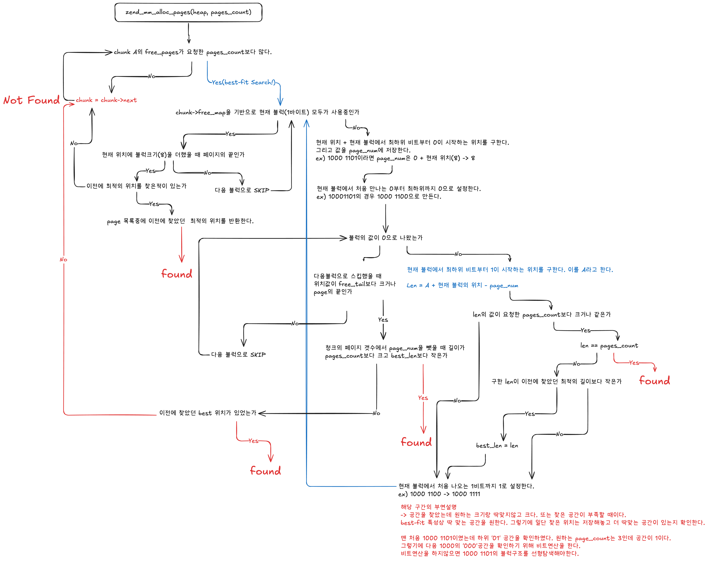

# PHP Zend Memory Allocator 살펴보기
PHP 개발자를 위한 메모리 관리 구조
## 개요
PHP 언어로 변수 또는 [zval](https://www.phpinternalsbook.com/php5/zvals/basic_structure.html)을 할당하게 되면 내부적으로 동작하는 메모리 할당자를 통해 관리됩니다. glibc에 존재하는 `malloc`, `free`같은 것으로 생각할 수 있지만 PHP는 이를 한층 더 wrapping한 `Zend Memory Allocator`를 통해서 관리합니다. 또한 사용가능한 API는 아래와 같습니다. 
```C
/* 주어진 size만큼 메모리 할당 */
emalloc(size_t size)

/* 주어진 메모리 공간을 해제 */
efree(void *ptr)
```
그리고 이러한 할당과 해제 과정에서 CHUNK(2MB)와 Page(4KB) 단위로 메모리를 관리하면서 선 할당, 해제 후 재할당등의 기법을 사용하여 메모리 할당과 해제에서 레이턴시를 줄이는 구조로 되어있습니다. 


이번 챕터는 `Zend Memory Allocator`의 내부동작을 `GDB` 디버거와 PHP 확장 모듈 개발과 함께 살펴볼 예정입니다. 또한 디버깅시 도움되는 다양한 gdb 스크립트등을 추가적으로 소개예정입니다.
> [!NOTE]  
> 본 내용은 PHP-8.4.10을 기준으로 진행됩니다. 

## 준비
본론만 보고싶으신분은 [본론](#본론)으로 넘어가주세요
### PHP 컴파일
앞서 말한 `gdb` 디버깅과 PHP 확장 모듈을 개발하면서 확인하기 위해서는 php source code를 직접 빌드하는 것이 필요합니다. 
```bash
git clone --depth 1 --branch php-8.4.10 https://github.com/php/php-src.git

cd php-src
./buildconf --force
./configure --enable-debug --enable-fpm --disable-cgi --with-openssl --enable-phpdbg --enable-phpdbg-debug --enable-opcache
./config.nice 
make -j $(nproc)
make test
sudo make install

php -v
```
위 진행 과정에서 필요한 의존성 패키지는 직접 설치가 필요합니다.

## 본론
### 기본 정보
소개할 내용을 크게 `초기화`, `할당`, `해제`로 나눌 수 있습니다. 또 할당은 3KB미만의 작은 할당, 2MB 이하의 큰 할당, 2MB이상의 거대할당으로 나눌 수 있습니다. 이러한 할당들은 하나의 전역변수인 `zend_mm_heap`이라는 구조체에 관리 됩니다.
```c
/* zend_alloc.c */
// 설명에 필요하지 않는 부분은 제거했습니다.
struct _zend_mm_heap {
    // 3KB 이하의 해제된 메모리 공간을 링크드 리스트형태로 가리킵니다. 
	zend_mm_free_slot *free_slot[ZEND_MM_BINS]; /* free lists for small sizes */

	zend_mm_huge_list *huge_list;               /* list of huge allocated blocks */

	zend_mm_chunk     *main_chunk;
	zend_mm_chunk     *cached_chunks;			/* list of unused chunks */
	int                chunks_count;			/* number of allocated chunks */
	int                peak_chunks_count;		/* peak number of allocated chunks for current request */
	int                cached_chunks_count;		/* number of cached chunks */
	double             avg_chunks_count;		/* average number of chunks allocated per request */
	int                last_chunks_delete_boundary; /* number of chunks after last deletion */
	int                last_chunks_delete_count;    /* number of deletion over the last boundary */
};
```
heap은 여러개의 2MB크기의 청크를 관리합니다. 중요한 필드는 free_slot입니다. free_slot은 3KB이하의 페이지를 할당한 후 해당 page를 bin의 size만큼 분할 후 free_slot에서 링크드 리스트형태로 관리합니다.   
예를 들어 56바이트를 요청하면 먼저 4KB의 page를 할당합니다. 4KB에서 56바이트만 필요한것이기에 4KB를 56바이트로 분할시켜 73개의 slot을만들고 하나를 할당시키고 나머지 72개는 free_slot에 넣어 다음 할당 요청때 바로 할당합니다. 이러한 slot의 갯수는 총 30개입니다. 

```c
/* zend_alloc.c */
struct _zend_mm_chunk {
	zend_mm_heap      *heap;
	zend_mm_chunk     *next;
	zend_mm_chunk     *prev;
    // 현재 청크에서 해제된(미할당) 페이지 갯수
	uint32_t           free_pages;				/* number of free pages */
    // 청크의 끝에서 연속된 free page가 시작되는 위치 
	uint32_t           free_tail;               /* number of continuous free pages at the end of chunk */
	uint32_t           num;
	zend_mm_heap       heap_slot;               /* used only in main chunk */
    // chunk가 관리하는 page의 할당여부를 비트단위로 저장합니다. 
	zend_mm_page_map   free_map;                /* 512 bits or 64 bytes */
    // chunk가 관리하는 page의 정보를 기록합니다. (작은 할당, 큰 할당, ...)
	zend_mm_page_info  map[ZEND_MM_PAGES];      /* 2 KB = 512 * 4 */
};
```

하나의 2MB 청크는 512개의 Page(4KB)로 구성되며 각 페이지의 할당 여부 체크, 할당 타입등의 정보를 저장하고 다음 청크와 연결리스트 형태로 관리됩니다. 


chunk에서 중요한 필드는 free_map, map, free_tail입니다. page는 512개이지만 free_map의 크기는 64바이트입니다. 이는 바이트단위로 page의 할당여부를 저장하는 것이 아닌 비트단위로 저장하기 때문에 64바이트로 512개의 페이지의 할당 여부를 저장할 수 있습니다. 앞으로 나올 비트연산트릭 때문에 해당 사실을 인지해야합니다.
> 하나의 chunk는 512개의 page를 관리하지만 실제 할당 가능한 page는 511개 입니다. 첫 번째 page는 chunk의 metadata를 관리합니다.

free_tail은 청크의 끝에서 해제된(free) page가 시작되는 지점을 의미합니다. 
> (페이지 끝)000000000000(✓)10101010010110000110(<- 할당 시작)이라면 체크된 위치를 의미합니다.

map은 할당한 page의 32bit 크기의 metadata를 저장하는 용도입니다. 

### 초기화
우선 php 모듈의 lifecycle부터 확인할 필요가 있습니다. 
 
php의 `MINIT - MSHUTDOWN` 큰 패턴안에 `RINIT - RSHUTDOWN`이라는 작은 패턴이 존재합니다. `zend_startup` -> `start_memory_manager` 함수를 호출하여 `Zend Memory Allocator`를 초기화 합니다.  
초기화된 `Zend Memory Allocator`는 전역변수인 `alloc_globals`에 저장됩니다. 

```C
typedef struct _zend_alloc_globals {
	zend_mm_heap *mm_heap;
} zend_alloc_globals;

# define AG(v) (alloc_globals.v)
static zend_alloc_globals alloc_globals;
[...]
ZEND_API void start_memory_manager(void)
{
    alloc_globals_ctor(&alloc_globals);
}

static void alloc_globals_ctor(zend_alloc_globals *alloc_globals)
{
[...]
	alloc_globals->mm_heap = zend_mm_init();
}
```
`zend_mm_init` 함수를 통해 전역변수인 heap을 초기화합니다.

그럼 위의 구조가 형성됩니다. 

첫 번째 PAGE에 `ZEND_MM_LRUN`이라는 값을 대입했습니다. 이는 할당된 주소가 어떤 타입을 가지는지 저장합니다. `ZEND_MM_LRUN`은 다음에 언급할 `3KB < size < 2MB` 구간의 경우를 의미하고 `ZEND_MM_SRUN`은 `16 <= size <= 3072` 구간을 의미합니다. 마지막으로 `ZEND_MM_FRUN`은 현재 메모리 주소는 해제된 상태임을 의미합니다. 

할당 부분을 넘어가기전에 이전에 `zend_mm_free_slot *free_slot[ZEND_MM_BINS];`를 언급한적이 있습니다. `16 <= size <= 3072` 사이에는 많은 값이 존재합니다. 해당 값 전부를 관리하게되면 오히려 성능상의 이슈가 발생하게 됩니다. 그렇기에 해당 구간 사이의 크기를 30개의 크기로 나눠서 관리합니다. 이를 `bins`라고 합니다. 표는 아래와 같습니다. 

위 값은 각각 `요청 size 범위` - `bin number`을 의미합니다. 
> 예를들어 요청한 size가 17 <= size <= 24인 경우 bin number가 2임을 의미합니다.
이런식으로 30개의 bin을 관리합니다.   

> 0번 bin은 제외했습니다. 

각 bin_number은 대표하는 size가 존재하는데 아래 표와 같습니다.

`bin_data_size`는 주어진 `bin_number`이 대표하는 size가 몇인지 관리하는 테이블입니다.   
`bin_pages`는 주어진 `bin_number`이 몇개의 page를 필요로하는지 관리하는 테이블입니다.


사용자가 56 사이즈의 메모리를 할당 요청했을 때 56이 어떤 bin_number인지 확인하고 해당 `free_slot`을 살펴보고 메모리가 있다면 반환하는 형식입니다.

### 할당
할당 과정을 조금 더 자세히 살펴보겠습니다. 


#### 작은 할당
사용자가 `emalloc`함수를 호출하여 메모리 할당을 요청하면 `zend_mm_alloc_heap`함수를 호출합니다. 
```C

void *zend_mm_alloc_heap(zend_mm_heap *heap, size_t size)
{
	if (size <= ZEND_MM_MAX_SMALL_SIZE) {
		ptr = zend_mm_alloc_small(heap, ZEND_MM_SMALL_SIZE_TO_BIN(size));
		return ptr;
	} 
    
    else if (size <= ZEND_MM_MAX_LARGE_SIZE) {
		ptr = zend_mm_alloc_large(heap, size);
		return ptr;
	} 
    
    else {
		return zend_mm_alloc_huge(heap, size);
	}
}
```
해당 함수에서 요청 `size`를 확인후 3KB 이하라면 `zend_mm_alloc_small`함수를 호출합니다. `ZEND_MM_SMALL_SIZE_TO_BIN` 매크로 함수를 통해 이전에 말한 size를 align해서 전달합니다.
> 55 바이트를 요청하면 56으로 align됩니다. 

```C
void *zend_mm_alloc_small(zend_mm_heap *heap, int bin_num)
{
	if (heap->free_slot[bin_num] != NULL) {
		zend_mm_free_slot *p = heap->free_slot[bin_num];
		heap->free_slot[bin_num] = zend_mm_get_next_free_slot(heap, bin_num, p);
		return p;
	} 
    
    else {
		return zend_mm_alloc_small_slow(heap, bin_num);
	}
}
```
`free_slot`을 살펴보고 해당 bin_number에 해당하는 메모리주소가 존재한다면 바로 반환합니다. 없다면 `zend_mm_alloc_small_slow`함수를 호출합니다.

해당 함수는 `zend_mm_alloc_pages`함수를 호출하여 하나의 4KB Page를 할당합니다. 그리고 `ZEND_MM_SRUN` 값을 `chunk->map[page_num]`에 저장합니다. 요청한 size는 56바이트 이므로 4KB를 73개의 갯수로 분할하여 `free_slot`에 linked list로 저장힙니다. 다음 56바이트의 요청은 `free_slot`에서 반환됩니다.
```bash
ZEND_MM_SRUN, ZEND_MM_LRUN같이 chunk->map에 저장하는 매크로는 해당 페이지의 service information을 4바이트 형태로 저장하는 용도입니다. 

# 2 bits
FUN     (free pages)
LRUN    (first page or large allocation)
SRUN    (first page or small allocation)

# 10 bits
lrun_pages  (allocated pages의 갯수)

# 5 bits
srun_bin_num    (bin number)

```

내부적으로 `zend_mm_alloc_pages` 함수를 호출하여 실질적으로 필요한 page(4KB)를 할당하는 로직을 나타냅니다.

해당 함수는 청크의 `free_map`의 필드를 확인하면서 필요한 `pages_count`와 비교하면서 best-fit구조로 알맞는 공간을 찾아냅니다. 기존적으로 하나의 chunk는 512개의 page를 소유하고 있으며 `free_map`은 64바이트로 비트연산으로 512개의 page의 할당 여부를 확인합니다. (1: 할당, 0: 미할당) 다만 그림으로 512개를 표현하기에는 다소 무리가 있기에 아래 가정을 진행합니다. 다만 알고리즘은 달라지지않습니다. 

1. 하나의 청크는 24개의 page를 관리합니다.
2. free_map은 3바이트로 24개의 page의 할당 여부를 체크합니다. 
3. 3개의 page를 필요로하는 할당 요청이 들어온 상태입니다.
4. 현재 chunk의 page 사용량은 다음과 같습니다. 


그리고 다음 `zend_mm_alloc_pages` 함수의 내부 구현입니다. 
```bash
# 필요한 개념 및 변수 안내
# ex) 블럭 구조가 001100 001110일 때 free_tail은 10입니다. 
free_tail :: 청크의 끝에서 free pages가 시작되는 위치입니다. 

pages_count :: 요청한 page 갯수

# 이는 필요 page count가 3일 때 가장 최적의 길이는 3을 찾습니다. 없다면 그 다음 사이즈가 됩니다.
best_len :: 최적의 길이 
```

> 오타수정 ex) 1000 1101일 때 최하위 비트부터 0이 시작하는 위치는 1입니다. 즉, page_num은 1입니다. 0아님(오타)

조금 복잡한 알고리즘이지만 요약하면 `free_map`을 보고 요청된 `pages_count`에 최적의 공간을 찾아서 해당 주소를 반환한다고 생각하면 됩니다.


그럼 위에서 가정한 부분을 가지고 어떤 로직을 타는지 확인해보겠습니다. 

> 위 가정한 청크를 기반으로 커버리지되지않는 부분은 제거했습니다. 


#### 큰 할당 
똑같이 위 로직을 따르지만 small bins와 달리 free_slot에 저장하지 않고 주어진 size를 page크기만큼 나눠서 필요한 page_count를 지정합니다. 그리고 zend_mm_alloc_pages함수를 호출하여 페이지를 할당합니다.

### 해제
메모리 해제는 `efree` -> `zend_mm_free_heap`함수를 호출하면서 이루어집니다.


## 테스트 및 디버깅
확장 모듈을 기반으로 직접 디버깅 합니다.
### PHP 확장 모듈 추가하기
```bash
cd php-src/ext
php ext_skel.php --ext [확장모듈 이름] # example php ext_skel.php --ext heap
```
원하시는 확장모듈 이름을 넣고 실행시키면(예를 들어 heap) `heap`이라는 이름의 폴더가 생기게 됩니다. 사용자는 다음파일을 수정하면 됩니다. 
```bash
1. heap.c # source code here!
2. heap_arginfo.h
3. heap_stub.php
``` 

#### 확장 모듈 컴파일 하기
```bash
cd php-src/ext/heap
./configure
make
```

#### 확장모듈 테스트하기
> 확장 모듈을 만들면 기본적으로 test1함수가 있습니다. 그대로 사용합니다. 
```c
/* heap.c */

// for breakpoint
void helloworld(){
    return;
}

PHP_FUNCTION(test1)
{
	ZEND_PARSE_PARAMETERS_NONE();
    helloworld();
	int *a = emalloc(1750);
    int *b = emalloc(1750);

    efree(a);
    efree(b)
}
```
1750바이트를 2번 할당하고 해제합니다. 예상되는 결과로는 첫 번째 할당시 이전에 할당된적 없는 크기이므로 `zend_mm_alloc_pages`함수가 호출되어 pages를 할당합니다. 그리고 3KB 이하 크기인 small allocate이니 bin number기 26인 free_slot을 생성합니다.  
그리고 다음 할당시 free_slot에서 할당 받을것으로 예상됩니다. 

```bash
phpize
make
make test
```

```php
<?php
test1();
?>
```
`hellworld`함수를 추가한 이유는 해당 구간에 breakpoint를 걸어서 디버깅의 편의성을 추가하기 위함입니다.

```bash
gdb php
```
```bash
pwndbg> set break pending on
pwndbg> b helloworld
Function "helloworld" not defined.
Breakpoint 1 (helloworld) pending.

pwndbg> run test.php
```
`helloworld`함수는 현재 모듈에 있는 함수로 로딩되지않는 함수입니다. pending break를 설정하고 실행합니다. 

```bash
In file: /home/tuuna/php-src/ext/heap/heap.c:28
   23 /* {{{ void test1() */
   24 PHP_FUNCTION(test1)
   25 {
   26         ZEND_PARSE_PARAMETERS_NONE();
   27         helloworld();
 ► 28         int *a = emalloc(1750);
   29         int *b = emalloc(1750);
   30
   31         efree(a);
   32         efree(b);
   33 }
```

```bash
pwndbg> p alloc_globals->mm_heap->free_slot[26]
$4 = (zend_mm_free_slot *) 0x0
```
현재 bin number가 26인 free_slot은 아직 비어져있는 상태입니다. 

```bash
pwndbg> p alloc_globals->mm_heap->main_chunk->free_map
$8 = {18446744073709551615, 2305843009213693951, 65472, 0, 0, 0, 0, 0}
```
free_map을 살펴보면 위와 같습니다. 이를 이진수로 표현하면 다음과 같습니다.
```bash
1111111111111111111111111111111111111111111111111111111111111111
0001111111111111111111111111111111111111111111111111111111111111
0000000000000000000000000000000000000000000000001111111111000000
0000000000000000000000000000000000000000000000000000000000000000

0000000000000000000000000000000000000000000000000000000000000000
0000000000000000000000000000000000000000000000000000000000000000
0000000000000000000000000000000000000000000000000000000000000000
0000000000000000000000000000000000000000000000000000000000000000
```
`zend_mm_alloc_pages`함수를 호출하면 `best-fit` 할당방식을 사용하여 위에서 2번째 줄 000부터 3번째 줄 0000까지 사용함을 예측할 수 있습니다. 
> 7개를 사용한 이유는 bin_pages를 보면 bin_number 26일 때 page_count가 7개로 설정되어 있습니다. 

```bash
pwndbg> n # 진행
pwndbg> p alloc_globals->mm_heap->main_chunk->free_map
$9 = {18446744073709551615, 18446744073709551615, 65487, 0, 0, 0, 0, 0}
```

```bash
1111111111111111111111111111111111111111111111111111111111111111
1111111111111111111111111111111111111111111111111111111111111111
0000000000000000000000000000000000000000000000001111111111001111
0000000000000000000000000000000000000000000000000000000000000000

0000000000000000000000000000000000000000000000000000000000000000
0000000000000000000000000000000000000000000000000000000000000000
0000000000000000000000000000000000000000000000000000000000000000
0000000000000000000000000000000000000000000000000000000000000000
```
예상된 값으로 바뀐것을 볼 수 있습니다. 

다음은 free_slot을 살펴보겠습니다. 
```bash
pwndbg> p alloc_globals->mm_heap->free_slot[26]
$10 = (zend_mm_free_slot *) 0xfffff4e7d700
```
위 주소로 설정되어 있음을 확인할 수 있습니다. 해당 주소가 어떻게 연결되어 있는지 확인해보겠습니다. 
```bash
pwndbg> set $p = (void **)0xfffff4e7d700
pwndbg> while ($p != 0)
 >printf "ptr = %p\n", $p
 >set $p = *(void **)$p
 >end
ptr = 0xfffff4e7d700
ptr = 0xfffff4e7de00
ptr = 0xfffff4e7e500
ptr = 0xfffff4e7ec00
ptr = 0xfffff4e7f300
ptr = 0xfffff4e7fa00
ptr = 0xfffff4e80100
ptr = 0xfffff4e80800
ptr = 0xfffff4e80f00
ptr = 0xfffff4e81600
ptr = 0xfffff4e81d00
ptr = 0xfffff4e82400
ptr = 0xfffff4e82b00
ptr = 0xfffff4e83200
ptr = 0xfffff4e83900
```
위 스크립트를 통해 해당 주소에 연결된 `next_free_slot`을 호출하는데 NULL일때까지 출력합니다
가장 앞 주소인 `0xfffff4e7d700`이 다음 할당에 쓰일것으로 예상됩니다. 확인해보겠습니다. 

```bash
pwndbg> n
pwndbg> p b
$11 = (int *) 0xfffff4e7d700
```
그럼 다음과 같이 free_slot이 변경됩니다. 
```bash
pwndbg> set $p = (void **)0xfffff4e7de00
pwndbg> while ($p != 0)
 >printf "ptr = %p\n", $p
 >set $p = *(void **)$p
 >end
ptr = 0xfffff4e7de00
ptr = 0xfffff4e7e500
ptr = 0xfffff4e7ec00
ptr = 0xfffff4e7f300
ptr = 0xfffff4e7fa00
ptr = 0xfffff4e80100
ptr = 0xfffff4e80800
ptr = 0xfffff4e80f00
ptr = 0xfffff4e81600
ptr = 0xfffff4e81d00
ptr = 0xfffff4e82400
ptr = 0xfffff4e82b00
ptr = 0xfffff4e83200
ptr = 0xfffff4e83900
```
여기까지가 앞서 설명한 내용을 기반을 실제 디버깅을 통해 확인하는 과정입니다. 

### 요약
PHP의 메모리를 관리하는 Zend Memory Allocator는 하나의 Heap Manager와 2MB 크기의 Chunk, 각 청크는 512개의 4KB의 Pages를 관리합니다. 할당 요청이 오면 사이즈를 확인하고 3KB이하라면 small bin으로 보고 free_slot에서 이전에 할당해제된 주소를 반환, 그 외의 경우(2MB 이하) page 크기 만큼 나눠 필요한 page 갯수만큼 구한 뒤 best-fit 알고리즘에 따라 최적의 공간을 찾아내고 할당합니다. 없다면 새로운 chunk를 할당받습니다.

