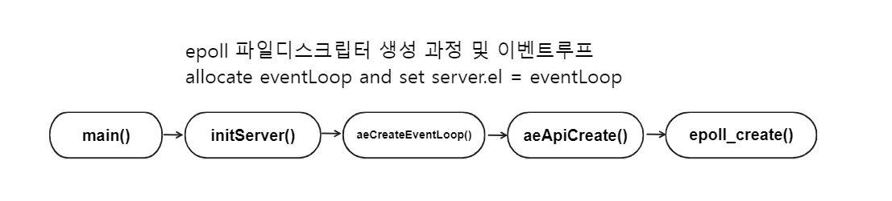

# Redis EventLoop Architecture

### 개론

`redis`의 공식문서를 보면 자기네들은 자체적인 `libev`등을 사용하지 않고 자체적인 이벤트루프를 구현해서 쓴다고한다. 

자체적인 이벤트루프란 무엇인가 어떻게 만들었을 까 궁금증이 생겨 소스코드를 다운받아 `gdb`의 콜스택추적 기능을 사용하여  분석을 시작하였다. 

아래내용은 `redis`가 데이터를 어떻게 처리하느냐보다 `redis`는 어떤식으로 네트워킹 모델을 만들었는가 이벤트루프를 구성하였는가에 초점을 맞춘 분석글이다. 

### 컴파일

소규모 소스코드의 경우 구조를 몇 번의 클릭만으로 파악할 수 있지만 `redis`의 경우 많은 소스코드 파일으 가지고 있어 분석에 어려움이 있다. 그렇기에 `gdb`의 `backtrace` 기능과 `watch point`를 사용해서 콜 스택을 추적하고 어떤식으로 진입점을 가지는지 어떤 함수에서 처리하는지 알 수 있다. 

그러기 위해서는 디버깅할 수 있게 컴파일을 진행하는 것이 우선이다. 

`redis`의 source코드를 다운받고 src 폴더로 들어가면 Makefile이 존재한다. Makefile내부에서 `noopt:` 부분이 존재하는데 이 부분에 `-g -ggdb` 옵션을 추가로넣고 저장한다. 

그리고 아래의 커맨드를 쉘에서 실행하여 컴파일을 진행한다. 

```bash
make noopt 
```

### 디버깅

`redis`의 문서([https://redis.io/docs/reference/internals/internals-rediseventlib/](https://redis.io/docs/reference/internals/internals-rediseventlib/))를 보면 이벤트루프의 구조로 `epoll API`를 사용하는 것을 알 수 있다. 이를 근거로 일반적으로 서버에서 `epoll api`를 사용해서 클라이언트의 입력을 처리하기 까지 아래의 절차를 거칠것으로 추측된다. 

1. `epoll_create`로 `epoll instance`를 만들고 파일디스크립터를 반환받을 것이다. 
2. `epoll_wait`로 알림받기 위해서는 등록할 서버의 `socket file descriptor`를 생성해야할것이다.  
3. `epoll_wait api`를 호출하여 알림을 대기할 것이다. 
4. 클라이언트의 입력을 받을려면 `read` 시스템콜을 호출할것이다.

### epoll_create

`epoll API`를 사용하기 위해서는 먼저 `epoll_create`함수를 통해 `epoll instance`를 만들고 `instance`에 대한 `file descriptor`을 반환받아야 한다. 그렇다면 `gdb`에 `epoll_create`함수에 `breakpoint`를 걸고 `run` 커맨드르 실행한다. 

```c
pwndbg> b *epoll_create
pwndbg> r
pwndbg> bt
#0  epoll_create () at ../sysdeps/unix/syscall-template.S:120
#1  0x00005555555da4c0 in aeApiCreate (eventLoop=0x7ffff782a140) at /home/tuuna/redis/src/ae_epoll.c:49
#2  0x00005555555daa53 in aeCreateEventLoop (setsize=10128) at ae.c:88
#3  0x00005555555e771e in initServer () at server.c:2624
#4  0x00005555555f4b23 in main (argc=1, argv=0x7fffffffdfa8) at server.c:7306
#7  0x00005555555d58a5 in _start ()
```

`bt` 커맨드를 통해 콜스택을 출력하였다.  `redis`는 `eventloop`를 구성하기위해 위의 함수를 순서대로 호출하는 것을 알 수 있다. 

이제 소스코드단에서 확인을 진행한다. 

```c
// server.c
// initServer() 
server.el = aeCreateEventLoop(server.maxclients+CONFIG_FDSET_INCR);
  if (server.el == NULL) {
      serverLog(LL_WARNING,
          "Failed creating the event loop. Error message: '%s'",
          strerror(errno));
      exit(1);
} 
```

```c
// ae.c 
// aeCreateEventLoop 
// call epoll_create()
aeEventLoop *eventLoop;
...
if ((eventLoop = zmalloc(sizeof(*eventLoop))) == NULL) goto err;
eventLoop->events = zmalloc(sizeof(aeFileEvent)*setsize);
eventLoop->fired = zmalloc(sizeof(aeFiredEvent)*setsize);
...
if (aeApiCreate(eventLoop) == -1) goto err;
/* Events with mask == AE_NONE are not set. So let's initialize the
 * vector with it. */
for (i = 0; i < setsize; i++)
    eventLoop->events[i].mask = AE_NONE;
return eventLoop;
```

```c
// ae_epoll.c 
// aeApiCreate() 
state->epfd = epoll_create(1024); /* 1024 is just a hint for the kernel */
if (state->epfd == -1) {
    zfree(state->events);
    zfree(state);
    return -1;
}
...
eventLoop->apidata = state;
```

핵심적인 부분은 `aeEventLoop *eventLoop` 선언하고 할당받으며 `epoll_create`로 받은 값을 설정 및 연결을 관리할 클라이언트의 목록(events), 순간적인 알림을 받아 처리할 목록(fired)를 초기화하고 `eventLoop`를 반환하여 전역변수로 선언된 `server.el`에 할당하는 것을 알 수 있다. 

그림으로 표현하자면 아래와 같다. 



### listen & bind & epoll_ctl

`epoll_create`로 `epoll instance`에 대한 `file descriptor`을 받았다면 이제 `server socket`을 만들고 `listen`하고 `bind`하고 `epoll_ctl api`를 통해 해당 `server socket fd` 를 등록해야 한다. 

`bind 함수`에 `breakpoint`를 걸고 콜스택을 확인해보자. 

```c
pwndbg> b *bind 
pwndbg> r
pwndbg> bt
#0  bind () at ../sysdeps/unix/syscall-template.S:120
#1  0x00005555555dc7b5 in anetListen (err=0x5555558a29f0 <server+1584> "", s=6, sa=0x555555ad1ba0, len=16, backlog=511) at anet.c:421
#2  0x00005555555dcaa5 in _anetTcpServer (err=0x5555558a29f0 <server+1584> "", port=6379, bindaddr=0x0, af=2, backlog=511) at anet.c:470
#3  0x00005555555dcb74 in anetTcpServer (err=0x5555558a29f0 <server+1584> "", port=6379, bindaddr=0x7ffff7820050 "*", backlog=511) at anet.c:488
#4  0x00005555555e6f4e in listenToPort (sfd=0x5555558a25a0 <server+480>) at server.c:2465
#5  0x00005555556f0148 in connSocketListen (listener=0x5555558a25a0 <server+480>) at socket.c:349
#6  0x00005555555e1a3a in connListen (listener=0x5555558a25a0 <server+480>) at /home/tuuna/redis/src/connection.h:432
#7  0x00005555555e81a1 in initListeners () at server.c:2813
#8  0x00005555555f4b85 in main (argc=1, argv=0x7fffffffdfa8) at server.c:7319
```

위의 콜스택을 기반으로 어떤 과정을 통해서 `socket`을 만들고 bind, listen까지 거치는지 그리고 해당 소켓을 기반으로 `epoll_ctl`과정을 거치는지 소스코드 기반으로 확인을 진행한다.

`main()`함수에서 `initServer()`함수를 통해 성공적으로 `eventLoop`를 초기화 되었다면 `initListeners()`함수를 호출하여 `server socker fd`를 생성하고 `bind`, `listen`, `epoll`에 등록 및 만들어진 소켓에 대해 클라이언트의 접속 요청이 왔을 때 `accept` 핸들러를 등록한다. 

먼저 주목해야 할 코드는 `listener`에 따른 핸들러들이 등록된 구조체를 `listener→ct`에 할당하는 것이다. 

```c
// server.c 
// initListeners()
connListener *listener;
if (server.port != 0) {
    conn_index = connectionIndexByType(CONN_TYPE_SOCKET);
    if (conn_index < 0)
        serverPanic("Failed finding connection listener of %s", CONN_TYPE_SOCKET);
    listener = &server.listeners[conn_index];
    listener->bindaddr = server.bindaddr;
    listener->bindaddr_count = server.bindaddr_count;
    listener->port = server.port;
    listener->ct = connectionByType(CONN_TYPE_SOCKET);
}
```

`connentionnByType()`함수를 통해 `ConnectionType`이라는 구조체를 `ct`에 할당되게 된다. `ConnectionType`   구조체는 상황에 맞게 핸들러를 호출 할 수 있도록 함수 포인터들을 모은 구조체이다. 

```c
// connection.c
ConnectionType *connectionByType(const char *typename) {
  ConnectionType *ct;
  for (int type = 0; type < CONN_TYPE_MAX; type++) {
      ct = connTypes[type];
      if (!ct)
          break;

      if (!strcasecmp(typename, ct->get_type(NULL)))
          return ct;
  }

  serverLog(LL_WARNING, "Missing implement of connection type %s", typename);

  return NULL;
}
```

```c
// socket.c 
static ConnectionType CT_Socket = {
...
    /* ae & accept & listen & error & address handler */
    .ae_handler = connSocketEventHandler,
    .accept_handler = connSocketAcceptHandler,
    .addr = connSocketAddr,
    .is_local = connSocketIsLocal,
    .listen = connSocketListen,

    /* create/shutdown/close connection */
    .conn_create = connCreateSocket,
    .conn_create_accepted = connCreateAcceptedSocket,
    .shutdown = connSocketShutdown,
    .close = connSocketClose,

    /* connect & accept */
    .connect = connSocketConnect,
    .blocking_connect = connSocketBlockingConnect,
    .accept = connSocketAccept,

    /* IO */
    .write = connSocketWrite,
    .read = connSocketRead,
    .set_write_handler = connSocketSetWriteHandler,
    .set_read_handler = connSocketSetReadHandler,
    .get_last_error = connSocketGetLastError,
};
```

```c
// server.c 
// initListeners()
if (connListen(listener) == C_ERR) {
    serverLog(LL_WARNING, "Failed listening on port %u (%s), aborting.", listener->port, listener->ct->get_type(NULL));
    exit(1);
}

// connection.h
/* Listen on an initialized listener */
static inline int connListen(connListener *listener) {
    return listener->ct->listen(listener);
}
```

그리고 `connListen`함수를 호출하여 인자로 이전에 세팅한 `listener`를 넘겨준다. 

`connListen`함수는 인자로 주어진 `listener`에 대해 listen 핸들러를 호출한다. 위에 언급한 `ConnectionType` 구조체의 listen 필드는 `connSocketListen` 함수로 등록되어 있다. 

즉, `connSocketListen()`함수를 호출하고 `listener`를 인자로 넘긴다. 

`connSocketListen()`함수는 내부적으로 `listenToPort()`함수를 호출한다. 

```c
static int connSocketListen(connListener *listener) {
    return listenToPort(listener);
}
```

`listenToPort()`함수에서 핵심적으로 봐야할 부분은 `tcp socket`을 만드는 함수와 해당 소켓을 `non blocking`으로 설정하는 함수이다. 

```c
// server.c 
// listenToPort()

if (strchr(addr,':')) {
    /* Bind IPv6 address. */
    sfd->fd[sfd->count] = anetTcp6Server(server.neterr,port,addr,server.tcp_backlog);
} else {
    /* Bind IPv4 address. */
    sfd->fd[sfd->count] = anetTcpServer(server.neterr,port,addr,server.tcp_backlog);
}

...
anetNonBlock(NULL,sfd->fd[sfd->count]);
```

먼저 `anetTcpServer`함수를 살펴보면 내부적으로 `_anetTcpServer`함수를 호출한다. 

```c
// anet.c 
int anetTcpServer(char *err, int port, char *bindaddr, int backlog)
{
    return _anetTcpServer(err, port, bindaddr, AF_INET, backlog);
}
```

`_anetTcpServer`함수는 내부적으로 `socket fd`를 생성하고 `anetListen`함수를 통해 `bind()`, `listen()`까지 진행한다. 그리고 만들어진 `socket`을 `return` 한다. 

```c
// anet.c 
// _anetTcpServer() 
...
for (p = servinfo; p != NULL; p = p->ai_next) {
    if ((s = socket(p->ai_family,p->ai_socktype,p->ai_protocol)) == -1)
        continue;

    if (af == AF_INET6 && anetV6Only(err,s) == ANET_ERR) goto error;
    if (anetSetReuseAddr(err,s) == ANET_ERR) goto error;
    if (anetListen(err,s,p->ai_addr,p->ai_addrlen,backlog) == ANET_ERR) s = ANET_ERR;
    goto end;
}
...
```

```c
// anet.c 
// anetListen()
static int anetListen(char *err, int s, struct sockaddr *sa, socklen_t len, int backlog) {
    if (bind(s,sa,len) == -1) {
        anetSetError(err, "bind: %s", strerror(errno));
        close(s);
        return ANET_ERR;
    }

    if (listen(s, backlog) == -1) {
        anetSetError(err, "listen: %s", strerror(errno));
        close(s);
        return ANET_ERR;
    }
    return ANET_OK;
}
```

그리고 마지막으로 `initListeners()`함수에서 클라이언트의 요청이 왔을 때 `listener→ct`에 등록한 `ConnectionType` 구조체의 `accept_handler` 함수 포인터를 호출 하도록 등록한다. 이 때 `accept_handler`에 등록된 함수는 `connSocketAcceptHandler()`함수 이다. 

```c
// server.c 
// initListeners() 
if (createSocketAcceptHandler(listener, connAcceptHandler(listener->ct)) != C_OK){
	serverPanic("Unrecoverable error creating %s listener accept handler.", listener->ct->get_type(NULL));
}
```

```c
// server.c 
// createSocketAcceptHandler() 
int createSocketAcceptHandler(connListener *sfd, aeFileProc *accept_handler) {
    int j;

    for (j = 0; j < sfd->count; j++) {
        if (aeCreateFileEvent(server.el, sfd->fd[j], AE_READABLE, accept_handler,sfd) == AE_ERR) {
            /* Rollback */
            for (j = j-1; j >= 0; j--) aeDeleteFileEvent(server.el, sfd->fd[j], AE_READABLE);
            return C_ERR;
        }
    }
    return C_OK;
}
```

`createSocketAcceptHandler()`함수는 내부적으로 `aeCreateFileEvent`함수를 호출하여 추후 `epoll_wait api`를 통해서 `server socket fd`  `EPOLLIN` 알림받았을 때(즉, 커넥션 요청이 왔을 때) `read`를 호출해야 하는데 이 때 `read`를 호출할 때 `accept_handler`를 호출하도록 등록한다. 

```c
// ae.c 
int aeCreateFileEvent(aeEventLoop *eventLoop, int fd, int mask,
        aeFileProc *proc, void *clientData)
{
    if (fd >= eventLoop->setsize) {
        errno = ERANGE;
        return AE_ERR;
    }
    aeFileEvent *fe = &eventLoop->events[fd];

    if (aeApiAddEvent(eventLoop, fd, mask) == -1)
        return AE_ERR;
    fe->mask |= mask;
    if (mask & AE_READABLE) fe->rfileProc = proc;
    if (mask & AE_WRITABLE) fe->wfileProc = proc;
    fe->clientData = clientData;
    if (fd > eventLoop->maxfd)
        eventLoop->maxfd = fd;
    return AE_OK;
}
```

위에서 보는거처럼 `mask`값이 어떻게 세팅되어있냐에 따라 `rfileProc`에 설정할지 `wfileProc`에 설정할지 알 수 있다. 

이 부분이 추후 설명할 `epoll_wait` 함수를 통해 반한된 `FILE DESCRIPTOR`들이 어떠한 알림(`EPOLLIN`, `EPOLLOUT`)인지 확인하고 그에 맞는 `rfileProc`, `wfileProc` 함수 포인터를 호출한다. 

아직 내용을 적진 않았지만 알림받은 파일디스크립터가 `server fd`라면 등록된 `accept_handler` 즉, `connSocketAcceptHandler`함수이다. `client fd`의 경우 `readQueryFromClient`함수이다. 

```c
// ae_epoll.c 
static int aeApiAddEvent(aeEventLoop *eventLoop, int fd, int mask) {
    aeApiState *state = eventLoop->apidata;
    struct epoll_event ee = {0}; /* avoid valgrind warning */
    /* If the fd was already monitored for some event, we need a MOD
     * operation. Otherwise we need an ADD operation. */
    int op = eventLoop->events[fd].mask == AE_NONE ?
            EPOLL_CTL_ADD : EPOLL_CTL_MOD;

    ee.events = 0;
    mask |= eventLoop->events[fd].mask; /* Merge old events */
    if (mask & AE_READABLE) ee.events |= EPOLLIN;
    if (mask & AE_WRITABLE) ee.events |= EPOLLOUT;
    ee.data.fd = fd;
    if (epoll_ctl(state->epfd,op,fd,&ee) == -1) return -1;
    return 0;
}
```

그리고 `aeApiAddEvent`함수를 호출하여 이전에 만든 `server socket fd`를 `epoll_ctl`를 통해 등록한다. 

여기서 알 수 있는 점이 `Edge Trigger`를 사용하는 `Nginx`와 다르게 `Redis`는 `EPOLLET` 플래그를 안 넣는것으로 보아 `Level-Trigger`형식을 사용하는것을 알 수 있다. 

또한 인자로 주어진 `fd`를 `eventsLoop→events[fd]`로 등록하는 것을 알 수 있다. 

여기까지 `socket fd`를 만들고 `bind`, `listen`하고 `accept_handler`등록하고 `epoll_ctl`을 통해 등록하는 과정이다. 과정을 그림으로 표현하면 아래와 같다. 


### epoll_wait

지금까지 `server socket fd`를 생성하고 `epoll`에 등록하는 절차, `eventLoop`를 초기화하는 절차를 살펴보았다. 

이번에는 `redis`가 어떻게 이벤트루프 처리하는지 알아보는 과정을 가질 것이다. 

`epoll api`를 사용한다면 이벤트루프의 처리를 `epoll_wait`에서 처리를 진행한다.  `epoll_wait`에 `breakpoint`를 걸고 `run`한다. 

```c
pwndbg> b *epoll_wait
pwndbg> r
pwndbg> bt
#0  epoll_wait (epfd=5, events=0x7ffff78fd000, maxevents=10128, timeout=0) at ../sysdeps/unix/sysv/linux/epoll_wait.c:28
#1  0x00005555555da81c in aeApiPoll (eventLoop=0x7ffff782a140, tvp=0x7fffffffddb0) at /home/tuuna/redis/src/ae_epoll.c:114
#2  0x00005555555db465 in aeProcessEvents (eventLoop=0x7ffff782a140, flags=27) at ae.c:403
#3  0x00005555555db77d in aeMain (eventLoop=0x7ffff782a140) at ae.c:501
#4  0x00005555555f4d6a in main (argc=1, argv=0x7fffffffdfa8) at server.c:7365
```

`main`함수에서 `aeMain`함수를 호출고 인자로 `server.el` 즉, 이전에 초기화한 `eventLoop`를 넘겨준다. 

```c
// server.c 
// main()
...
aeMain(server.el);
...
```

`aeMain`함수는 `while` 반복문을 통해서 `aeProcessEvents`함수를 지속적으로 호출한다. 

```c
// ae.c 
void aeMain(aeEventLoop *eventLoop) {
    eventLoop->stop = 0;
    while (!eventLoop->stop) {
        aeProcessEvents(eventLoop, AE_ALL_EVENTS|
                                   AE_CALL_BEFORE_SLEEP|
                                   AE_CALL_AFTER_SLEEP);
    }
}
```

`aeProcessEvents`함수 내부로 들어가면 큰 구조를 이루고 있기에 앞서 보인 콜스택에 따라 `aeApiPoll` 함수를 호출하는 구간을 확인하자 

```c
// ae.c 
// aeProcessEvents 
...
/* Call the multiplexing API, will return only on timeout or when
 * some event fires. */
numevents = aeApiPoll(eventLoop, tvp);
...
```

`aeApiPoll`함수는 내부적으로 `epoll_wait api`를 호출하여 등록한 이벤트 알림이 있기를 대기한다.

아래 타이머 설정을 통해 무한정 알림이 있기까지 대기하는 것이 아닌 설정한 시간만큼 `wake`, `sleep`을 반복한다. 

```c
// ae_epoll.c 
static int aeApiPoll(aeEventLoop *eventLoop, struct timeval *tvp) {
    aeApiState *state = eventLoop->apidata;
    int retval, numevents = 0;

    retval = epoll_wait(state->epfd,state->events,eventLoop->setsize,
            tvp ? (tvp->tv_sec*1000 + (tvp->tv_usec + 999)/1000) : -1);
    
    if (retval > 0) {
        int j;

        numevents = retval;
        for (j = 0; j < numevents; j++) {
            int mask = 0;
            struct epoll_event *e = state->events+j;

            if (e->events & EPOLLIN){
                mask |= AE_READABLE;
            };
            if (e->events & EPOLLOUT){
                mask |= AE_WRITABLE;
            };
            if (e->events & EPOLLERR){
                mask |= AE_WRITABLE|AE_READABLE;
            };
            if (e->events & EPOLLHUP){
                mask |= AE_WRITABLE|AE_READABLE;
            };
            eventLoop->fired[j].fd = e->data.fd;
            eventLoop->fired[j].mask = mask;
        }
    } else if (retval == -1 && errno != EINTR) {
        panic("aeApiPoll: epoll_wait, %s", strerror(errno));
    }

    return numevents;
}
```

`epoll_wait api`가 반환하여 알림받은 디스크립터의 수를 `retval`에 값을 저장하고 `retval`이 `1` 이상이라면 이벤트가 발생한 디스크립터를 조사한다.  해당 이벤트가 `EPOLLIN`인지 `EPOLLOUT`인지 검사하고 이를 `if - else if` 구조가 아닌 `if - if` 구조를 통해서 검사한다. 이는 한번에 `EPOLLIN`과 `EPOLLOUT`이 발생할 수 있기 때문이다.  

그리고 이벤트가 감지된 파일디스크립터를 `eventLoop→fired[j]`에 넣고 `retval`을 `return`한다. 

다시 `aeProcessEvents`함수로 돌아와서 `return` 받은 `retva`과 `eventLoop→fired`를 통해서 `EPOLLIN`인지 `EPOLLOUT`인지 설정한 `mask`를 통해서 정해진 `handler`를 호출한다. 

```c
// ae.c 
// aeProcessEvents() 
...
for (j = 0; j < numevents; j++) {
    int fd = eventLoop->fired[j].fd;
    aeFileEvent *fe = &eventLoop->events[fd];
    int mask = eventLoop->fired[j].mask;
    int fired = 0; /* Number of events fired for current fd. */
...
    int invert = fe->mask & AE_BARRIER;
...
    if (!invert && fe->mask & mask & AE_READABLE) {
        fe->rfileProc(eventLoop,fd,fe->clientData,mask);
        fired++;
        fe = &eventLoop->events[fd]; /* Refresh in case of resize. */
    }

    /* Fire the writable event. */
    if (fe->mask & mask & AE_WRITABLE) {
        if (!fired || fe->wfileProc != fe->rfileProc) {
            fe->wfileProc(eventLoop,fd,fe->clientData,mask);
            fired++;
        }
    }
...
    processed++;
}
...
```

`for`문을 통해 `fired`에 등록된 `fd`를 처리한다. 여기서 재밋는 점은 `write handler`보다 `read handler`를 우선적으로 처리한다는 것이다. 이는 `read`한 즉시 `write`할 시 쿼리를 즉시 처리할 수 있으므로 유용하다. 

가장 처음 클라이언트가 서버에 `connect`한다면 `server socket fd`가 가장 먼저 이벤트 알림을 받을 것이고 `connect`한다는 것은 `EPOLLIN mask`가 설정된다는 것이다. 

즉, `server socker fd`의 `rfileProc` 핸들러가 호출될것이다. 

이는 이전에 `rfileProc`핸들러에 `connSocketAcceptHandler`함수를 등록하는 것을 확인했으며 `client`가 접속하게 된다면 해당 함수를 호출하게 될것이다. 확`인을 위해 `accept4()`함수에 `breakpoint`를 걸고 다른 터머널에서 `redis-cli` 커맨드를 실행하고 `call stack`을 확인해본다. 

```c
pwndbg> b *accept4
pwndbg> r
pwndbg> bt
#0  accept4 (fd=6, addr=..., addr_len=0x7fffffffdc28, flags=526336) at ../sysdeps/unix/sysv/linux/accept4.c:29
#1  0x00005555555dcd43 in anetGenericAccept (err=0x5555558a29f0 <server+1584> "", s=6, sa=0x7fffffffdc40, len=0x7fffffffdc28) at anet.c:526
#2  0x00005555555dce03 in anetTcpAccept (err=0x5555558a29f0 <server+1584> "", serversock=6, ip=0x7fffffffdd10 "P\335\377\377\377\177", ip_len=46, port=0x7fffffffdd04) at anet.c:555
#3  0x00005555556eff04 in connSocketAcceptHandler (el=0x7ffff782a140, fd=6, privdata=0x5555558a25a0 <server+480>, mask=1) at socket.c:319
#4  0x00005555555db541 in aeProcessEvents (eventLoop=0x7ffff782a140, flags=27) at ae.c:441
#5  0x00005555555db77d in aeMain (eventLoop=0x7ffff782a140) at ae.c:501
#6  0x00005555555f4d6a in main (argc=1, argv=0x7fffffffdfa8) at server.c:7365
```

앞서 언급한 `connSocketAcceptHandler`함수가 호출되는 것을 파악했었다. 

또한 `gdb`의 `single step`으로 `fe→rfileProc`에 어떤 함수가 등록되어있는지 확인가능하다 아래는 `gdb`의 결과이다.

```c
────────────────────────────────────────────────────────────────────────────────────────────────[ SOURCE (CODE) ]────────────────────────────────────────────────────────────────────────────────────────────────
In file: /home/tuuna/redis/src/ae.c
   412
   413         for (j = 0; j < numevents; j++) {
   414             int fd = eventLoop->fired[j].fd;
   415             aeFileEvent *fe = &eventLoop->events[fd];
   416             int mask = eventLoop->fired[j].mask;
 ► 417             int fired = 0; /* Number of events fired for current fd. */
   418
   419             /* Normally we execute the readable event first, and the writable
   420              * event later. This is useful as sometimes we may be able
   421              * to serve the reply of a query immediately after processing the
   422              * query. */
──────────────────────────────────────────────────────────────────────────────────────────────────[ BACKTRACE ]──────────────────────────────────────────────────────────────────────────────────────────────────
 ► 0   0x5555555db4c6 aeProcessEvents+463
   1   0x5555555db77d aeMain+46
   2   0x5555555f4d6a main+3352
─────────────────────────────────────────────────────────────────────────────────────────────────────────────────────────────────────────────────────────────────────────────────────────────────────────────────
pwndbg> p *fe
$5 = {
  mask = 1,
  rfileProc = 0x5555556efeab <connSocketAcceptHandler>,
  wfileProc = 0x0,
  clientData = 0x5555558a25a0 <server+480>
}
```

`rfileProc` 함수포인터를 호출하는 시점에 `fe`를 `print`해보면 어떤식으로 구조체가 할당되어있는지 확인이 가능하다. 

```c
// socket.c 
static void connSocketAcceptHandler(aeEventLoop *el, int fd, void *privdata, int mask) {
    int cport, cfd, max = MAX_ACCEPTS_PER_CALL;
    char cip[NET_IP_STR_LEN];
    UNUSED(el);
    UNUSED(mask);
    UNUSED(privdata);

    while(max--) {
        cfd = anetTcpAccept(server.neterr, fd, cip, sizeof(cip), &cport);
        if (cfd == ANET_ERR) {
            if (errno != EWOULDBLOCK)
                serverLog(LL_WARNING,
                    "Accepting client connection: %s", server.neterr);
            return;
        }
        serverLog(LL_VERBOSE,"Accepted %s:%d", cip, cport);
        acceptCommonHandler(connCreateAcceptedSocket(cfd, NULL),0,cip);
    }
}
```

```c
// anet.c 
// anetTcpAccept()
if ((fd = anetGenericAccept(err,serversock,(struct sockaddr*)&sa,&salen)) == ANET_ERR)
        return ANET_ERR;
```

```c
// anet.c 
// anetGenericAccept()
fd = accept4(s, sa, len,  SOCK_NONBLOCK | SOCK_CLOEXEC);
```

`connSocketAcceptHandler`함수는 내부적으로 `anetTcpAccept`함수를 호출하며 `anetTcpAccept`함수는 `anetGenericAccept`함수를 호출하여 `accept4()`함수를 호출한다. 이 때 `accept4`함수는 `NON-BLOCKING`을 추가 함수 없이 바로 설정을 가능하게 해준다. 그리고 `accept4()`함수를 통해 얻은 `client fd`를 반환한다. 

`connSocketAcceptHandler`함수 내부를 좀 더 보면 `accept`을 통해 얻은 `cfd`를 반환받고 이를 기반으로 각 종 클라이언트 핸들러 및 `epoll_ctl`를 통한 관찰대상으로 등록하는 과정을 거친다. 

```c
// socket.c 
// connSocketAcceptHandler()
...
acceptCommonHandler(connCreateAcceptedSocket(cfd, NULL),0,cip);
...
```

`connCreateAcceptedSocket`함수를 통해 `connection` 구조체를 만들고 `cfd`를 설정한다. 

```c
// socket.c 
static connection *connCreateAcceptedSocket(int fd, void *priv) {
    UNUSED(priv);
    connection *conn = connCreateSocket();
    conn->fd = fd;
    conn->state = CONN_STATE_ACCEPTING;
    return conn;
}
```

`connCreateSocket`함수는 앞서 언급한 각종 핸들러들이 등록된 `CT_socket`의 주소값을 참조하게 하고 할당하는 기능을 지닌다. 

```c
// socket.c 
static connection *connCreateSocket(void) {
    connection *conn = zcalloc(sizeof(connection));
    conn->type = &CT_Socket;
    conn->fd = -1;
    conn->iovcnt = IOV_MAX;

    return conn;
}
```

반환된 `connection` 구조체를 `acceptCommonHandler`함수의 인자로 주어로 주어진다. 해당 함수는 내부적으로 `createClient`함수를 호출하여 클라로부터 데이터를 받았을 때 처리할 수 있게하는 `read` 핸들러 함수를 등록하고 `client`의 데이터를 저장 및 처리하는 `client` 구조체를 설정한다. 

```c
// networking.c 
// acceptCommonHandler()
/* Create connection and client */
if ((c = createClient(conn)) == NULL) {
    char addr[NET_ADDR_STR_LEN] = {0};
    char laddr[NET_ADDR_STR_LEN] = {0};
    connFormatAddr(conn, addr, sizeof(addr), 1);
    connFormatAddr(conn, laddr, sizeof(addr), 0);
    serverLog(LL_WARNING,
              "Error registering fd event for the new client connection: %s (addr=%s laddr=%s)",
              connGetLastError(conn), addr, laddr);
    connClose(conn); /* May be already closed, just ignore errors */
    return;
}
```

```c
// networking.c 
// createClient() 
...
client *c = zmalloc(sizeof(client));
...
if (conn) {
    connEnableTcpNoDelay(conn);
    if (server.tcpkeepalive)
        connKeepAlive(conn,server.tcpkeepalive);
    connSetReadHandler(conn, readQueryFromClient);
    connSetPrivateData(conn, c);
}
...
c->conn = conn;
c->name = NULL;
c->bufpos = 0;
c->buf_peak = c->buf_usable_size;
c->qb_pos = 0;
c->querybuf = sdsempty();
...
```

`createClient`함수내부에서는 `client`구조체를 할당 및 초기화를 진행하고 `connSetReadHandler`함수를 통해  클라이언트의 입력을 처리할 핸들러를 등록한다 이때 등록하는 핸들러는 `readQueryFromClient`함수이다. 

```c
// connection.h
/* Register a read handler, to be called when the connection is readable.
 * If NULL, the existing handler is removed.
 */
static inline int connSetReadHandler(connection *conn, ConnectionCallbackFunc func) {
    return conn->type->set_read_handler(conn, func);
}
```

`set_read_handler`함수는 함수 포인터 형식으로 되어있는데 이는 이전에 언급한 `Connection` 구조체의 `CT_Socket`이다. 좀 더 자세히 살펴보자. 

```c
// socket.c 
// CT_Socket
.set_read_handler = connSocketSetReadHandler,
```

```c
// socket.c 
/* Register a read handler, to be called when the connection is readable.
 * If NULL, the existing handler is removed.
 */
static int connSocketSetReadHandler(connection *conn, ConnectionCallbackFunc func) {
    if (func == conn->read_handler) return C_OK;

    conn->read_handler = func;
    if (!conn->read_handler)
        aeDeleteFileEvent(server.el,conn->fd,AE_READABLE);
    else
        if (aeCreateFileEvent(server.el,conn->fd,
                    AE_READABLE,conn->type->ae_handler,conn) == AE_ERR) return C_ERR;
    return C_OK;
}
```

`conn` 구조체의 `read_handler`로 `readQueryFromClient`함수를 등록하고  `aeCreateFileEvent`함수를 통해 `fd`를등록하는데 `EPOLLIN mask`가 `setup`될 때 `ae_handler`함수를 호출 할 수 있게 한다. 

`ae_handler`함수는 `socket.c`파일에 `CT_Socket`에 정의되어 있다. 

```c
// socket.c 
static ConnectionType CT_Socket = {
  /* ae & accept & listen & error & address handler */
  .ae_handler = connSocketEventHandler,
}
```

`connSocketEventHandler`는 셋업된 `flag`가 `EPOLLIN인`지 `EPOLLOUT`인지 따라서 `read_handler`를 호출할 것인지 `write_handler`를 호출할것인지 결정해주는 함수이다. 

`ae_handler`함수 등록은 `aeCreateFileEvent`를 통해서 `epoll_ctl`함수를 내부적으로 호출하여 등록하는데 이는 앞서 설명한것과 같기때문에 내용은 생략이다.

여기까지 내용이 `epoll_wait api`를 통해 관심받은 `fd`가 `server socket fd`일 때이다. 

`client fd`일 때는 또 내용이 길어지기 때문에 여기까지 함수의 호출 루틴을 그림으로 표현하고 다음으로 넘어갈 예정이다. 


그럼 이제 알림받은 파일 디스크립터가 `server socket fd`가 아닌 `client socket fd`일 때를 가정한다. 그렇다면 `aeProcessEvent`함수에서 `EPOLLIN mask`가 되어있다면 `rfileProc`함수 포인터를 호출한다. 이전에 `connSocketEventHandler`함수로 등록했던것이다. 

```c
// socket.c 
// connSocketEventHandler()
/* Handle normal I/O flows */
if (!invert && call_read) {
    if (!callHandler(conn, conn->read_handler)) return;
}
/* Fire the writable event. */
if (call_write) {
    if (!callHandler(conn, conn->write_handler)) return;
}
/* If we have to invert the call, fire the readable event now
 * after the writable one. */
if (invert && call_read) {
    if (!callHandler(conn, conn->read_handler)) return;
}
```

이때 이전에 `read_handler`는 `readQueryFromClient`함수로 등록했었었다. 

즉, 클라이언트의 데이터 입력처리가 오면 `readQueryFromClient`함수를 호출한다. 

```c
// networking.c 
void readQueryFromClient(connection *conn) {
...
readlen = PROTO_IOBUF_LEN;
...
nread = connRead(c->conn, c->querybuf+qblen, readlen);
...
if (processInputBuffer(c) == C_ERR)
...
}
```

`readQueryFromClient`함수는 지정된 길이(`readlen`)만큼 `connRead`함수를 호출하여 클라이언트의 입력을 읽어들이고 `processInputBuffer`함수의 인자로 넣어 클라이언트의 입력을 처리한다. 

```c
// connection.h
static inline int connRead(connection *conn, void *buf, size_t buf_len) {
    int ret = conn->type->read(conn, buf, buf_len);
    return ret;
}
```

여기서 재밋는점이 `read`함수는 `blocking`이 아닌 `non-blocking`으로 되어있고 딱 한번만 호출한다. 만약 데이터읽기를 실패한다면 어떻게 할것인가 

이는 추후 설명할 함수에서 클라이언트의 입력을 덜 받았을 때 해당 명령어를 실행하지 않고 클라이언트의 입력을 다 받았을 때만 커맨더를 처리하는 로직을 가진다. 

즉, 아직 읽을 데이터가 남아있다면 `Level-Trigger`의 특징상 알림이 다시 발생하게 되고 해당 디스크립터에 대해 다시 `read`를 진행하게 된다. 

즉, 이때 완전한 커맨드가 완성되고 명령어를 올바르게 수행할 수 있게 된다. 

```c
int processInputBuffer(client *c) {
...
	if (c->reqtype == PROTO_REQ_INLINE) {
	    if (processInlineBuffer(c) != C_OK) break;
	} else if (c->reqtype == PROTO_REQ_MULTIBULK) {
	    if (processMultibulkBuffer(c) != C_OK) break;
	} else {
	    serverPanic("Unknown request type");
	}
	...
	/* We are finally ready to execute the command. */
	if (processCommandAndResetClient(c) == C_ERR) {
	    /* If the client is no longer valid, we avoid exiting this
	     * loop and trimming the client buffer later. So we return
	     * ASAP in that case. */
	    return C_ERR;
	}
}
```

클라이언트가 보낸 데이터는 `INLINE`인가 `MULTIBULK`인가에 따라서 `processInlineBuffer`함수를 호출하느냐 `processMultibulkBuffer`함수를 호출하느냐에 달라진다. 해당 함수를 통해서 입력을 가공한다음 `processCommandAndResetClient`함수를 호출하여 커맨더를 실행한다. 

만일 클라이언트의 입력이 덜 들어왔다면 `processMultibulkBuffe`함수에서 `C_ERR`를 반환하여 `processCommandAndResetClient`함수를 호출하지 않도록 한다. 그리고 추후 입력을 다시 받아서 완전하게 되었을 때 `C_OK`를 반환하여 `processCommandAndResetClient`함수를 호출하여 커맨드를 처리한다. 

지금까지 클라이언트의 요청 처리 장면이다. 그림으로 표현하면 오른쪽 부분이 추가된 부분이다. 


### 전체적인 프로세스

전체적인 이벤트루프의 구조는 아래와 같다. 

