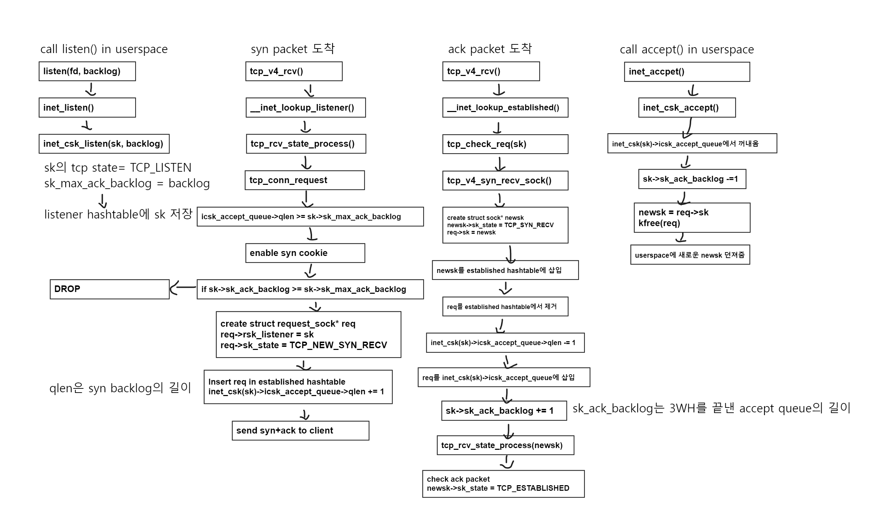

# How 3 Way HandShake in Linux Kernel

### 개론

`TCP`의 `3 Ways HandShake`의 과정은 간단하다. 클라이언트가 `syn`을 보내고 서버가 `syn+ack`를 보내고 클라이언트는 `ack`를 보내면서 `3WH`가 끝맺게 된다.
그리고 인터넷에 흔히 볼 수 있는 `syn`을 패킷의 클라이언트를 저장되는 `syn backlog`, `ack`패킷을 수락한 클라이언트가 저장되는 `accept backlog`들이 있다는 것을 알고 있다.
과연 `TCP`가 구현된 리눅스 커널에서도 위처럼 간단하게 진행될까라는 의구심에 분석을 진행했다.
해당 분석은 `Fastopen`, 동시개방, 능동개방, 재전송, `Syn Cookie`등의 기술들은 분석하지 않고 패스했으며 오직 `TCP 3 Way HandShake`의 과정만 분석을 진행했다.

또한, 본 `linux kernel source code`는 `6.4.3` 버전을 기준으로 풀어나갑니다. 

### 컴파일

또한 이 문서를 읽는 과정에서 정말 해당 부분이 맞을까라는 의문이 들 수 있다. 그렇기에 직접 컴파일하여 `printk`함수로 로직을 확인해보시길 바랍니다. 

```bash
# 최초 설치의 경우

apt update
apt upgrade
wget https://cdn.kernel.org/pub/linux/kernel/v6.x/linux-6.4.3.tar.xz
tar xvf linux-6.4.3.tar.xz
apt install build-essential dwarves python3 libncurses-dev flex bison libssl-dev bc libelf-dev zstd gnupg2 wget -y
cd linux-6.4.3
cp -v /boot/config-$(uname -r) .config
make menuconfig
scripts/config --disable SYSTEM_REVOCATION_KEYS
make localmodconfig
make bzImage
make modules
make modules_install
make install
update-grub
reboot 
uname -a
```

```bash
# 최초 설치 이후 소스코드 수정 컴파일 
make bzImage
make modules
make modules_install
make install
update-grub
reboot 
uname -a
```

### INIT TCP_LISTEN

소켓을 생성하고 IP와 Port에 바인딩하여 외부로 노출시키기 위해서는 아래 3가지의 함수를 필요로 한다. `socket(2)`, `bind(2)`, `listen(2).` 

여기서 `socket`함수와 bind함수의 과정은 생략하고 listen함수를 살펴보자. `user application`단에서 `listen`함수를 호출하면 `__sys_listen`함수를 호출한다. 

```c
// net/socket.c

SYSCALL_DEFINE2(listen, int, fd, int, backlog)
{
	return __sys_listen(fd, backlog);
}
```

`__sys_listen`함수는 아래와 같이 구현되어있다. 

```c
// net/socket.c 

int __sys_listen(int fd, int backlog)
{
	struct socket *sock;
	int err, fput_needed;
	int somaxconn;

	sock = sockfd_lookup_light(fd, &err, &fput_needed);
	if (sock) {
		somaxconn = READ_ONCE(sock_net(sock->sk)->core.sysctl_somaxconn);
		if ((unsigned int)backlog > somaxconn)
			backlog = somaxconn;

		err = security_socket_listen(sock, backlog);
		if (!err)
			err = sock->ops->listen(sock, backlog);

		fput_light(sock->file, fput_needed);
	}
	return err;
}
```

인자로 주어진 `fd`를 통해 그에 맞는 `struct sock*` 타입의 `sock`을 찾아낸다. 그리고 인자로 주어진 `backlog`값이 올바른값인지 확인하고 `security_socket_listen`함수를 호출하여 `permission`을 확인한다 만약 `0`이 `return`된다면 허용된 권한임을 나타낸다. 

그리고 `sock→ops→listen` 함수포인터를 호출한다. 이때 `sock→ops`는 `proto_ops`구조체이며 `ops` 필드에 할당된 값은 아래와 같다. 

```c
// net/ipv4/af_inet.c
const struct proto_ops inet_stream_ops = {
	.family		   = PF_INET,
	.owner		   = THIS_MODULE,
	.release	   = inet_release,
	.bind		   = inet_bind,
	.connect	   = inet_stream_connect,
	.socketpair	   = sock_no_socketpair,
	.accept		   = inet_accept,
	.getname	   = inet_getname,
	.poll		   = tcp_poll,
	.ioctl		   = inet_ioctl,
	.gettstamp	   = sock_gettstamp,
	.listen		   = inet_listen,
	.shutdown	   = inet_shutdown,
	.setsockopt	   = sock_common_setsockopt,
	.getsockopt	   = sock_common_getsockopt,
	.sendmsg	   = inet_sendmsg,
	.recvmsg	   = inet_recvmsg,
#ifdef CONFIG_MMU
	.mmap		   = tcp_mmap,
#endif
	.sendpage	   = inet_sendpage,
	.splice_read	   = tcp_splice_read,
	.read_sock	   = tcp_read_sock,
	.read_skb	   = tcp_read_skb,
	.sendmsg_locked    = tcp_sendmsg_locked,
	.sendpage_locked   = tcp_sendpage_locked,
	.peek_len	   = tcp_peek_len,
#ifdef CONFIG_COMPAT
	.compat_ioctl	   = inet_compat_ioctl,
#endif
	.set_rcvlowat	   = tcp_set_rcvlowat,
};
EXPORT_SYMBOL(inet_stream_ops);
```

`listen`함수포인터는 `inet_listen`함수를 호출하는것과 같다. 

이제부터 코드를 보면서 가장 중요한것은 코드를 보면 알겠지만 `struct socket*`과 `struct sock*`을 같이 쓰는 경우라면 `socket`은 `sock`으로 `sock`은 `sk`로 표현하는 경우가 많다. 주의깊게 봐야한다. 

```c
/*
 *	Move a socket into listening state.
 */
int inet_listen(struct socket *sock, int backlog)
{
	struct sock *sk = sock->sk;
	unsigned char old_state;
	int err, tcp_fastopen;

	lock_sock(sk);

	err = -EINVAL;
	if (sock->state != SS_UNCONNECTED || sock->type != SOCK_STREAM)
		goto out;

	old_state = sk->sk_state;
	if (!((1 << old_state) & (TCPF_CLOSE | TCPF_LISTEN)))
		goto out;

	WRITE_ONCE(sk->sk_max_ack_backlog, backlog);
	/* Really, if the socket is already in listen state
	 * we can only allow the backlog to be adjusted.
	 */
	if (old_state != TCP_LISTEN) {
...
		err = inet_csk_listen_start(sk);
		if (err)
			goto out;
...
	}
	err = 0;

out:
	release_sock(sk);
	return err;
}
EXPORT_SYMBOL(inet_listen);
```

주석에 적힌것처럼 `inet_listen`함수의 큰 목적은 `sock`의 `TCP` 상태를 `LISTEN` 상태로 변경하는 것이고 `listener hash table`에 넣는것이다. 

```c
if (sock->state != SS_UNCONNECTED || sock->type != SOCK_STREAM)
		goto out;
```

`socket`의 상태가 이미 `CONNECT`된 상태인지 `socket`의 타입이 `SOCK_STREAM`유형의 `TCP`인지 확인한다. 

```c
old_state = sk->sk_state;
	if (!((1 << old_state) & (TCPF_CLOSE | TCPF_LISTEN)))
		goto out;

	WRITE_ONCE(sk->sk_max_ack_backlog, backlog);
```

`old_state`변수에 `sk`의 `tcp state`를 넣는다. 그리고 `CLOSE`나 `LISTEN`상태인지 확인한다. 

해당 상태가 맞다면 인자로 주어진 `backlog`값을 설정한다. 

즉, 인자로 주어진 `backlog`값을 `sk→sk_max_ack_backlog`에 값을 쓴다.

```c
	if (old_state != TCP_LISTEN) {
...
		err = inet_csk_listen_start(sk);
		if (err)
			goto out;
...
	}
```

`old_state`의 값이 `TCP_LISTEN`인지 확인하고 `TCP_LISTEN`상태가 아니라면 `inet_csk_listen_start`함수를 호출한다. 만약 `TCP_LISTEN`상태라면 `inet_listen`함수는 `backlog`값만 설정한다. 

```c
// net/ipv4/inet_connection_sock.c 

int inet_csk_listen_start(struct sock *sk)
{
	struct inet_connection_sock *icsk = inet_csk(sk);
	struct inet_sock *inet = inet_sk(sk);
	int err;
...
	sk->sk_ack_backlog = 0;
	inet_csk_delack_init(sk);

	/* There is race window here: we announce ourselves listening,
	 * but this transition is still not validated by get_port().
	 * It is OK, because this socket enters to hash table only
	 * after validation is complete.
	 */
	inet_sk_state_store(sk, TCP_LISTEN);
	err = sk->sk_prot->get_port(sk, inet->inet_num);
	if (!err) {
		inet->inet_sport = htons(inet->inet_num);

		sk_dst_reset(sk);
		err = sk->sk_prot->hash(sk);

		if (likely(!err))
			return 0;
	}

	inet_sk_set_state(sk, TCP_CLOSE);
	return err;
}
```

`inet_csk_listen_start`함수는 `struct sock*` 타입의 `sk`의 `tcp` 상태를 `TCP_LISTEN`으로 설정한다. 

그리고 `hash` 함수포인터 즉, `inet_hash`함수를 호출하여 `listener hash table`에 `sk`를 집어넣는다. 

이때 `hash`함수포인터와 `get_port`함수 포인터를 담고있는 구조체는 아래와 같이 정의되어있다. 

```c
// net/ipv4/tcp_ipv4.c

struct proto tcp_prot = {
	.name			= "TCP",
	.owner			= THIS_MODULE,
	.close			= tcp_close,
	.pre_connect		= tcp_v4_pre_connect,
	.connect		= tcp_v4_connect,
	.disconnect		= tcp_disconnect,
	.accept			= inet_csk_accept,
	.ioctl			= tcp_ioctl,
	.init			= tcp_v4_init_sock,
	.destroy		= tcp_v4_destroy_sock,
	.shutdown		= tcp_shutdown,
	.setsockopt		= tcp_setsockopt,
	.getsockopt		= tcp_getsockopt,
	.bpf_bypass_getsockopt	= tcp_bpf_bypass_getsockopt,
	.keepalive		= tcp_set_keepalive,
	.recvmsg		= tcp_recvmsg,
	.sendmsg		= tcp_sendmsg,
	.sendpage		= tcp_sendpage,
	.backlog_rcv		= tcp_v4_do_rcv,
	.release_cb		= tcp_release_cb,
	.hash			= inet_hash,
	.unhash			= inet_unhash,
	.get_port		= inet_csk_get_port,
	.put_port		= inet_put_port,
#ifdef CONFIG_BPF_SYSCALL
	.psock_update_sk_prot	= tcp_bpf_update_proto,
#endif
	.enter_memory_pressure	= tcp_enter_memory_pressure,
	.leave_memory_pressure	= tcp_leave_memory_pressure,
	.stream_memory_free	= tcp_stream_memory_free,
	.sockets_allocated	= &tcp_sockets_allocated,
	.orphan_count		= &tcp_orphan_count,

	.memory_allocated	= &tcp_memory_allocated,
	.per_cpu_fw_alloc	= &tcp_memory_per_cpu_fw_alloc,

	.memory_pressure	= &tcp_memory_pressure,
	.sysctl_mem		= sysctl_tcp_mem,
	.sysctl_wmem_offset	= offsetof(struct net, ipv4.sysctl_tcp_wmem),
	.sysctl_rmem_offset	= offsetof(struct net, ipv4.sysctl_tcp_rmem),
	.max_header		= MAX_TCP_HEADER,
	.obj_size		= sizeof(struct tcp_sock),
	.slab_flags		= SLAB_TYPESAFE_BY_RCU,
	.twsk_prot		= &tcp_timewait_sock_ops,
	.rsk_prot		= &tcp_request_sock_ops,
	.h.hashinfo		= NULL,
	.no_autobind		= true,
	.diag_destroy		= tcp_abort,
};
EXPORT_SYMBOL(tcp_prot);
```

`inet_hash`함수의 내부 코드를 살펴보면 아래와 같다. 

```c
// net/ipv4/inet_hashtable.c
int inet_hash(struct sock *sk)
{
	int err = 0;

	if (sk->sk_state != TCP_CLOSE)
		err = __inet_hash(sk, NULL);

	return err;
}
```

내부적으로 `__inet_hash`함수를 호출한다. 

```c
// net/ipv4/inet_hashtable.c 

int __inet_hash(struct sock *sk, struct sock *osk)
{
	struct inet_hashinfo *hashinfo = tcp_or_dccp_get_hashinfo(sk);
	struct inet_listen_hashbucket *ilb2;
	int err = 0;

	if (sk->sk_state != TCP_LISTEN) {
...
		inet_ehash_nolisten(sk, osk, NULL);
...
		return 0;
	}
	WARN_ON(!sk_unhashed(sk));
	ilb2 = inet_lhash2_bucket_sk(hashinfo, sk);

	spin_lock(&ilb2->lock);
	if (sk->sk_reuseport) {
		err = inet_reuseport_add_sock(sk, ilb2);
		if (err)
			goto unlock;
	}
	if (IS_ENABLED(CONFIG_IPV6) && sk->sk_reuseport &&
		sk->sk_family == AF_INET6)
		__sk_nulls_add_node_tail_rcu(sk, &ilb2->nulls_head);
	else
		__sk_nulls_add_node_rcu(sk, &ilb2->nulls_head);
	sock_set_flag(sk, SOCK_RCU_FREE);
	sock_prot_inuse_add(sock_net(sk), sk->sk_prot, 1);
unlock:
	spin_unlock(&ilb2->lock);

	return err;
}
```

`__inet_hash`함수는 `hash table`에 넣으려는 `sock`의 상태가 `TCP_ESTABLISHED`인지 확인한다. 만약 맞다면 `inet_ehash_nolisten`함수를 호출하여 `established hash`에 `sk`를 넣는다. 그렇지 않고 `TCP_LISTEN`상태라면 `__sk_nulls_add_node_rcu`함수를 호출하여 `listener hash`에 `sk`를 넣는다. 

해당 함수가 중요한 이유는 추후 설명할 `TCP`패킷의 `entry` 함수인 `tcp_v4_rcv`함수에서 패킷에 해당하는 `sock`을 찾기 위해 해당 `hash table`을 찾아보기  때문이다. 

즉, 요기까지가 `listen`함수를 호출하여 `TCP_LISTEN`상태로 세팅하는 과정이다.

재밋는 점은 `listen`함수는 이미 `listen`함수를 호출했더라도 실패를 반환하지 않고 그저 백로그값만 설정한다는 것이다. 

### LISTEN → TCP_NEW_SYN_RECV

이전까지는 패킷이 도착하기전 `socket`에 대해 외부주소에서 접속할 수 있도록 바인딩하고 `sock`의 상태를 `TCP_LISTEN`상태로 두었다.

이번에는 `TCP_LISTEN`상태인 `sock`에 대해 `syn` 패킷이 왔을 때의 과정을 살펴볼 것이다.

`IP Packet`의 `Entry Point`는 `ip_rcv()`함수이다. 해당 함수의 내부로직을 통해 해당 패킷이 TCP라고 판정된다면 `tcp_v4_rcv()`함수를 호출하여 `struct sk_buff *skb`를 인자로 넘겨준다. 

```c
#define INDIRECT_CALL_2(f, f2, f1, ...)					\
	({								\
		likely(f == f2) ? f2(__VA_ARGS__) :			\
				  INDIRECT_CALL_1(f, f1, __VA_ARGS__);	\
	})

ret = INDIRECT_CALL_2(ipprot->handler, tcp_v4_rcv, udp_rcv, skb);
```

```c
// net/ipv4/tcp_ipv4.c 

int tcp_v4_rcv(struct sk_buff *skb)
{
	struct net *net = dev_net(skb->dev);
	enum skb_drop_reason drop_reason;
	int sdif = inet_sdif(skb);
	int dif = inet_iif(skb);
	const struct iphdr *iph;
	const struct tcphdr *th;
	bool refcounted;
	struct sock *sk;
	int ret;

	drop_reason = SKB_DROP_REASON_NOT_SPECIFIED;
	if (skb->pkt_type != PACKET_HOST)
		goto discard_it;
...
	th = (const struct tcphdr *)skb->data;
...

	th = (const struct tcphdr *)skb->data;
	iph = ip_hdr(skb);

lookup:
	sk = __inet_lookup_skb(net->ipv4.tcp_death_row.hashinfo,
			       skb, __tcp_hdrlen(th), th->source,
			       th->dest, sdif, &refcounted);
	if (!sk)
		goto no_tcp_socket;

process:
	if (sk->sk_state == TCP_TIME_WAIT)
		goto do_time_wait;

	if (sk->sk_state == TCP_NEW_SYN_RECV) {
...
	}
...
	th = (const struct tcphdr *)skb->data;
	iph = ip_hdr(skb);
...
	if (sk->sk_state == TCP_LISTEN) {
		ret = tcp_v4_do_rcv(sk, skb);
		goto put_and_return;
	}
...

	if (!sock_owned_by_user(sk)) {
		ret = tcp_v4_do_rcv(sk, skb);
	} else {
		if (tcp_add_backlog(sk, skb, &drop_reason))
			goto discard_and_relse;
	}
...
put_and_return:
	if (refcounted)
		sock_put(sk);

	return ret;

no_tcp_socket:
...
discard_it:
	SKB_DR_OR(drop_reason, NOT_SPECIFIED);
	/* Discard frame. */
	kfree_skb_reason(skb, drop_reason);
	return 0;
...
do_time_wait:
...
}
```

해당 함수는 `tcp_v4_rcv`함수의 본체이며 매우 길기에 중요하지않다고 생각하는 부분은 생략 처리를 진행했으며 핵심적인 부분만 짚고 넘어갈 생각이다. 

```c
sk = __inet_lookup_skb(net->ipv4.tcp_death_row.hashinfo,
			       skb, __tcp_hdrlen(th), th->source,
			       th->dest, sdif, &refcounted);
	if (!sk)
		goto no_tcp_socket;
```

`__inet_lookup_skb`함수를 통해 인자로 주어진 `hashinfo`의 `hashtable`에서 `source`, `dest`등을 이용해 `hash`를 만들고 테이블에서 찾는과정이다. 내부는 아래와 같다. 

```c
// include/net/inet_hashtable.h

static inline struct sock *__inet_lookup_skb(struct inet_hashinfo *hashinfo,
					     struct sk_buff *skb,
					     int doff,
					     const __be16 sport,
					     const __be16 dport,
					     const int sdif,
					     bool *refcounted)
{
	struct sock *sk = skb_steal_sock(skb, refcounted);
	const struct iphdr *iph = ip_hdr(skb);

	if (sk)
		return sk;

	return __inet_lookup(dev_net(skb_dst(skb)->dev), hashinfo, skb,
			     doff, iph->saddr, sport,
			     iph->daddr, dport, inet_iif(skb), sdif,
			     refcounted);
}
```

먼저 `skb_steal_sock`함수를 호출하여 `skb`내의 `struct sock* sk` 필드의 값을 가지고 온다. 그리고 `skb→sk`를 `NULL`값으로 세팅한다. 

```c
// include/net/sock.h

static inline struct sock *
skb_steal_sock(struct sk_buff *skb, bool *refcounted)
{
	if (skb->sk) {
		struct sock *sk = skb->sk;

		*refcounted = true;
		if (skb_sk_is_prefetched(skb))
			*refcounted = sk_is_refcounted(sk);
		skb->destructor = NULL;
		skb->sk = NULL;
		return sk;
	}
	*refcounted = false;
	return NULL;
}
```

만약 `skb`에 설정된 `sock`이 없을 때는 `__inet_lookup`함수를 호출하여 `hashtable`에서 `sock`을 찾는다. 

```c
// include/net/inet_hashtables.h

static inline struct sock *__inet_lookup(struct net *net,
					 struct inet_hashinfo *hashinfo,
					 struct sk_buff *skb, int doff,
					 const __be32 saddr, const __be16 sport,
					 const __be32 daddr, const __be16 dport,
					 const int dif, const int sdif,
					 bool *refcounted)
{
	u16 hnum = ntohs(dport);
	struct sock *sk;

	sk = __inet_lookup_established(net, hashinfo, saddr, sport,
				       daddr, hnum, dif, sdif);
	*refcounted = true;
	if (sk)
		return sk;
	*refcounted = false;
	return __inet_lookup_listener(net, hashinfo, skb, doff, saddr,
				      sport, daddr, hnum, dif, sdif);
}
```

해당함수는 가장 먼저 `__inet_lookup_established`함수를 호출하여 `established hashtable`을 먼저 조사하고 없다면 `__inet_lookup_listener`함수를 호출하여 `listener hashtable`을 조사한다. 그렇게 해서 찾은 `sock`을 반환한다. 

그래도 없다면 `tcp_v4_rcv`함수의 `no_tcp_socket` 루틴을 타게되고 해당 패킷은 `kfree_skb_reason`함수를 호출하여 폐기된다. 

만약 해당 `sock`이 존재한다면 먼저 해당 `sock`의 `tcp state`가 `TCP_TIME_WAIT`인지 확인한다. 

```c
if (sk->sk_state == TCP_TIME_WAIT)
		goto do_time_wait;
```

`TCP_TIME_WAIT`상태라면 `do_time_wait`루틴을 타게된다. 지금은 `LISTEN` → `NEW_SYN_RECV`상태를 확인할것이기에 추후 알아보도록 한다. 

```c
if (sk->sk_state == TCP_NEW_SYN_RECV) {
	...
}
```

그리고 `sock`의 `tcp state`가 `TCP_NEW_SYN_RECV`인지 확인한다. 이 또한 추후 `TCP_NEW_SYN_RECV` → `TCP_SYN_RECV`에서의 부분에서 알아볼것이기에 패스한다. 

```c
if (sk->sk_state == TCP_LISTEN) {
		ret = tcp_v4_do_rcv(sk, skb);
		goto put_and_return;
	}
```

`tcp_v4_rcv`함수를 쭉 내려다 보면 해당 `sock`의 `tcp state`가 `TCP_LISTEN`인지 확인하는 구간이 존재한다. `bind`하고 `listen` 함수를 호출한 `socket`은 TCP_LISTEN상태가 되며 클라이언트의 `3 Ways HandShake`요청을 보냈을 때 해당 구간이 호출되게 된다. 

즉, `tcp_v4_do_rcv`함수를 호출한다. 

`tcp_v4_do_rcv`함수의 정의는 아래와 같다.

```c
// net/ipv4/tcp_ipv4.c 
int tcp_v4_do_rcv(struct sock *sk, struct sk_buff *skb)
{
	enum skb_drop_reason reason;
	struct sock *rsk;
...
// sk state가 ESTABLISHED일때의 로직은 추후에 ...
if (sk->sk_state == TCP_ESTABLISHED){
...
}
...
	if (sk->sk_state == TCP_LISTEN) {
		struct sock *nsk = tcp_v4_cookie_check(sk, skb);
		if (!nsk)
			goto discard;
		if (nsk != sk) {
			if (tcp_child_process(sk, nsk, skb)) {
				rsk = nsk;
				goto reset;
			}
			return 0;
		}
	} else{
		sock_rps_save_rxhash(sk, skb);
	}

	if (tcp_rcv_state_process(sk, skb)) {
		rsk = sk;
		goto reset;
	}
	return 0;

reset:
	tcp_v4_send_reset(rsk, skb);
discard:
	kfree_skb_reason(skb, reason);
	return 0;
}
```

`tcp_v4_do_rcv`함수의 큰 로직은 넘겨받은 `struct sock* sk`의 `sk_state`가 `TCP_ESTABLISHED`인지 확인하고 맞다면 그에 맞는 로직 수행 후 함수를 종료한다. 해당 로직에 대해서는 추후 `ESTABLISHED`때 설명할 것이다.  

만약 TCP_LISTEN이라면 해당 로직수행 `tcp_v4_cookie_check`함수를 호출하여 `sk`를 반환받는다. 해당함수는 아래와 같이 구현되어있다. 

```c
// net/ipv4/tcp_ipv4.c 

static struct sock *tcp_v4_cookie_check(struct sock *sk, struct sk_buff *skb)
{
#ifdef CONFIG_SYN_COOKIES
	const struct tcphdr *th = tcp_hdr(skb);

	if (!th->syn)
		sk = cookie_v4_check(sk, skb);
#endif
	return sk;
}
```

`CONFIG_SYN_COOKIES`같이 켜져있다면 `cookie_v4_check`함수를 호출하여 `sk`를 반환받는다. 그렇지 않다면 인자로 넘겨받았던 `sk`를 그대로 반환한다. 

일반적으로 LISTEN상태에서 넘겨받는 `tcp header`에는 `syn bit`가 켜져있으므로 인자로 넘겨받았던 `sk`가 그대로 반환된다. 

이때 `CONFIG_SYN_COOKIES`의 값은 컴파일과정에서 결정된다. 

```c
tcp_syncookies - INTEGER
	Only valid when the kernel was compiled with CONFIG_SYN_COOKIES
	Send out syncookies when the syn backlog queue of a socket
	overflows. This is to prevent against the common 'SYN flood attack'
	Default: 1

	Note, that syncookies is fallback facility.
	It MUST NOT be used to help highly loaded servers to stand
	against legal connection rate. If you see SYN flood warnings
	in your logs, but investigation	shows that they occur
	because of overload with legal connections, you should tune
	another parameters until this warning disappear.
	See: tcp_max_syn_backlog, tcp_synack_retries, tcp_abort_on_overflow.

	syncookies seriously violate TCP protocol, do not allow
	to use TCP extensions, can result in serious degradation
	of some services (f.e. SMTP relaying), visible not by you,
	but your clients and relays, contacting you. While you see
	SYN flood warnings in logs not being really flooded, your server
	is seriously misconfigured.

	If you want to test which effects syncookies have to your
	network connections you can set this knob to 2 to enable
	unconditionally generation of syncookies.
```

자신의 OS가 `CONFIG_SYM_COOKIES`에 대해 활성상태인지 확인하기 위해서는 아래의 명령어를 치면 된다. 

```c
cat /proc/sys/net/ipv4/tcp_syncookies
```

다시 본론인 `tcp_v4_do_rcv`함수 돌아와서 `tcp_v4_cookie_check`함수의 반환값이 인자로 주어진 값과 같으므로 `tcp_child_process`함수를 실행시키지 않고 `tcp_rcv_state_process`함수를 호출하여 `tcp state`에 따른 로직을 진행한다. 

```c
// net/ipv4/tcp_input.c 

int tcp_rcv_state_process(struct sock *sk, struct sk_buff *skb)
{
	struct tcp_sock *tp = tcp_sk(sk);
	struct inet_connection_sock *icsk = inet_csk(sk);
	const struct tcphdr *th = tcp_hdr(skb);
	struct request_sock *req;
	int queued = 0;
	bool acceptable;
	SKB_DR(reason);

	switch (sk->sk_state) {

	case TCP_LISTEN:
		if (th->ack)
			return 1;

		if (th->rst) {
			SKB_DR_SET(reason, TCP_RESET);
			goto discard;
		}
		if (th->syn) {
			if (th->fin) {
				SKB_DR_SET(reason, TCP_FLAGS);
				goto discard;
			}
			/* It is possible that we process SYN packets from backlog,
			 * so we need to make sure to disable BH and RCU right there.
			 */
...
			acceptable = icsk->icsk_af_ops->conn_request(sk, skb) >= 0;
...
			if (!acceptable)
				return 1;
			consume_skb(skb);
			return 0;
		}
		SKB_DR_SET(reason, TCP_FLAGS);
		goto discard;
...
	}
...
	if (!queued) {
discard:
		tcp_drop_reason(sk, skb, reason);
	}
	return 0;

consume:
	__kfree_skb(skb);
	return 0;
}
```

`tcp_rcv_state_process`함수 내용이 방대하기때문에 현재 필요한 TCP_LISTEN상태에 따른 코드만 볼것이다. 다른 상태 코드는 추후 다른 상태 설명시 추가예정이다.

인자로 넘겨받은 `struct sock* sk`의 `sk_state` 즉, `tcp state`가 `TCP_LISTEN`이라면 해당 `case`를 타게 되고 `tcp header`에 `syn bit`가 켜져있는지 확인한다. `fin` 값이 꺼져있는 상태라면 `icsk→icsk_af_ops→connrequest` 함수 포인터를 호출하여 해당 커넥션에 대해 연결 요청을 진행한다. 이때 `icsk_af_ops`가 가리키는 `const struct **[inet_connection_sock_af_ops](https://elixir.bootlin.com/linux/v6.4.3/C/ident/inet_connection_sock_af_ops)** ***[icsk_af_ops](https://elixir.bootlin.com/linux/v6.4.3/C/ident/icsk_af_ops)**;` 부분은 아래와 같이 정의되어있으며 아래 함수를 통해 초기화를 진행한다. 

```c
// net/ipv4/tcp_ipv4.c

const struct inet_connection_sock_af_ops ipv4_specific = {
	.queue_xmit	   = ip_queue_xmit,
	.send_check	   = tcp_v4_send_check,
	.rebuild_header	   = inet_sk_rebuild_header,
	.sk_rx_dst_set	   = inet_sk_rx_dst_set,
	.conn_request	   = tcp_v4_conn_request,
	.syn_recv_sock	   = tcp_v4_syn_recv_sock,
	.net_header_len	   = sizeof(struct iphdr),
	.setsockopt	   = ip_setsockopt,
	.getsockopt	   = ip_getsockopt,
	.addr2sockaddr	   = inet_csk_addr2sockaddr,
	.sockaddr_len	   = sizeof(struct sockaddr_in),
	.mtu_reduced	   = tcp_v4_mtu_reduced,
};

/* NOTE: A lot of things set to zero explicitly by call to
 *       sk_alloc() so need not be done here.
 */
static int tcp_v4_init_sock(struct sock *sk)
{
	struct inet_connection_sock *icsk = inet_csk(sk);

	tcp_init_sock(sk);

	icsk->icsk_af_ops = &ipv4_specific;

#ifdef CONFIG_TCP_MD5SIG
	tcp_sk(sk)->af_specific = &tcp_sock_ipv4_specific;
#endif

	return 0;
}
```

`tcp_v4_init_sock`함수는 위에서 언급한 `struct proto tcp_proto`에 정의되어있다. 이전에 언급하지 않았지만 `tcp_proto`는 `inet_init`함수를 호출하면서 등록이 진행된다. 

```c
// net/ipv4/af_inet.c 

static int __init inet_init(void)
{
	struct inet_protosw *q;
	struct list_head *r;
	int rc;
...
	raw_hashinfo_init(&raw_v4_hashinfo);

	rc = proto_register(&tcp_prot, 1);
	if (rc)
		goto out;
...
/*
static const struct net_proto_family inet_family_ops = {
	.family = PF_INET,
	.create = inet_create,
	.owner	= THIS_MODULE,
};
*/
	/*
	 *	Tell SOCKET that we are alive...
	 */
	(void)sock_register(&inet_family_ops);
...
}
```

`inet_init`함수는 커널이 부팅되면서 자동으로 실행되는 함수로 내부적으로 `proto_register`함수를 호출하면서 등록을 진행한다. 

추가적으로 `sock_register`함수를 호출하면서 `inet_family_ops`를 인자로 넘겨주는데 이때 `inet_create`함수는 `userspace`에서 `socket`함수를 호출하면 내부적으로 실행되는 함수이다. 

즉 `conn_request`는 `tcp_v4_conn_request`함수를 호출하는것이다. 

```c
// net/ipv4/tcp_ipv4.c 

struct request_sock_ops tcp_request_sock_ops __read_mostly = {
	.family		=	PF_INET,
	.obj_size	=	sizeof(struct tcp_request_sock),
	.rtx_syn_ack	=	tcp_rtx_synack,
	.send_ack	=	tcp_v4_reqsk_send_ack,
	.destructor	=	tcp_v4_reqsk_destructor,
	.send_reset	=	tcp_v4_send_reset,
	.syn_ack_timeout =	tcp_syn_ack_timeout,
};

const struct tcp_request_sock_ops tcp_request_sock_ipv4_ops = {
	.mss_clamp	=	TCP_MSS_DEFAULT,
#ifdef CONFIG_TCP_MD5SIG
	.req_md5_lookup	=	tcp_v4_md5_lookup,
	.calc_md5_hash	=	tcp_v4_md5_hash_skb,
#endif
#ifdef CONFIG_SYN_COOKIES
	.cookie_init_seq =	cookie_v4_init_sequence,
#endif
	.route_req	=	tcp_v4_route_req,
	.init_seq	=	tcp_v4_init_seq,
	.init_ts_off	=	tcp_v4_init_ts_off,
	.send_synack	=	tcp_v4_send_synack,
};

int tcp_v4_conn_request(struct sock *sk, struct sk_buff *skb)
{
	/* Never answer to SYNs send to broadcast or multicast */
	if (skb_rtable(skb)->rt_flags & (RTCF_BROADCAST | RTCF_MULTICAST))
		goto drop;

	return tcp_conn_request(&tcp_request_sock_ops,
				&tcp_request_sock_ipv4_ops, sk, skb);

drop:
	tcp_listendrop(sk);
	return 0;
}
```

`tcp_v4_conn_request`함수는 먼저 인자로 넘겨받은 `skb`에 대해 멀티캐스트 또는 브로드캐스트에 대한 `SYN`은 응답하지 않도록 확인하고 

`tcp_request_sock_ipv4_ops`와 `tcp_request_sock_ops`를 인자로 넘기면서 `tcp_conn_request`함수를 호출한다. 해당 인자들은 위에 정의되어있다. 

이전부터 `~~_v4_~~`함수를 호출하고 내부적으로 `v4`글자가 없는 함수를 다시 호출하는 경우가 많은데 이는 `ipv4`와 `ipv6`에 대해 동일한 함수를 사용하여 호환성을 유지한다. 

```c
// net/ipv4/tcp_input.c

int tcp_conn_request(struct request_sock_ops *rsk_ops,
		     const struct tcp_request_sock_ops *af_ops,
		     struct sock *sk, struct sk_buff *skb)
{
	struct tcp_fastopen_cookie foc = { .len = -1 };
	__u32 isn = TCP_SKB_CB(skb)->tcp_tw_isn;
	struct tcp_options_received tmp_opt;
	struct tcp_sock *tp = tcp_sk(sk);
	struct net *net = sock_net(sk);
	struct sock *fastopen_sk = NULL;
	struct request_sock *req;
	bool want_cookie = false;
	struct dst_entry *dst;
	struct flowi fl;
	u8 syncookies;

	syncookies = READ_ONCE(net->ipv4.sysctl_tcp_syncookies);

	if ((syncookies == 2 || inet_csk_reqsk_queue_is_full(sk)) && !isn) {
		want_cookie = tcp_syn_flood_action(sk, rsk_ops->slab_name);
		if (!want_cookie)
			goto drop;
	}

	if (sk_acceptq_is_full(sk)) {
		NET_INC_STATS(sock_net(sk), LINUX_MIB_LISTENOVERFLOWS);
		goto drop;
	}

	req = inet_reqsk_alloc(rsk_ops, sk, !want_cookie);
	if (!req)
		goto drop;

	req->syncookie = want_cookie;
	tcp_rsk(req)->af_specific = af_ops;
	tcp_rsk(req)->ts_off = 0;
...
	**dst = af_ops->route_req(sk, skb, &fl, req);
	if (!dst)
		goto drop_and_free;
...
	if (!want_cookie && !isn) {
		int max_syn_backlog = READ_ONCE(net->ipv4.sysctl_max_syn_backlog);
...
		isn = af_ops->init_seq(skb);
	}
...
	tcp_rsk(req)->snt_isn = isn;
...
	if (fastopen_sk) {
...
		if (!inet_csk_reqsk_queue_add(sk, req, fastopen_sk)) {
...
	} else {
		tcp_rsk(req)->tfo_listener = false;
		if (!want_cookie) {
			req->timeout = tcp_timeout_init((struct sock *)req);
			inet_csk_reqsk_queue_hash_add(sk, req, req->timeout);
		}
		// 여기서 syn + ack 전송?
		/*
			내부적으로 tcp_v4_send_synack함수 호출
		*/
		af_ops->send_synack(sk, dst, &fl, req, &foc,
				    !want_cookie ? TCP_SYNACK_NORMAL :
						   TCP_SYNACK_COOKIE,
				    skb);
...
	}
	reqsk_put(req);
	return 0;
...
	return 0;
}
```

`tcp_conn_request`함수는 매우 길지만 중요한 코드만 차근차근 알아보도록 한다. 

```c
syncookies = READ_ONCE(net->ipv4.sysctl_tcp_syncookies);

	/* TW buckets are converted to open requests without
	 * limitations, they conserve resources and peer is
	 * evidently real one.
	 */
	if ((syncookies == 2 || inet_csk_reqsk_queue_is_full(sk)) && !isn) {
		want_cookie = tcp_syn_flood_action(sk, rsk_ops->slab_name);
		if (!want_cookie)
			goto drop;
	}
```

`inet_cks_reqsk_queue_is_full`함수를 호출하여 `request_sock`을 담고 있는 큐의 길이가 이전에 listen함수를 통해 설정한 `sk→sk_max_ack_backlog`값 보다 같거나 큰지 확인한다. 이를 통해 현재 백로그가 가득찼으며 `syn flooding attack`에 대비하여 `syncookie`를 발행할것인지 결정한다. 

`request_sock`의 자료구조는 다음과 같다. 

```c
// include/net/request_sock.h
/* struct request_sock - mini sock to represent a connection request
 */
struct request_sock {
	struct sock_common		__req_common;
#define rsk_refcnt			__req_common.skc_refcnt
#define rsk_hash			__req_common.skc_hash
#define rsk_listener			__req_common.skc_listener
#define rsk_window_clamp		__req_common.skc_window_clamp
#define rsk_rcv_wnd			__req_common.skc_rcv_wnd

	struct request_sock		*dl_next;
	u16				mss;
	u8				num_retrans; /* number of retransmits */
	u8				syncookie:1; /* syncookie: encode tcpopts in timestamp */
	u8				num_timeout:7; /* number of timeouts */
	u32				ts_recent;
	struct timer_list		rsk_timer;
	const struct request_sock_ops	*rsk_ops;
	struct sock			*sk;
	struct saved_syn		*saved_syn;
	u32				secid;
	u32				peer_secid;
	u32				timeout;
};

// include/net/request_sock.h
/** struct request_sock_queue - queue of request_socks
 *
 * @rskq_accept_head - FIFO head of established children
 * @rskq_accept_tail - FIFO tail of established children
 * @rskq_defer_accept - User waits for some data after accept()
 *
 */
struct request_sock_queue {
	spinlock_t		rskq_lock;
	u8			rskq_defer_accept;

	u32			synflood_warned;
	atomic_t		qlen;
	atomic_t		young;

	struct request_sock	*rskq_accept_head;
	struct request_sock	*rskq_accept_tail;
...
};

// include/net/inet_connection_sock.h
// @icsk_accept_queue:	   FIFO of established children
struct inet_connection_sock {
...
	struct request_sock_queue icsk_accept_queue;
...
}

// include/net/inet_connection_sock.h
static inline int inet_csk_reqsk_queue_is_full(const struct sock *sk)
{
	return inet_csk_reqsk_queue_len(sk) >= sk->sk_max_ack_backlog;
}

// include/net/inet_connection_sock.h 
static inline int inet_csk_reqsk_queue_len(const struct sock *sk)
{
	return reqsk_queue_len(&inet_csk(sk)->icsk_accept_queue);
}

// include/net/request_sock.h
static inline int reqsk_queue_len(const struct request_sock_queue *queue)
{
	return atomic_read(&queue->qlen);
}

```

즉, `request_sock_queue`는 `request_sock`을 `FIFO`형태로 담고있는 큐이며 `inet_csk_reqsk_queue_is_full`함수를 통해 설정된 `backlog`값보다 큰지 확인한다. 

```c
if (sk_acceptq_is_full(sk)) {
		NET_INC_STATS(sock_net(sk), LINUX_MIB_LISTENOVERFLOWS);
		goto drop;
	}
```

```c
// include/net/sock.h

/* Note: If you think the test should be:
 *	return READ_ONCE(sk->sk_ack_backlog) >= READ_ONCE(sk->sk_max_ack_backlog);
 * Then please take a look at commit 64a146513f8f ("[NET]: Revert incorrect accept queue backlog changes.")
 */
static inline bool sk_acceptq_is_full(const struct sock *sk)
{
	return READ_ONCE(sk->sk_ack_backlog) > READ_ONCE(sk->sk_max_ack_backlog);
}
```

`sk_acceptq_is_full`함수를 호출하여 `struct sock* sk`가 포함하고 있는 `sk_ack_backlog`값이 `listen`함수를 통해 주어진 `backlog`값보다 큰지 확인한다. 

만약 크다면 해당 패킷은 `DROP`한다. 

```c
req = inet_reqsk_alloc(rsk_ops, sk, !want_cookie);
	if (!req)
		goto drop;

	req->syncookie = want_cookie;
```

`inet_reqsk_alloc`함수를 호출하여 `request_sock`을 만들어내고 `syncookie` 사용유무를 설정한다. 

```c
struct request_sock *inet_reqsk_alloc(const struct request_sock_ops *ops,
				      struct sock *sk_listener,
				      bool attach_listener)
{
	struct request_sock *req = reqsk_alloc(ops, sk_listener,
					       attach_listener);

	if (req) {
		struct inet_request_sock *ireq = inet_rsk(req);

		ireq->ireq_opt = NULL;
...
		atomic64_set(&ireq->ir_cookie, 0);
		ireq->ireq_state = TCP_NEW_SYN_RECV;
		write_pnet(&ireq->ireq_net, sock_net(sk_listener));
		ireq->ireq_family = sk_listener->sk_family;
		req->timeout = TCP_TIMEOUT_INIT;
		/*
			ireq->ireq_state와 sk_listener->sk_state와 다른 이유 
			req->rsk_listener에 sk를 대입한것이기에 
			
			req->__req_common.sk_state에 TCP_NEW_SYN_RECV설정한거랑 
			req->__req_common.skc_listener->__sk_common.sk_state와 다른거임
		*/
	}
	return req;
}
```

`inet_reqsk_alloc`함수는 `reqsk_alloc`함수를 호출하여 `struct request_sock *req`를 만들어낸다. 

```c
static inline struct request_sock *
reqsk_alloc(const struct request_sock_ops *ops, struct sock *sk_listener,
	    bool attach_listener)
{
	struct request_sock *req;
	req = kmem_cache_alloc(ops->slab, GFP_ATOMIC | __GFP_NOWARN);
	if (!req)
		return NULL;
	req->rsk_listener = NULL;
	if (attach_listener) {
...
		req->rsk_listener = sk_listener;
	}
	req->rsk_ops = ops;
	req_to_sk(req)->sk_prot = sk_listener->sk_prot;
...
	req->saved_syn = NULL;
...
	req->sk = NULL;
...
	return req;
}
```

그리고 `req→rsk_listener`에 인자로 주어진 `sk_listener(sk)`를 대입한다. 

이때 `sk_listener`은 최초 `tcp_v4_rcv`함수에서 `sk→sk_state == TCP_LISTEN`이였는가 확인했던 `struct sock*`이다. 해당 `req`가 `null`이 아니라면 `inet_rsk`함수를 호출하여 `struct inet_request_sock *` 타입으로 캐스팅을 진행한다. 그리고 `ireq_state`에 `TCP_NEW_SYN_RECV`를 설정한다. 

이러한 과정을 통해 처음 검사를 진행했고 인자로 넘겨받은 `struct sock* sk`는 새로만들어진 `req`의 `rsk_listener`에 담겨지게된다. 

2개의 함수가 종료되고 다시 `tcp_conn_request`함수로 돌아오게 되면 `req`에는 `struct request_sock*`이 할당된다. 

계속 `tcp_conn_request`함수를 진행하도록 한다. 

```c
dst = af_ops->route_req(sk, skb, &fl, req);
	if (!dst)
		goto drop_and_free;
```

`af_ops`의 `route_req`함수 포인터를 호출하는 코드가 보이게 된다. 이는 인자로넘겨받은 `af_ops` 즉, `const struct tcp_request_sock_ops tcp_request_sock_ipv4_ops`의 `.route_req = tcp_v4_route_req` 부분이다. 

```c
// net/ipv4/tcp_ipv4.c
static void tcp_v4_init_req(struct request_sock *req,
			    const struct sock *sk_listener,
			    struct sk_buff *skb)
{
	struct inet_request_sock *ireq = inet_rsk(req);
	struct net *net = sock_net(sk_listener);

	sk_rcv_saddr_set(req_to_sk(req), ip_hdr(skb)->daddr);
	sk_daddr_set(req_to_sk(req), ip_hdr(skb)->saddr);
	RCU_INIT_POINTER(ireq->ireq_opt, tcp_v4_save_options(net, skb));
}

static struct dst_entry *tcp_v4_route_req(const struct sock *sk,
					  struct sk_buff *skb,
					  struct flowi *fl,
					  struct request_sock *req)
{
	tcp_v4_init_req(req, sk, skb);

	if (security_inet_conn_request(sk, skb, req))
		return NULL;

	return inet_csk_route_req(sk, &fl->u.ip4, req);
}
```

즉, `route_req`함수포인터는 `tcp_v4_route_req`함수를 호출한다. 그리고 `tcp_v4_init_req` 함수를 내부적으로 호출한다. 해당함수는 `sk_rcv_saddr_set`함수와 `sk_daddr_set`함수를 호출하여 인자로 주어진 `sk`의 목적지 주소를 `req`의 출발지 주소로 설정, `sk`의 출발지 주소를 `req`의 목적지 주소로 설정한다. 

```c
// include/net/inet_hashtables.h

static inline void sk_daddr_set(struct sock *sk, __be32 addr)
{
	sk->sk_daddr = addr; /* alias of inet_daddr */
}

static inline void sk_rcv_saddr_set(struct sock *sk, __be32 addr)
{
	sk->sk_rcv_saddr = addr; /* alias of inet_rcv_saddr */
}
```

주소세팅이 끝나면 `initial sequence number`라고 `isn`을 만드는 과정을 가진다. 

```c
isn = af_ops->init_seq(skb);
```

이때 `init_seq`함수 포인터는 `const struct tcp_request_sock_ops tcp_request_sock_ipv4_ops`의 

`.init_seq = tcp_v4_init_seq`로 정의된다. 

초기 시퀀스 넘버를 만들었다면 이제 `syn`을 보낸 클라이언트에게 `syn+ack`응답을 해주어야 한다. 해당 과정을 아래 와 같다. 

```c
if (!want_cookie) {
			req->timeout = tcp_timeout_init((struct sock *)req);
			inet_csk_reqsk_queue_hash_add(sk, req, req->timeout);
		}
		af_ops->send_synack(sk, dst, &fl, req, &foc,
				    !want_cookie ? TCP_SYNACK_NORMAL :
						   TCP_SYNACK_COOKIE,
				    skb);
```

`inet_csk_reqsk_queue_hash_add`함수를 호출하여 해당 `struct request_sock* req`를 이전에 언급한 `established hashtable`에 넣는다. 

```c
// net/ipv4/inet_connection_sock.c
void inet_csk_reqsk_queue_hash_add(struct sock *sk, struct request_sock *req,
				   unsigned long timeout)
{
	reqsk_queue_hash_req(req, timeout);
	inet_csk_reqsk_queue_added(sk);
}

// include/net/inet_connection_sock.h
static inline void inet_csk_reqsk_queue_added(struct sock *sk)
{
	reqsk_queue_added(&inet_csk(sk)->icsk_accept_queue);
}

// include/net/request_sock.h
static inline void reqsk_queue_added(struct request_sock_queue *queue)
{
	atomic_inc(&queue->young);
	atomic_inc(&queue->qlen);
}

// net/ipv4/inet_connection_sock.c
static void reqsk_queue_hash_req(struct request_sock *req,
				 unsigned long timeout)
{
...
	inet_ehash_insert(req_to_sk(req), NULL, NULL);
...
}
```

좀 더 풀어서 설명하자면 `inet_csk_reqsk_queue_hash_add`함수는 `reqsk_queue_hash_req`함수를 호출하고 해당 함수는 `inet_ehash_insert`함수를 호출하여 `req`를 `established hashtable`에 집어넣는다. 

그리고 `inet_csk_reqsk_queue_added`함수를 호출하고 인자로 `req`가 아닌 `sk`를 넘겨준다.

해당 함수는 `reqsk_queue_added`함수를 호출하여 `qlen`의 길이를 원자적으로 증가시킨다.  

이 `qlen`을 통해 현재 `syn` 요청을 보낸 클라이언트의 수를 확인할 수 있다. 

즉, 인터넷에서 말한 `syn backlog`란 `syn`을 보낸 클라이언트를 위해 따로 만들어진 메모리공간이 아닌 `qlen:int` 값이며 해당 `struct request_sock`은 `established hashtable`에 넣어지며 다른 `established`된 `sock`, `timewait`된 `sock`과 공용으로 쓰인다. 

주의) 영원히 `established hashtable`에 있는것이 아니며 `3 ways handshake`과정이 끝나면 `reqsk_queue_unlink` 함수를 호출하면서 제거된다. 

그리고 `af_ops->send_synack` 해당 함수포인터를 호출하여 `syn` 패킷을 보낸 종단(클라이언트)에게 `syn+ack` 패킷을 보낸다. 

이때 해당 함수는 `const struct tcp_request_sock_ops tcp_request_sock_ipv4_ops`에 정의된 `.send_synack = tcp_v4_send_synack`이다.  

```c
// net/ipv4/tcp_ipv4.c
/*
 *	Send a SYN-ACK after having received a SYN.
 *	This still operates on a request_sock only, not on a big
 *	socket.
 */
static int tcp_v4_send_synack(const struct sock *sk, struct dst_entry *dst,
			      struct flowi *fl,
			      struct request_sock *req,
			      struct tcp_fastopen_cookie *foc,
			      enum tcp_synack_type synack_type,
			      struct sk_buff *syn_skb)
{
	const struct inet_request_sock *ireq = inet_rsk(req);
	struct flowi4 fl4;
	int err = -1;
	struct sk_buff *skb;
	u8 tos;
...
	skb = tcp_make_synack(sk, dst, req, foc, synack_type, syn_skb);

	if (skb) {
		__tcp_v4_send_check(skb, ireq->ir_loc_addr, ireq->ir_rmt_addr);
...
		err = ip_build_and_send_pkt(skb, sk, ireq->ir_loc_addr,
					    ireq->ir_rmt_addr,
					    rcu_dereference(ireq->ireq_opt),
					    tos);
...
	}

	return err;
}
```

`tcp_v4_send_synack`함수의 내용은 `syn+ack`패킷을 가진 `TCP Packet을 skb`에 생성하고 `ip_build_and_send_pkt`함수를 호출하여 `IP Header`를 `skb`에 삽입한다. 그리고 `ip_local_out`함수를 호출하여 종단에게 패킷을 전송한다. 그리고 함수를 끝낸다. 

지금까지 호출했던 콜러함수들을 연속적으로 종료시키면서 `TCP_LISTEN`상태일 때 `SYN` 패킷을 받는 과정이 끝나게 된다. 

지금까지 방대한 내용을 풀었기에 지금까지의 내용을 정리하자면 `user application`단에서 `listen`함수를 호출하면 해당 시스템콜은 커널로 제어권이 넘어가게 되고 커널함수 `inet_listen`함수를 호출하게 된다. 그리고 인자로 넘긴 파일 디스크립터값과 백로그값을 기반으로 `struct sock* sk`를 찾아내고 `sk`의 `sk_max_backlog` 값을 설정하고 `sk_state`의 값을 `TCP_LISTEN`로 설정한다. 그리고 해당 `sk`를 `listener hashtable`에 넣고 수신대기한다. 

그리고 클라이언트로부터 `syn`패킷이 들어오면 `tcp_conn_request`함수를 호출한다. 해당함수는 `struct request_sock *req`를 생성하고 `req의 rsk_listener`에 처음 수신대기했던 `struct sock *sk`를 대입한다. 그리고 `req`의 `TCP STATE`로 `TCP_SYN_RECV`가 아닌 `TCP_NEW_SYN_RECV`값을 설정한다. 

그리고 `req`를 `established hashtable`에 저장하면서 `sk`의 `qlen`의 값을 원자적으로 `+1`한다. 

이때 `established hashtable`에 저장되는 `req`는 영구적인것이 아닌 `3 ways handshake`가 끝나면 삭제된다. 

그리고 매우 중요한것은 `syn` 대기열에 해당하는 `qlen`의 값을 `struct sock *sk`에 있는 `sk_ack_backlog`값과 오해하면 안된다. `sk_ack_backlog`의 값은 종단에게 `syn+ack` 패킷을 보내고 `ack`패킷을 받아서 `3WH`과정이 끝났을 떄 `sk_ack_backlog`의 값이 `+1`되고 `user application`단에서 `accept`함수를 호출하고 해당 커널에서는 ****`[inet_csk_accept](https://elixir.bootlin.com/linux/v6.4.3/C/ident/inet_csk_accept)` ****함수를 호출하고 해당함수는  `[reqsk_queue_remove](https://elixir.bootlin.com/linux/v6.4.3/C/ident/reqsk_queue_remove)` 함수를 호출하여 `accept`이 완전히 된 `sock`에 대해 `sk_ack_backlog`값을 `-1`한다. 

### TCP_NEW_SYN_RECV → TCP_SYN_RECV

지금까지의 과정을 거쳤다면 `established hashtable`에는 `struct request_sock* req`가 있으며 `req`의 `rsk_listener` 필드에는 처음 수신대기(listen)했던 `struct sock* sk`가 포함되어있고 `sk`의 `qlen:int`에는 `syn` 패킷을 받은 대기열의 길이를 의미한다는 것을 기억해야 한다.

이전에 설명한 `tcp` 패킷이 처음으로 도착하는 함수 `tcp_v4_rcv`함수로 다시 넘어가서 `SYN` 패킷을 받은 다음부터의 과정을 설명하고자 한다. 

```c
if (sk->sk_state == TCP_NEW_SYN_RECV) {
		struct request_sock *req = inet_reqsk(sk);
		bool req_stolen = false;
		struct sock *nsk;
...
		sk = req->rsk_listener;
...
		nsk = NULL;
		if (!tcp_filter(sk, skb)) {
			th = (const struct tcphdr *)skb->data;
			iph = ip_hdr(skb);
			tcp_v4_fill_cb(skb, iph, th);
			nsk = tcp_check_req(sk, skb, req, false, &req_stolen);
		} 
...
		if (nsk == sk) {
			reqsk_put(req);
			tcp_v4_restore_cb(skb);
		} else if (tcp_child_process(sk, nsk, skb)) {
			tcp_v4_send_reset(nsk, skb);
			goto discard_and_relse;
		} else {
			sock_put(sk);
			return 0;
		}
	}
...
if (!sock_owned_by_user(sk)) {
		ret = tcp_v4_do_rcv(sk, skb);
	} else {
		if (tcp_add_backlog(sk, skb, &drop_reason))
			goto discard_and_relse;
	}
```

`tcp_v4_rcv`함수는 이전에 전체 코드를 올렸으니 이번에는 간략하게만 소개를 진행한다. 

현재 `sk`의 `sk_state`는 이전에 `TCP_NEW_SYN_RECV`로 설정했기에 `syn` 패킷을 받은 직후라면 해당 루틴을 타게 된다. 

그리고 `sk`에 `req→rsk_listener`를 대입하게 되는데 이는 이전에 언급한 수신대기한 `sk`이다.(`syn` 패킷이 도착하여 생성된 `struct request_sock *req` 아님!)

그리고 `tcp_check_req` 함수를 호출하여 `종단`에 보낸 `syn+ack`의 응답인 `ack`패킷을 처리하여 최종적으로 `3WH`를 성과시킨다. 그리고 `tcp_check_req`함수는 정상적인 `ack`패킷에 대해 이전에 `syn` 패킷을 받아 `established hashtable`에 넣은 `req`를 지우고 `qlen`의 값을 `-1`한다. 

그리고 `full sock`을 만들고 이를 `established hashtable`에 집어넣는다. 

코드로 살펴보도록 하자. `tcp_check_req`함수는 길이가 길기때문에 중요한것외엔 생략했다. 

```c
// net/ipv4/tcp_minisock.c

/*
 * Process an incoming packet for SYN_RECV sockets represented as a
 * request_sock. Normally sk is the listener socket but for TFO it
 * points to the child socket.
 */

struct sock *tcp_check_req(struct sock *sk, struct sk_buff *skb,
			   struct request_sock *req,
			   bool fastopen, bool *req_stolen)
{
	struct tcp_options_received tmp_opt;
	struct sock *child;
	const struct tcphdr *th = tcp_hdr(skb);
	__be32 flg = tcp_flag_word(th) & (TCP_FLAG_RST|TCP_FLAG_SYN|TCP_FLAG_ACK);
	bool paws_reject = false;
	bool own_req;
...
	/* ACK sequence verified above, just make sure ACK is
	 * set.  If ACK not set, just silently drop the packet.
	 *
	 * XXX (TFO) - if we ever allow "data after SYN", the
	 * following check needs to be removed.
	 */
	if (!(flg & TCP_FLAG_ACK))
		return NULL;

	/* OK, ACK is valid, create big socket and
	 * feed this segment to it. It will repeat all
	 * the tests. THIS SEGMENT MUST MOVE SOCKET TO
	 * ESTABLISHED STATE. If it will be dropped after
	 * socket is created, wait for troubles.
	 */
	child = inet_csk(sk)->icsk_af_ops->syn_recv_sock(sk, skb, req, NULL,
							 req, &own_req);
...
	return inet_csk_complete_hashdance(sk, child, req, own_req);
...
}
```

`flg`값에 `TCP_FLAG_ACK`가 포함되어있는지 확인하고 없다면 `NULL`을 반환한다. 그리고 `syn_recv_sock`함수포인터를 콜하는데 이는 이전에 정의된 `tcp_v4_syn_recv_sock`함수이다. 

```c
/*
 * The three way handshake has completed - we got a valid synack -
 * now create the new socket.
 */
struct sock *tcp_v4_syn_recv_sock(const struct sock *sk, struct sk_buff *skb,
				  struct request_sock *req,
				  struct dst_entry *dst,
				  struct request_sock *req_unhash,
				  bool *own_req)
{
	struct inet_request_sock *ireq;
	bool found_dup_sk = false;
	struct inet_sock *newinet;
	struct tcp_sock *newtp;
	struct sock *newsk;
#ifdef CONFIG_TCP_MD5SIG
	const union tcp_md5_addr *addr;
	struct tcp_md5sig_key *key;
	int l3index;
#endif
	struct ip_options_rcu *inet_opt;

	if (sk_acceptq_is_full(sk))
		goto exit_overflow;

	newsk = tcp_create_openreq_child(sk, req, skb);
	if (!newsk)
		goto exit_nonewsk;
...
	*own_req = inet_ehash_nolisten(newsk, req_to_sk(req_unhash),
				       &found_dup_sk);

	return newsk;
...
}
```

`tcp_v4_syn_recv_sock`함수는 `tcp_create_openreq_child`함수를 통해 완전한 `struct sock*` 타입의 `newsk`를 반환받는다.

```c
// net/ipv4/tcp_minisock.h

struct sock *tcp_create_openreq_child(const struct sock *sk,
				      struct request_sock *req,
				      struct sk_buff *skb)
{
	struct sock *newsk = inet_csk_clone_lock(sk, req, GFP_ATOMIC);
...
	return newsk;
}
```

이때 `tcp_create_openreq_child`함수 내부에서 `inet_csk_clone_lock`함수를 호출한다. 

```c
// net/ipv4/inet_connection_sock.h

struct sock *inet_csk_clone_lock(const struct sock *sk,
				 const struct request_sock *req,
				 const gfp_t priority)
{
	struct sock *newsk = sk_clone_lock(sk, priority);

	if (newsk) {
		struct inet_connection_sock *newicsk = inet_csk(newsk);
...
		inet_sk_set_state(newsk, TCP_SYN_RECV);
...
		inet_sk(newsk)->inet_dport = inet_rsk(req)->ir_rmt_port;
		inet_sk(newsk)->inet_num = inet_rsk(req)->ir_num;
		inet_sk(newsk)->inet_sport = htons(inet_rsk(req)->ir_num);
...
		security_inet_csk_clone(newsk, req);
	}
	return newsk;
}
```

`inet_csk_clone_lock`함수는 인자로 주어진 `sk`는 수신대기하던 `struct sock*`이고 `req`는 `syn` 패킷이 도달해서 만들어진 `struct reques_sock*` 이다. 

`newsk`는 `sk_clone_lock`함수를 호출하여 `sk`를 복사하고 `newsk`의 `tcp state`를 `TCP_LISTEN`에서 `TCP_SYN_RECV`로 변경한다. 

주의할전은 `TCP_NEW_SYN_RECV`에서 `TCP_SYN_RECV`로 변경되는 것이 아닌 `TCP_LISTEN`에서 변경된다. 왜냐하면 `req`가 아닌 `sk`를 복사했기 때문이다. 

그리고 `tcp_create_openreq_child` 함수를 빠져나와 `newsk` 을 반환받고 `newsk`을`inet_ehash_nolisten`함수를 호출하여 `established hashtable`에 저장한다. 

그리고 `tcp_v4_syn_recv_sock` 함수를 빠져나와 다시 `tcp_check_req` 함수에 돌아와서 다음 코드인`inet_csk_complete_hashdance`함수를 호출한다. 

```c
// net/ipv4/inet_connection_sock.h

struct sock *inet_csk_complete_hashdance(struct sock *sk, struct sock *child,
					 struct request_sock *req, bool own_req)
{
	if (own_req) {
		inet_csk_reqsk_queue_drop(req->rsk_listener, req);
		reqsk_queue_removed(&inet_csk(req->rsk_listener)->icsk_accept_queue, req);
..
if (sk != req->rsk_listener) {
...
}
else if (inet_csk_reqsk_queue_add(sk, req, child)) {
			return child;
		}
...
}
```

`inet_csk_complete_hashdance`함수는 `inet_csk_reqsk_queue_drop`함수를 호출한다. 

```c
// net/ipv4/inet_connection_sock.h

bool inet_csk_reqsk_queue_drop(struct sock *sk, struct request_sock *req)
{
	bool unlinked = reqsk_queue_unlink(req);

	if (unlinked) {
		reqsk_queue_removed(&inet_csk(sk)->icsk_accept_queue, req);
		reqsk_put(req);
	}
	return unlinked;
}
```

`inet_csk_reqsk_queue_drop`함수는 `reqsk_queue_unlink`함수를 호출하여 `established hashtable`에서 이전에 저장한 `req`를 삭제한다. 

삭제 함수는 `__sk_nulls_del_node_init_rcu`이다. 

```c
// net/ipv4/inet_connection_sock.c

/* return true if req was found in the ehash table */
static bool reqsk_queue_unlink(struct request_sock *req)
{
	struct sock *sk = req_to_sk(req);
	bool found = false;
	if (sk_hashed(sk)) {
...
		found = __sk_nulls_del_node_init_rcu(sk);
...
	}
...
	return found;
}
```

그리고 `reqsk_queue_removed`함수를 호출하여 `qlen:actomic_t` 의 값을 -1한다.

```c
// include/net/request_sock.h

static inline void reqsk_queue_removed(struct request_sock_queue *queue,
				       const struct request_sock *req)
{
	if (req->num_timeout == 0)
		atomic_dec(&queue->young);
	atomic_dec(&queue->qlen);
}
```

그리고 마지막으로 `inet_csk_reqsk_queue_add`함수를 호출하는데 아래와 같다. 

```c
// net/ipv4/inet_connection_sock.c

struct sock *inet_csk_reqsk_queue_add(struct sock *sk,
				      struct request_sock *req,
				      struct sock *child)
{
	struct request_sock_queue *queue = &inet_csk(sk)->icsk_accept_queue;

	spin_lock(&queue->rskq_lock);
	if (unlikely(sk->sk_state != TCP_LISTEN)) {
		inet_child_forget(sk, req, child);
		child = NULL;
	} else {
		req->sk = child;
		req->dl_next = NULL;
		if (queue->rskq_accept_head == NULL)
			WRITE_ONCE(queue->rskq_accept_head, req);
		else
			queue->rskq_accept_tail->dl_next = req;
		queue->rskq_accept_tail = req;
		sk_acceptq_added(sk);
	}
	spin_unlock(&queue->rskq_lock);
	return child;
}
```

`icsk_accept_queue`에 인자로 넘겨받은 `req`의 `sk`필드에 `child`를 대입하고 `req`를 `rskq_accept_head`에 값을 쓰면서 `3WH`가 끝난 `sock`을 큐에 삽입한다. 

그리고 `sk_acceptq_added(sk)`함수를 호출하여 `sk_ack_backlog`의 값을 `+1`만큼 증가시킨다. 이때 이전에 언급한 `sk`의 `sk_ack_backlog`이다. 

즉, `sk_ack_backlog`는 `3WH`가 끝나고 유저 단에서 `accept()`함수를 호출하기 전에 `3WH`가 끝난 큐의 길이다. 

```c
// include/net/sock.h

static inline void sk_acceptq_added(struct sock *sk)
{
	WRITE_ONCE(sk->sk_ack_backlog, sk->sk_ack_backlog + 1);
}
```

그리고 해당 함수를 끝으로 `tcp_check_req`함수를 종료하고 생성한 `struct sock*` 타입의 `child(newsk)`를 반환한다. 

그리고 `tcp_v4_rcv`함수로 돌아오게 되는데 생성한 `child`는 인자로 넘긴 `sk`와 다르기때문에 `tcp_child_process`함수를 호출한다. 

```c
if (nsk == sk) {
		reqsk_put(req);
		tcp_v4_restore_cb(skb);
	} else if (tcp_child_process(sk, nsk, skb)) {
		tcp_v4_send_reset(nsk, skb);
		goto discard_and_relse;
	} else {
		sock_put(sk);
		return 0;
	}
```

```c
// net/ipv4/tcp_minisock.c

int tcp_child_process(struct sock *parent, struct sock *child,
		      struct sk_buff *skb)
	__releases(&((child)->sk_lock.slock))
{
	int ret = 0;
	int state = child->sk_state;
...
	if (!sock_owned_by_user(child)) {
		ret = tcp_rcv_state_process(child, skb);
		/* Wakeup parent, send SIGIO */
		if (state == TCP_SYN_RECV && child->sk_state != state)
			parent->sk_data_ready(parent);
	} else {
		/* Alas, it is possible again, because we do lookup
		 * in main socket hash table and lock on listening
		 * socket does not protect us more.
		 */
		__sk_add_backlog(child, skb);
	}

	bh_unlock_sock(child);
	sock_put(child);
	return ret;
}
```

`tcp_child_process`함수는 `sock_owned_by_user`함수를 호출하여 인자로 주어진 `child sock`에 대해 소유하고있는 어플리케이션이 있는지 확인한다. 이때 소유라는 개념은 `synchronizer`, 동기의 개념이다. 

만약 소유하고 있는(lock되어있지 않은) 상태가 아니라면 `tcp_rcv_state_process`함수를 호출한다. 

`tcp_rcv_state_process`함수 또한 이전에 설명했기 때문에 간략하게 중요한 부분만 추가코드를 제시할 예정이다. 

```c
int tcp_rcv_state_process(struct sock *sk, struct sk_buff *skb)
{
	struct tcp_sock *tp = tcp_sk(sk);
	struct inet_connection_sock *icsk = inet_csk(sk);
	const struct tcphdr *th = tcp_hdr(skb);
	struct request_sock *req;
	int queued = 0;
	bool acceptable;
	SKB_DR(reason);
...
	/* step 5: check the ACK field */
	acceptable = tcp_ack(sk, skb, FLAG_SLOWPATH |
				      FLAG_UPDATE_TS_RECENT |
				      FLAG_NO_CHALLENGE_ACK) > 0;

	if (!acceptable) {
		if (sk->sk_state == TCP_SYN_RECV)
			return 1;	/* send one RST */
		tcp_send_challenge_ack(sk);
		SKB_DR_SET(reason, TCP_OLD_ACK);
		goto discard;
	}

	switch (sk->sk_state) {
	case TCP_SYN_RECV:
		tp->delivered++; /* SYN-ACK delivery isn't tracked in tcp_ack */
...
		if (req) {
...
		} else {
...
		tcp_set_state(sk, TCP_ESTABLISHED);
		sk->sk_state_change(sk);
...
		break;
...
	}
...
	/* step 7: process the segment text */
	switch (sk->sk_state) {
...
	case TCP_ESTABLISHED:
		tcp_data_queue(sk, skb);
		queued = 1;
		break;
	}

	/* tcp_data could move socket to TIME-WAIT */
	if (sk->sk_state != TCP_CLOSE) {
		tcp_data_snd_check(sk);
		tcp_ack_snd_check(sk);
	}

	if (!queued) {
discard:
		tcp_drop_reason(sk, skb, reason);
	}
	return 0;

consume:
	__kfree_skb(skb);
	return 0;
}
```

`tcp_rcv_state_process`의 `SYN_RECV`부분과 `ESTABLISHED`에 대한 일부코드이다. 차근차근 코드를 따라보도록 한다. 

위의 생략된 코드를 실행하고나서 마주하는 코드는 아래와 같다. 

```c
	/* step 5: check the ACK field */
	acceptable = tcp_ack(sk, skb, FLAG_SLOWPATH |
				      FLAG_UPDATE_TS_RECENT |
				      FLAG_NO_CHALLENGE_ACK) > 0;
```

`tcp_ack`함수를 호출하여 recv된 ack 패킷에 대해서 다양한 검증 루틴(오래된 ack인가, SACK가 필요한가 등등….)을 거친다. 만약 정상적인 ack라면 1을 반환한다. 

```c
switch (sk->sk_state) {
	case TCP_SYN_RECV:
...
		tcp_set_state(sk, TCP_ESTABLISHED);
		sk->sk_state_change(sk);
		...
		break;
}
```

그리고 sk의 sk_state가 TCP_SYN_RECV라면 sk의 sk_state를 TCP_ESABLISHED로 변경한다. 

```c
/* step 7: process the segment text */
	switch (sk->sk_state) {
...
	case TCP_ESTABLISHED:
		tcp_data_queue(sk, skb);
		queued = 1;
		break;
	}
```

그리고 위에서 `TCP_ESABLISHED`로 변경했다면 다음 `switch`구문에서 해당 `case`에 도달하게 된다. 

그리고 `tcp_data_queue`함수를 호출하여 읽을 데이터를 사용자가 `recv`했을 떄 읽을 수 있도록 큐에 넣을 수 있도록 하는 것인데 오늘 작성할 `3WH`와 연관성이 떨어지므로 다음 분석때 작성할 예정이다. 

여기까지의 과정이 `3WH`의 과정이다. 

여담으로 `tcp`의 데이터를 유저단으로 던져줄 때에는 `slow-path`와 `fast-path`가 있는 처음에만 `tcp_data_queue`함수를 호출하여 데이터를 던져주고 그 다음부터는 `tcp_rcv_established` 함수를 사용해서 던져준다. 

### Call accept() In User Application

이제 정말 마지막 과정이다. 유저 어플리케이션이 `accept`함수를 호출하면 커널은 내부적으로 `inet_accept`함수를 호출하고 `inet_csk_accept`함수를 이따라 호출한다. 

```c
// net/ipv4/inet_connection_sock.c

struct sock *inet_csk_accept(struct sock *sk, int flags, int *err, bool kern)
{
	struct inet_connection_sock *icsk = inet_csk(sk);
	struct request_sock_queue *queue = &icsk->icsk_accept_queue;
	struct request_sock *req;
	struct sock *newsk;
	int error;

	/* We need to make sure that this socket is listening,
	 * and that it has something pending.
	 */
	error = -EINVAL;
	if (sk->sk_state != TCP_LISTEN)
		goto out_err;

	/* Find already established connection */
	if (reqsk_queue_empty(queue)) {
		long timeo = sock_rcvtimeo(sk, flags & O_NONBLOCK);

		/* If this is a non blocking socket don't sleep */
		error = -EAGAIN;
		if (!timeo)
			goto out_err;

		error = inet_csk_wait_for_connect(sk, timeo);
		if (error)
			goto out_err;
	}
	req = reqsk_queue_remove(queue, sk);
	newsk = req->sk;

out:
	release_sock(sk);

	return newsk;
}
```

`inet_csk_accept`함수는 인자로 주어진 수신대기하는 `sk`의 `sk_state`가 `TCP_LISTEN`상태가 맞는지 확인한다. 그리고 이전에 `3WH` 가 끝난 `req`가 들어가는 `icsk_accept_queue`를 확인하고 비어져있다면 `inet_csk_wait_for_connect`함수를 호출하여 인터럽트가 올때까지 대기한다. 

만약 큐에 `req`가 존재한다면 해당 `req`를 `icsk_accept_queue`에서 제거하고 `req`의 `sk`필드에 저장된 `sk`를 `newsk`에 할당하고 반환한다. 그리고 함수를 종료하고 `inet_accept`함수는 반환돤 `newsk`를 기반으로 작업하고 유저단에 정보를 제공한다. 

### 요약

`User Application`에서 호출한 `listen`함수는 인자로 주어진 `fd`와 `백로그`값을 인자로 넘기고 커널내부에서서는 `inet_listen`함수를 호출한다.
`inet_listen`함수는 인자로 넘겨진 `fd`를 기반으로 `sockfd_lookup_light`함수를 호출하여 `struct sock* sk`를 찾아내고 `sock(sk)`의 `sk_max_ack_backlog`값을 설정한다.
이때 설정하는 `sk_max_ack_backlog`값은 `syn` 대기열의 길이와 `3WH`를 끝낸 `struct request_sock* req`들이 포함된 `queue`의 최대 길이 이다.

그리고 수신대기하는 `sock(sk)`의 `sk_state`필드를 `TCP_LISTEN`으로 설정하고 `listener hashtable`에 저장한다.

`IPv4 TCP Packet`이 도착한다면 최초로 콜되는 함수는 `tcp_v4_rcv`함수이다. 해당 패킷의 `ip port` 정보를 기반으로 `established hashtable`에서 정보에 기반하는 `struct sock* sk`를 찾고 없다면 `listener hashtable`에서 찾는다. `SYN` 패킷을 받기전에는 `TCP_LISTEN`상태이기에 이전에 `inet_listen`함수에서 넣었던 `listener hashtable`에 `sock`이 존재할 것이다.

이때 도착하는 패킷이 `SYN Flag`가 켜져있는 패킷 즉, `3WH`를 시작하는 패킷이라면 `tcp_conn_request`함수를 호출하여 연결요청을 처리한다.

해당코드에서 `sk`의 바로 다음에 설명할 `qlen:actomic_t`의 값이 `sk_max_ack_backlog`의 값과 같거나 초과되었는지 확인한다.
만약 초과되었다는 것은 `syn` 패킷을 보낸 종단(클라이언트)로 부터 `ack`패킷을 못 받았던 클라이언트의 수를 의미한다.
이때 초과되었으면 `syn flooding`을 의시하고 `syn cookies`의 사용유무를 결정한다.

그리고 `sk`의 `sk_ack_backlog`의 값과 `sk_max_ack_backlog`의 값을 비교해서 `sk_ack_backlog`의 값이 `sk_max_ack_backlog`의 값보다 같거나 초과되었다면 해당 패킷은 `DROP`한다.
이 뜻은 `3WH`까지 완료되었으나 아직 `User Application`이 `accept`함수를 호출하지 않아 큐에 있는 `struct sock* sk`를 가져가지 않았다는 것이다.

해당 조건들이 만족했다면 연결 요청을 진행할 수 있게 도와주는 `struct request_sock* req`를 생성하고 `req`의 `sk_state`필드를 `TCP_NEW_SYN_RECV`로 변경한다.
그리고 `req`의 `rsk_listener`필드에 수신대기했던 `sock(sk)`를 대입한다.

그리고 `req`를 `syn` 대기열이라고 불리는 또는 `established`나 `time wait`된 `struct sock* sk`들이 저장되는 `established hashtable`에 저장한다.

그리고 `req`의 `rsk_listener`에 저장했던 수신대기했던 `sk`를 `struct inet_connection_sock*`으로 캐스팅하고 `inet_connection_sock`의 `icsk_accept_queue`의 `qlen:actomic_t` 필드의 값을 `+1`한다.
그리고 `syn`을 보낸 종단(클라이언트)에게 `syn+ack`패킷을 전송한다.

만약 종단(클라이언트)로부터 `syn+ack`에 대한 `ack`패킷이 도착하게 된다면 최초 엔트리함수인 `tcp_v4_rcv`함수는 패킷의 정보`(IP, PORT)`를 기반으로 이전과 같이 `hashtable`에서 `sock`을 찾는다. 이전에 `established hashtable`에 넣었으니 `established hashtable`에서 `struct sock* sk`를 찾을 수 있을 것이다.
그리고 `tcp_check_req(sk)`함수를 호출하여 `ack`패킷에 대한 처리를 진행한다.

`tcp_check_req`함수는 `tcp_v4_syn_recv_sock`함수를 호출하여 완전한 `struct sock* newsk`를 생성한다. 그리고 `newsk`의 `sk_state`에 `TCP_SYN_RECV`값을 설정한다. 그리고 `newsk`를 `inet_ehash_nolisten`함수를 호출하여 `established hashtable`에 삽입한다. 

그런다음에  `inet_csk_complete_hashdance`함수를 호출하여 이전에 `struct request_sock* req`를 저장했던 `established hashtable`에서 `req`를 삭제하고 새로만들어진 `newsk`가 아닌 수신대기했던 `sk`의 `qlen(syn 대기열 길이)`의 값을 `-1`한다.그리고 `inet_csk_reqsk_queue_add`함수를 호출하여 `struct request_sock* req`의 `sk`필드에 새로만들어진 `newsk`를 대입한다.

그리고 `req`를 `struct inet_connection_sock*` 의 `icsk_accept_queue`에 첫 번째로 삽입한다.
이때 `icsk_accept_queue`는 `3WH`가 끝나고 `User Application`에서 `accept`함수를 호출하기전에 대기하는 대기열이다.(`SYN` 대기열과 다름)
이 과정에서 `req->rsk_listener`에 담긴 `sk` 즉, 수신대기하는 `TCP_LISTEN`상태의 `sk`의 `sk_ack_backlog`값을 `+1`한다.

그리고 `tcp_rcv_state_process`함수를 호출하여 새로만들어진 `newsk`의 `sk_state`에 따라 해당하는 로직을 수행한다. 이때 `newsk->sk_state`는 `TCP_SYN_RECV`이다.
`tcp_ack`함수를 통해 정상적인 `ack`인지 확인하고 `newsk`의 `sk_state`를 `TCP_SYN_RECV`에서 `TCP_ESTABLISHED`로 변경한다.

그리고 `tcp_data_queue`를 통해 데이터를 유저스페이스로 던져주는데 이 과정은 추후 분석예정

그리고 유저단에서 `accept`함수를 호출하면 커널은 `inet_csk_accept`함수를 호출하는데 이는 `3WH`과정이 끝난 `sock`들을 `icsk_accept_queue`에 넣었던 것을 하나 빼오고 `sk`(수신대기하던 `sk`)의 `sk_ack_backlog`의 값을 `-1`한다.

그리고 꺼내온 `req`의 `sk`필드 즉, `struct sock* newsk`를 반환한다. 그리고 `inet_csk_accept`함수의 콜러함수인 `inet_accept`함수는 반환받은 `newsk`를 좀 더 상위버전인 `struct socket* newsock`에 대입하고 이후 로직을 수행한다.

여기까지가 `3WH`의 과정이 리눅스는 어떠한 과정을 통해 수행하는지의 요약이다.

### 내용 추가
지금까지 설명을 보면 `syn backlog`라고 말하는 부분은 `ehash table`을 사용한다는 공용으로 사용한다는 것을 알 수 있다. 하지만 리눅스 커널 버전 4.3(포함)이전까지는 ehash table을 같이 사용하는 것이 아닌 각 `listener sk(struct sock *sk)`마다 `syn_table[array]`를 두고 해시배열처럼 `struct request_sock *req`를 담아서 사용했다.   
하지만 아래 커밋추가 이후 즉, 리눅스 커널 버전 4.4(포함)이후로부터는 이전에 설명했던 부분이 포함되었다. 또한 `ehash`에 들어간 `req`를 다른 `sock`과 구별하기 위해 `TCP_NEW_SYN_RECV`라는 `TCP STATE`를 새롭게 추가했던 것으로 추정된다.  
아래는 해당 리눅스 커널 커밋 부분이다.  
https://github.com/torvalds/linux/commit/079096f103faca2dd87342cca6f23d4b34da8871  

### 이미지
