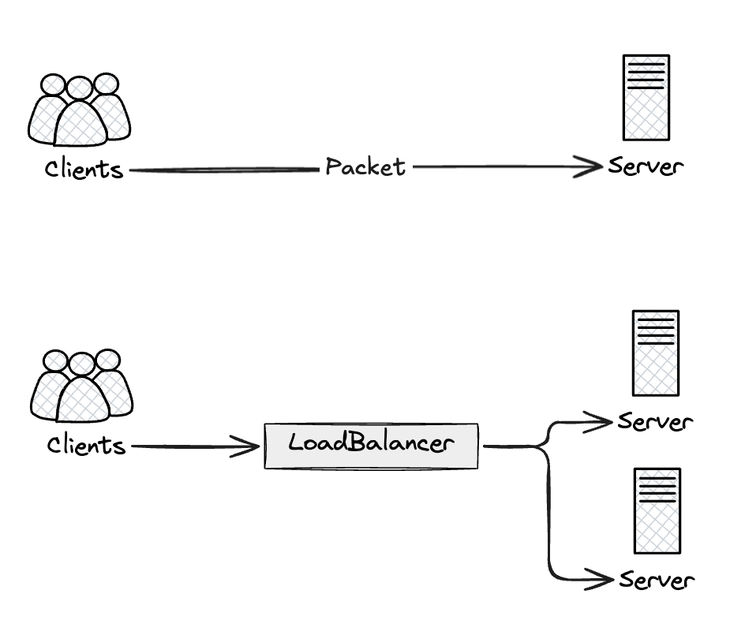
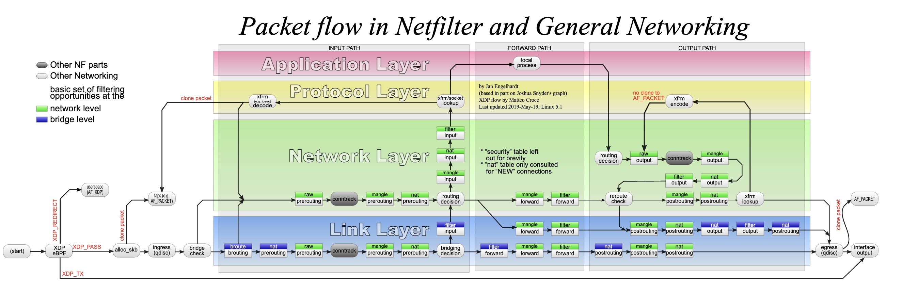
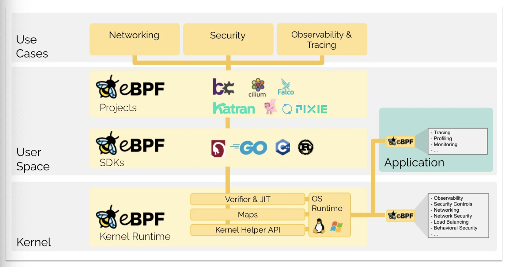
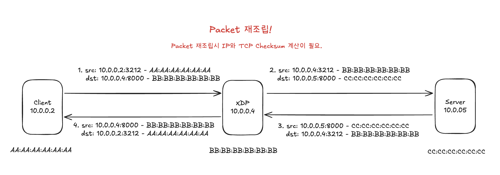
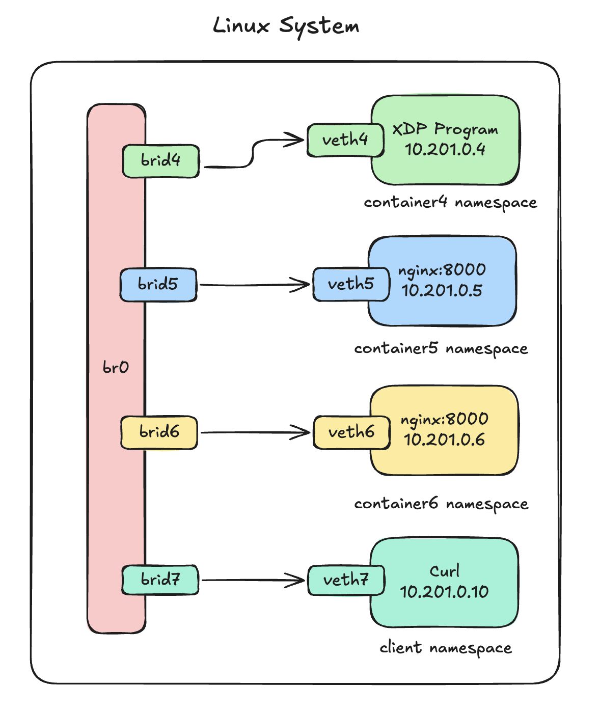
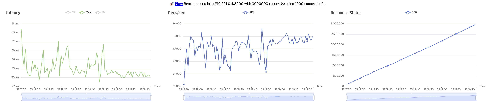
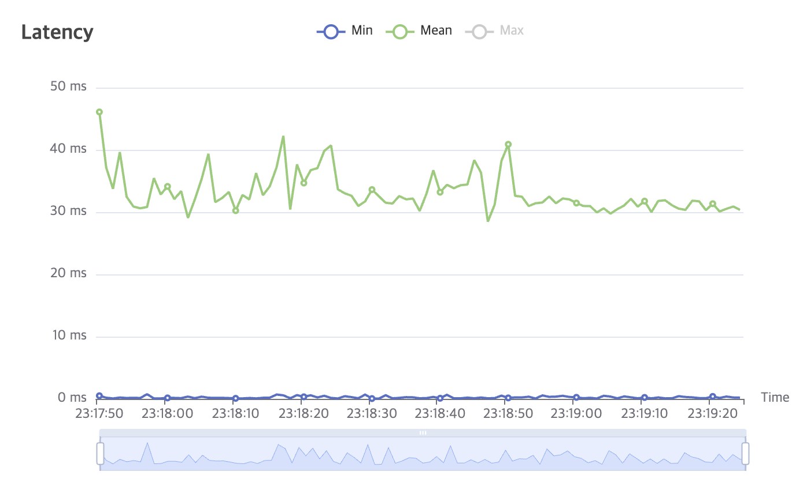
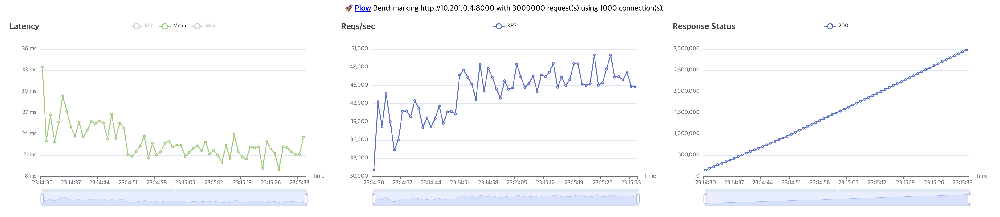
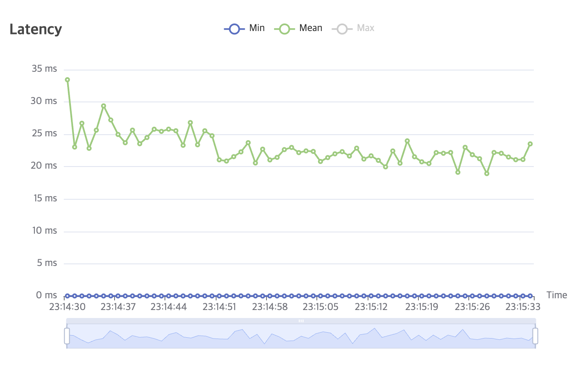

# ZERO COPY의 미학 #1 (XDP LoadBalancer)

## 소개
매우 간단한 서버를 구축한다고 했을 때 아래와 같이 생각할 수 있다. 


분산시스템 이론을 제외한채 서버의 트래픽을 분리하기 위해서는 추가적인 서버를 필요하고 클라이언트의 요청을 특정 서버로 포워딩 시키기 위해서는 앞단에 로드밸런서를 둘 수 있다. 로드밸런서를 뒀던 목적이 트래픽분리로 속도의 이점을 챙기려했지만 패킷이 이동하는 경로에 물리적인(또는 가상의) 네트워크 홉이 추가되었기에 이전 로드밸런서가 없던(베이스라인)시기보다 느리게된다.

일반적인 로드밸런서의 종류로는 유저스페이스 또는 커널스페이스에서 동작하는 구조로 나뉜다. 유저스페이스 로드밸런서의 경우 네트워크 인터페이스에서 패킷을 처리하고 커널스페이스로, 커널스페이스에서 유저스페이스로의 패킷 메모리 복사가 발생하여 속도측면에서 손실이 발생한다. 더군다나 서버가 아닌 패킷을 포워딩해야하는 로드밸런서 입장에서는 불필요한 오버헤드라고 볼 수 있다. 커널스페이스단에서 동작하는 로드밸런서의 경우 앞서 언급된 유저스페이스로의 메모리 카피등의 오버헤드는 줄일 수 있지만 `네트워크스택(TCP/IP)`을 거친다는 입장에서 그리고 핵심적인 NIC에서 수신한 패킷을 `sk_buff` 구조체를 할당하는 메모리 카피 부분이 발생한다.


[출처: https://en.wikipedia.org/wiki/Iptables]

앞서 말했듯이 이러한 부분은 포워딩하는 입장에서는 불필요한 오버헤드로 판단될 수 있다. 이번 글은 위의 문제점을 해결하는 리눅스 커널의 `네트워크 TCP/IP 스택`을 거치지 않고 `sk_buff` 구조체 할당을 진행하지 않는 `zero copy`를 할 수 있도록 도와주는 `eBPF`의 한종류인 `XDP` 그리고 `XDP LoadBalancer`에 대해서 자세히 알아보고자 한다. 마지막으로는 실제 만든 XDP 로드밸런서 프로그램이 유저스페이스에서 동작하는 로드밸런서와 비교했을 때 어느정도의 속도적 이점이 존재하는지 제시하고자 한다.

다만 이글은 리눅스 네트워크 스택이 어떤식으로 구성하는지는 다루지않는다. 다만 `eBPF/XDP`와 로드밸런서를 다루며 어떻게 패킷을 고속으로 처리하는지등을 주로 살펴본다.

## eBPF?   
`eBPF/XDP`와 관련해서 설명하기전에 `BPF`라는 것이 무엇인지 간략하게 설명하는것부터 시작한다.

[출처: https://ebpf.io/what-is-ebpf/]  
> 본 내용은 XDP를 설명하기위한 과정이므로 eBPF Virtual Machine, Verifier의 동작은 설명하지 않으며 언급만하고 넘어간다.

eBPF는 BPF(Berkeley Packet Filter)의 약자이지만 extend BPF는 패킷필터 이상의 기능(관찰가능성, 트레이싱, ,,,)을 수행하기 때문에 이제는 어떤 의미도 없는 독릭적인 용어다. eBPF 프로그램은 이벤트 기반이며 커널이나 애플리케이션이 특정 훅 지점을 통과할 때 실행된다. 후크의 종류로는 syscall, kernel or user tracing, network event, function entry/exit가 존재한다. 이러한 eBPF 프로그램은 커널스페이스에서 동작하기 때문에 엄격한 Verifier(검증기)를 통해 동작에 이상이 없음을 확인하고 JIT Compiler로부터 동작된다. 엄격한 검증기때문에 몇몇 함수 사용이 제한되기 때문에 eBPF는 특수한 형태의 커널 헬퍼 함수를 사용할 수 있다. 
> 엄격한 검사의 예로는 패킷 포인터 접근시 경계를 넘어갈 가능성이 있는지등이 존재한다.

즉, `eBPF`는 크게 `BPF MAP`, `Virtual Machine`, `Verifier` 3가지의 구성요소가 존재한다.

## XDP(eXpress Data Path)
XDP(eXpress Data Path)는 프로그래밍 가능한 패킷 처리 기술이다. 이전에 존재한 DPDK는 커널을 우회했기 때문에 보안과 안정성은 보장할 수 없었다. XDP 프로그램은 앞서 말한것과 같이 eBPF 프로그램은 검증기와 JIT을 통해 커널공간에서 안전하게 실행된다. 또한, XDP는 리눅스 커널의 일부분으로 구현되어 있어 리눅스 네트워크 스택과 완전히 통합된다. 그렇기에 프로그래머는 커널과 사용자 공간사이의 컨텍스트 전환없이 장치 드라이버(NIC)에서 직접 코드 실행이 가능하기에 하드웨어에서 패킷 수신 직후 해당 패킷의 처리를 결정 또는 조작등 여러가지 구현이 가능하다.

만든 XDP 프로그램의 반환값으로 Action이라는 정수 반환값을 필요로 하며 지원가능한 값은 다음과 같다. `XDP_DROP`, `XDP_PASS`, `XDP_REDIRECT`, `XDP_TX`, `XDP_ABORTED`

- `XDP_ABORTED`: 패킷을 DROP함과 동시에 예외를 추가로 일으킨다.
- `XDP_DROP` : 패킷을 DROP한다.  
- `XDP_PASS` : 패킷을 다음 처리기로 이동을 허용한다.
- `XDP_REDIRECT` : 도착한 패킷을 다른 NIC로 전달하거나, 추가처리를 위한 다른 CPU로 전달허간, 사용자 공간으로 전달한다.
- `XDP_TX` : 패킷을 수신했던 NIC로 다시 주입한다. 
> XDP_REDIRECT의 경우 나머지 3개의 Action과 달리 bpf helper 함수를 필요로한다.

XDP가 무엇인지는 대략적으로 감을 잡았더라도 어디서 어떻게 동작하는지 와닫지 않았을것이다. 실제로 XDP Program이 어떠한 과정으로 실행되는지 짧게 살펴본다. 사용되는 시스템은 실제 호스트가 아닌 `가상머신(virtio)`과 `가상이더넷(veth)`을 기반으로 진행예정이므로 리눅스 커널의 `veth`를 중심으로 살펴본다. 그리고 실제 XDP프로그램이 veth에 attach 예정인데 veth에 XDP 프로그램이 붙었는가에 따라 동작이 상이해진다. 이러한 부분 또한 집중적으로 살펴보겠다. 그리고 XDP는 `Native`와 `Generic` 모드가 존재하는데 `Generic` 모드는 간단하게 살펴보고 실제 구현과 동작은 Native 모드를 기준으로 진행한다.

### XDP INSTALL & ATTACH
> 본 소스코드는 Linux Kernel의 v6.11과 v6.17을 기준으로 합니다.
```C
/* drivers/net/veth.c */
static const struct net_device_ops veth_netdev_ops = {
    .ndo_init           = veth_dev_init,
    .ndo_start_xmit     = veth_xmit,
    .ndo_bpf		    = veth_xdp,
    .ndo_xdp_xmit		= veth_ndo_xdp_xmit,
    .ndo_get_peer_dev	= veth_peer_dev,
};

/* drivers/net/virtio_net.c */
static const struct net_device_ops virtnet_netdev = {
    .ndo_open            = virtnet_open,
    .ndo_stop   	     = virtnet_close,
    .ndo_start_xmit      = start_xmit,
    .ndo_bpf		     = virtnet_xdp,
};

/* net/core/dev.c */
static int dev_xdp_attach(struct net_device *dev, struct netlink_ext_ack *extack,
              struct bpf_xdp_link *link, struct bpf_prog *new_prog,
              struct bpf_prog *old_prog, u32 flags)
{
    enum bpf_xdp_mode mode;
    [...]
    /* Generic or Native */
    mode = dev_xdp_mode(dev, flags);
    [...]
    /* get xdp installation function */
    bpf_op = dev_xdp_bpf_op(dev, mode);
    [...]
    /* install xdp hook */
    err = dev_xdp_install(dev, mode, bpf_op, extack, flags, new_prog);
}

/* net/core/dev.c */
static bpf_op_t dev_xdp_bpf_op(struct net_device *dev, enum bpf_xdp_mode mode)
{
    switch (mode) {
    case XDP_MODE_SKB:
        return generic_xdp_install;
    case XDP_MODE_DRV:
    case XDP_MODE_HW:
        return dev->netdev_ops->ndo_bpf;
    default:
        return NULL;
    }
}
```
XDP 프로그램을 설치하게되면 `dev_xdp_attach` 함수를 호출하여 xdp를 붙일 때 `dev_xdp_mode`함수를 통해 XDP 동작 모드를 Generic 또는 Native중 하나 선택한다. `dev_xdp_install`함수 내에서 `Generic`의 경우 `generic_xdp_install`함수를 호출하여 generic_xdp_needed_key 값을 세팅한다. `Generic`의 경우 해당 값이 세팅되면 `__netif_receive_skb_core` -> `do_xdp_generic` 함수를 호출하여 XDP 프로그램을 실행한다. 함수에서 볼 수 있듯이 `sk_buff` 할당 이후에 실행되기에 일반적으로 알려진 `sk_buff`할당 이전에 실행되는 `Native` 모드와 차이가 있으며 성능 또한 떨어진다. 다만 모든 드라이버에 지원이 가능하며 테스트환경으로 진행은 가능하다.  

그 외의 경우 `ndo_bpf`에 연결된 함수 포인터를 호출하게 된다. `virtio_net`의 경우 `virtnet_xdp`, `veth`의 경우 `veth_xdp` 함수 이다. 실제 로드밸런서 구현에서 XDP 프로그램이 실행되는 곳은 `veth`이므로 해당 구간을 살펴본다. [`NAPI`](https://docs.kernel.org/networking/napi.html)의 경우 해당 링크를 참고하기를 바란다.

```C
/* drivers/net/veth.c */
static int veth_enable_xdp_range(struct net_device *dev, int start, int end,
                 bool napi_already_on)
{
[...]
    if (!napi_already_on)
        netif_napi_add(dev, &rq->xdp_napi, veth_poll);
[...]
    return err;
}
```
`veth_xdp`함수를 시작으로 타고 들어가면 `veth_enable_xdp_range`라는 함수를 확인할 수 있다. 해당 구간을 통해 napi의 poll함수 포인터에 `veth_poll`함수를 등록한다. NAPI를 활성화하고 polling함수로 `veth_poll`을 사용함을 의미한다. `NAPI`에대한 글이아닌 XDP 설치 및 실행에 관한것이기에 자세한것은 넘어간다. `bpftrace`를 사용해서 설명한 구간까지 실행되는지를 확인할 수 있다.

```bash
$ sudo bpftrace -e 'kprobe:veth_enable_xdp_range { print(kstack); }'
Attaching 1 probe...

veth_enable_xdp_range+0
veth_xdp_set+312
veth_xdp+40
dev_xdp_install+116
dev_xdp_attach+512
bpf_xdp_link_attach+512
link_create+548
__sys_bpf+788
```
`kprobe`를 사용해서 `veth_enable_xdp_range` 함수가 호출되는 시점에 kernel stack을 출력하는 `print(kstack)`를 실행한다. 이또한 `eBPF`를 사용해서 커널코드를 트레이싱하는 도구로 여기서도 `eBPF`의 편리함과 강력함을 알 수 있다.

여기까지가 XDP프로그램을 attach했을 때의 로직이다. `NAPI`관련해서는 보여야할 내용이 매우 많기 때문에 기회가 된다면 다른 챕터를 통해서 소개하고 싶다.

#### 번외) veth가 Native XDP를 지원하나요?
2018년 커널 패치중 veth에 generic이 아닌 native XDP를 지원하는 패치가 등장했다. 관련된 내용은 아래 패치를 참고하기를 바란다.  [Merge branch 'bpf-veth-xdp-support'](https://git.kernel.org/pub/scm/linux/kernel/git/torvalds/linux.git/commit/?id=60afdf066a35317efd5d1d7ae7c7f4ef2b32601f)


### XDP EXECUTION
로드밸런서를 구현한다고 하면 `XDP_PASS`가 아닌 `XDP_TX`를 Action값으로 반환하고 패킷을 실제 서버로 전송해야한다. 설치된 XDP 프로그램이 실행되는 구간과 `XDP_TX`를 반환했을 때의 동작 구조를 살펴볼 필요가 있다. 패킷처리 과정에서 XDP Program을 실행시키는데 공통적으로 `bpf_prog_run_xdp`함수를 호출하면서 동작한다. `veth`를 기준으로 해당 함수가 실행되기까지를 조금 설명하자면 다음과 같다. 그리고 실제 동작을 확인하기 위해 아래와 같이 was라는 `network namespace`를 만들고 `veth`를 배정한다.

```bash
# was라는 network namespace를 만든다.
$ sudo ip netns add was

# veth0, veth1쌍을 생성한다. 
$ sudo ip link add veth0 type veth peer name veth1

# veth1를 was network namespace에 배정한다.
$ sudo ip link set veth1 netns was
# 배정 확인
$ sudo ip netns exec was ip link

# veth0에 10.10.0.2 IP 주소를 부여한다. veth1에도 10.10.0.3을 부여한다.
$ sudo ip a add 10.10.0.2/24 dev veth0
$ sudo ip netns exec was ip a add 10.10.0.3/24 dev veth1

# veth0, veth1 up으로 변경한다.
$ sudo ip link set dev veth0 up
$ sudo ip netns exec was ip link set dev veth1 up

# 삭제
$ ip netns del was
```

```bash
### 1
$ sudo ip link
13: veth0@if12       UP             0a:31:b3:03:2a:a9 <BROADCAST,MULTICAST,UP,LOWER_UP>

### 2
$ sudo ip netns exec was ip link
lo               UNKNOWN        00:00:00:00:00:00 <LOOPBACK,UP,LOWER_UP>
12: veth1@if13       UP             fe:2d:16:44:5c:c4 <BROADCAST,MULTICAST,UP,LOWER_UP>
```

`ifindex`값이 각 각 `13`, `12`가 출력된다. 이상태에서 `was` 네임스페이스에서 웹서버를 실행한다. 
```bash
$ sudo ip netns exec was python3 -m http.server

Serving HTTP on 0.0.0.0 port 8000 (http://0.0.0.0:8000/) ...
```
그리고 다른 한쪽은 `bpftrace`를 사용해서 트레이싱을 진행한다.

```bash
sudo bpftrace -e 'kfunc:dev_hard_start_xmit
{
  if(args->dev->ifindex==2 || args->dev->ifindex==1) {
    return;
  }
  printf("ifindex=%d\n", args->dev->ifindex);
  print(kstack);
}'

Attaching 1 probe...

ifindex=13
dev_hard_start_xmit+8
[...]
__tcp_transmit_skb+1156
tcp_connect+1168
tcp_v4_connect+964
```
패킷을 전송하게 되면 커널 스택에서 볼 수 있는것처럼 기본적으로 상위 레이어부터 `dev_hard_start_xmit` -> `xmit_one` -> `netdev_start_xmit` -> `__netdev_start_xmit` -> `ndo_start_xmit` 로직을 수행한다. `ndo_start_xmit`함수포인터는 위에서 설명했듯이 `veth_xmit`과 연결된다. 

```C
/* drivers/net/veth.c */
static netdev_tx_t veth_xmit(struct sk_buff *skb, struct net_device *dev)
{
    [...]
    ret = veth_forward_skb(rcv, skb, rq, use_napi); // if xdp attached, use_napi=true
    [...]
}

static int veth_forward_skb(struct net_device *dev, struct sk_buff *skb,
                struct veth_rq *rq, bool xdp)
{
    return __dev_forward_skb(dev, skb) ?: xdp ?
        veth_xdp_rx(rq, skb) :
        __netif_rx(skb);
}
```
`veth_xmit`과 연결된 `veth_forward_skb`에서 xdp가 true라면 `veth_xdp_rx`함수를 호춯한다. 해당 함수는 ptr ring buffer queue에 데이터를 주입한다.
> __dev_forward_skb 함수는 상대 peer로 패킷 주입이 가능한지 다른 네트워크 네임스페이스로 넘어가는 패킷의 경우 관련 정보를 scrub 해야할지등을 결정한다. 
> __dev_forward_skb가 아닌 dev_forward_skb는 내부적으로 __dev_forward_skb 후 netif_rx_internal를 호출한다. 

```C
/* drivers/net/veth.c */
static int veth_xdp_rx(struct veth_rq *rq, struct sk_buff *skb)
{
    if (unlikely(ptr_ring_produce(&rq->xdp_ring, skb)))
        return NETDEV_TX_BUSY; /* signal qdisc layer */

    return NET_RX_SUCCESS; /* same as NETDEV_TX_OK */
}
```
주입은 `ptr_ring_produce`함수를 통해 진행된다. 생산자를 통해 삽입된 데이터는 NAPI Polling을 통해서 호출되는 `veth_poll` 함수를 통해 소비된다.

```C
/* drivers/net/veth.c */
static int veth_poll(struct napi_struct *napi, int budget)
{
[...]
    done = veth_xdp_rcv(rq, budget, &bq, &stats);
[...]
}

static int veth_xdp_rcv(struct veth_rq *rq, int budget,
            struct veth_xdp_tx_bq *bq,
            struct veth_stats *stats)
{
    for (i = 0; i < budget; i++) {
        void *ptr = __ptr_ring_consume(&rq->xdp_ring);

        if (veth_is_xdp_frame(ptr)) {
            /* ndo_xdp_xmit */
[...]
            frame = veth_xdp_rcv_one(rq, frame, bq, stats);
[...]
        } else {
            /* ndo_start_xmit */
            struct sk_buff *skb = ptr;
[...]
            skb = veth_xdp_rcv_skb(rq, skb, bq, stats);
            if (skb) {
                netif_receive_skb(skb);
            }
[...]
        }
        done++;
    }
[...]
}
```
`veth_xdp_rcv`함수에서 `__ptr_ring_consume`함수를 통해 `xdp_ring`에서 데이터를 소비한다. 소비된 데이터는 `veth_xdp_rcv_one`이나 `veth_xdp_rcv_skb`함수를 호출한다. 2개의 함수 모두 내부적으로 `bpf_prog_run_xdp` 함수를 호출하여 실제 `XDP 프로그램`을 실행한다. 해당 함수는 앞서 언급한 `Action`을 반환할 수 있고 `XDP_PASS`의 경우 `netif_receive_skb` 함수를 호출하여 네트워크 스택처리를 진행한다. `XDP_TX`를 반환하게 되면 아래 로직을 수행한다.
```C
/* drivers/net/veth.c */
static struct sk_buff *veth_xdp_rcv_skb(struct veth_rq *rq,
                    struct sk_buff *skb,
                    struct veth_xdp_tx_bq *bq,
                    struct veth_stats *stats)
{
[...]
    act = bpf_prog_run_xdp(xdp_prog, xdp);
[...]
    switch (act) {
[...]
    case XDP_TX:
        veth_xdp_tx(rq, xdp, bq);
    }
}

static int veth_poll(struct napi_struct *napi, int budget)
{
[...]
    done = veth_xdp_rcv(rq, budget, &bq, &stats);
[...]
    if (stats.xdp_tx > 0)
        veth_xdp_flush(rq, &bq);
[...]
}
```
`XDP_TX`를 반환하게 되면 `veth_xdp_tx`함수를 호출하여 처리했던 패킷을 frame으로 변환하여 queue에 넣는다. 다시 `veth_poll`로 돌아와서 `stats.xdp_tx`값이 0이상이 되기 때문에 `veth_xdp_flush`함수를 호출한다. 

```C
/* drivers/net/veth.c */
static int veth_xdp_xmit(struct net_device *dev, int n,
             struct xdp_frame **frames,
             u32 flags, bool ndo_xmit)
{
[...]
/* The napi pointer is set if NAPI is enabled, which ensures that
    * xdp_ring is initialized on receive side and the peer device is up.
    */
if (!rcu_access_pointer(rq->napi))
    goto out;

[...]
    for (i = 0; i < n; i++) {
        struct xdp_frame *frame = frames[i];
        void *ptr = veth_xdp_to_ptr(frame);

        __ptr_ring_produce(&rq->xdp_ring, ptr);
    }
[...]
}

static void veth_xdp_flush_bq(struct veth_rq *rq, struct veth_xdp_tx_bq *bq)
{
[...]
    sent = veth_xdp_xmit(rq->dev, bq->count, bq->q, 0, false);
[...]
}

static void veth_xdp_flush(struct veth_rq *rq, struct veth_xdp_tx_bq *bq)
{
[...]
    veth_xdp_flush_bq(rq, bq);
[...]
    __veth_xdp_flush(rcv_rq);
}
```
`veth_xdp_xmit`함수는 이전에 `veth_xdp_tx`함수에서 bulk queue에 넣었던 frame을 `__ptr_ring_produce`를 통해 `xdp_ring`에 주입한다. 해당 함수 구간으로 통해 처음 말했던 `XDP_TX`가 어떻게 수신했던 `NIC`로 패킷을 되돌리는지 알 수 있다. 

```C
if (!rcu_access_pointer(rq->napi))
    goto out;
```
여기서 굉장히 중요한 코드가 존재한다. rq 수신측이라고 생각하면 되는데 수신측에서 napi가 활성화 되어있는지를 확인한다. 그렇지않으면 out으로 이동하게 되서 produce를 하지못한다. NAPI 활성화는 수신측 veth에도 XDP 프로그램을 부착하면 된다. 이때는 아무런 기능을 하지 않는 모든 패킷을 `XDP_PASS`하는 프로그램을 붙이면된다.

여기까지가 `XDP 프로그램`를 설치하고 `XDP_PASS`, `XDP_TX`일 때의 간략한 동작 과정이다. 앞서 언급한것과 같이 커널을 우회하는 여러 기술보다 `XDP`의 경우 커널내부 소스와 통합되어있기 때문에 커널의 안정성기반으로 동작할 수 있다. 다만, 드라이버마다 `Native`모드 지원은 상이하기 때문에 지원되지 않는 드라이버는 `Generic`을 사용하게 된다. 

`NAPI`, `네트어크스택`등 실제 네트워크 구조의 설명은 많은 부분이 생략됐으며 그 과정에서 예상치 못한 잘못된 내용이 존재할 수 있지만 대략적인 구조로 생각했으면 한다.

### 로드밸런서
지금까지 XDP에 대해서 간략하게 알아보았다. 다음은 이 글의 목적인 XDP 로드밸런서를 구현하고 이를 테스트하는 시간을 가진다. XDP로드밸런서를 구현하기 위해서는 2가지의 아래 방식과 `DSR`방식이 존재하는데 이는 다음 기회에 살펴본다. 현재 진행하는 방식은 가장 구현난이도가 낮은 방식이나 성능적인 측면에서 다음에 나올 `DSR(Direct Server Return)` 방식보다는 좋지못하다. 


위 사진은 XDP 로드밸런서를 구현할 때 가장 베이스가 되는 모델이라고 생각한다. `XDP`는 `NIC`에서 패킷 수신 후 리눅스 네트워크 스택을 태우기전에 실행되는 구간이므로 `ethernet frame`과 `ip`, `tcp header` 및 `option` 처리가 필요하다. `XDP` 프로그램에서 트리거된 패킷을 살펴보면 목적지가 로드밸런서쪽으로 되어 있기 때문에 해당 값을 원하는 서버 목적지 정보 입력이 필요하다. 또한 패킷의 `IP Header`와 `TCP Header` 정보가 수정되었기 때문에 각 각 `Checksum` 재계산이 필요하다. 그리고 로드밸런서쪽에서 클라이언트와 서버관 커넥션을 어떻게 유지할것인가도 중요하다. 아래챕터에서 조금 자세히 살펴보도록한다.

> 위에서 언급한 구조를 기반으로 `Cilium eBPF`를 사용해서 코드 레벨에서의 설명을 하고자 한다. 다만, 설명을 위해 전체코드가 아닌 부분적으로 설명한다.

실제 내용을 진행하기전에 앞서 말했다싶이 `eBPF`는 `Verifier`라는 검증기를 가지고있다고 언급했다. 이는 `XDP` 프로그램을 개발할때도 주의해야한다. 패킷을 조작하기위해서는 패킷데이터에 직접 접근하고 수정해야하는데 그전에 반드시 패킷에 접근이 가능한지 접근 범위를 넘지않았는지의 조건검사를 기반으로 프로그래밍해야한다.

#### 0. 데이터 자료구조
로드밸런서는 클라이언트와 직접적인 커넥션을 맺는것이 아니기에 서버로 포워딩시 서로 다른 클라이언트가 동일한 소스포트를 달고왔을 때 포트충돌하여 `TCP Sequence`가 꼬일 수 있는 상황이 발생할 수 있다. 그렇기에 로드밸런서측은 고유한 하나의 포트만 사용해서 포워딩해야한다.
아래와 같은 상황이다. 

```bash
# 1번 클라이언트
10.201.0.3:3282 -> 로드밸런서:3282 -> 서버1

# 2번 클라이언트
10.201.0.4:3282 -> 로드밸런서:3282 -> 서버1
```
그렇기에 로드밸런서측은 클라이언트의 소스포트가 아닌 비워져있는 포트를 사용해야한다. 
```C
struct session{
    __u32 client_ip;
    __u16 client_port;
    __u32 server_ip; 
    __u16 server_port;
    __u8 reserve;
    __u8 used; 
    __u16 lb_port;

    __u8 client_mac[ETH_ALEN];
    __u8 server_mac[ETH_ALEN];

    __u8 client_state;
    __u8 server_state;
};

struct {
    __uint(type, BPF_MAP_TYPE_HASH); 
    __uint(max_entries, MAX_SESSION);
    __type(key, __u32);
    __type(value, struct session);
} session_map SEC(".maps");
```
위 구조체를 Value로두고 Key는 클라이언트의 출발지주소와 소스포트값을 이용해서 해시를 만들고 해시를 최대 키 갯수로 모듈러연산을 한다. 
결과값을 실제 로드밸런서가 사용할 포트범위를 더하여 나온 값을 키로하되 실제 대상서버로 전달되는 로드밸런서의 소스포트로 활용한다.

로드밸런서거 포워딩할 서버 목록들은 아래 자료구조로 되어있으며 이는 유저스페이스에서 등록을 진행한다.
```C
struct server_config {
    __u32 ip;
    __u16 port;
    __u8 mac[ETH_ALEN];
};

struct {
    __uint(type, BPF_MAP_TYPE_ARRAY);
    __uint(max_entries, SERVER_NUM);
    __type(key, __u32);
    __type(value, struct server_config);
} servers SEC(".maps");
```

#### 1. 클라이언트 -> 로드밸런서 -> 서버
```bash
sudo ip netns exe client1 curl 10.201.0.4:8000
```
클라이언트가 서버에 접속하고자하면 가장먼저 로드밸런서 주소에 접근한다. TCP라면 `TCP 3 Way Handshake`를 진행할것이다. 로드밸런서쪽은 클라이언트와 3WH를 즉, 커넥션을 맺는것이 목적이 아닌 패킷을 `Forward`하는것이 목적이다. 그렇기에 3WH를 대상 서버와 할 수 있도록 도와줘야한다. 

클라이언트가 첫 TCP 커넥션 요청을하게 되면 `SYN`패킷을 전송하게 된다. 로드밸런서측에서는 파싱한 TCP Header에서 `SYN` 플래그가 활성화되어있다면 첫 커넥션으로보고 해시테이블에 등록한다. 
```C
__u32 hash = get_two_hash(iph->saddr, tcph->source);
/* port_num == 로드밸런서 포트 */
__u32 port_num = (hash % MAX_SESSION) + 20000;
/* server_key는 실제 서버 갯수를 모듈러연산해서 결정하도록 한다. */
__u32 server_key = hash % SERVER_NUM;  

if(tcph->syn) {
    [...]
    struct session ss = {
            .client_ip = iph->saddr,
            .client_port = tcph->source,
            .server_ip = server->ip, 
            .server_port = server->port,
            .lb_port = port_num,
            .used = 1,
            .client_state = ESTABLISHED,
            .server_state = ESTABLISHED,
    };

    bpf_map_update_elem(&session_map, &port_num, &ss, BPF_NOEXIST);
}
```
session 구조체를 만들고 로드밸런서입장에서 커넥션을 관리할 수 있게 됐다. 이제 실제 클라이언트의 목적지(Mac, IP, Port) 정보를 서버로 변경한다. 그리고 출발지 정보(Mac, IP, Port)또한 로드밸런서에서 온 것처럼 변경한다. 
```C
__builtin_memcpy(eth->h_dest, ss->server_mac, ETH_ALEN);
__builtin_memcpy(eth->h_source, load_balancer_mac, ETH_ALEN);

tcph->source = ss->lb_port;
iph->saddr = load_balancer_ip;
iph->daddr = ss->server_ip;

return XDP_TX;
```
`IP Header`와 `TCP Header`가 변경되었기 때문에 `Checksum`또한 변경해줘야한다. 체크섬 계산은 BPF내 Helper함수를 사용하거나 직접 `Word`단위로 반복문을 통해 계산하여도된다. 다만, TCP 패킷의 길이가 짝수가 아닌 홀수로 왔을 때 나머지 한바이트또한 계산해줘야 한다. 그리고 마무리로 `XDP_TX` Action값을 반환하여 도착했던 NIC로 프레임을 재주입한다. 주입된 프레임은 설정된 `맥주소`와 `IP`, `Port`를 기반으로 서버측으로 전송된다.

#### 2. 서버 -> 로드밸런서 -> 클라이언트
서버측으로 전달된 패킷은 서버측 네트워크스택에서 처리되고 응답값을 출발지(로드밸런서)에게 전송한다. 로드밸런서가 패킷을 수신하게 되면 `TCP Header`의 목적지 포트로 이전에 등록한 `session_map`에서 검색하여 클라이언트 정보를 찾는다.
```C
__u32 port_num = tcph->dest;
struct session *ss = bpf_map_lookup_elem(&session_map, &port_num);
```
session 구조체에는 클라이언트의 맥주소와 IP, 실제 소스포트가 저장되어있다. 이를 기반으로 아래와 같이 변경하고 체크섬또한 재계산한다.
```C
__builtin_memcpy(eth->h_dest, ss->client_mac, ETH_ALEN);
__builtin_memcpy(eth->h_source, load_balancer_mac, ETH_ALEN);

iph->saddr = load_balancer_ip;
iph->daddr = ss->client_ip;
tcph->dest = ss->client_port;

// 체크섬 계산
iph->check = iph_csum(iph);
tcph->check = tcph_csum(tcph, iph, data_end);
```
조작된 패킷은 클라이언트가 보낸때와 같이 `XDP_TX`값을 반환하여 도착했던 NIC에 프레임을 재주입한다. 주입된 패킷은 클라이언트에게 전송된다.

만약 서버측에서 `RST` 또는 `FIN` 플래그를 전송하게 되면 `session_map`에서 커넥션을 종료를 의미하며 session맵에서 삭제를 진행한다.
```C
if(tcph->rst) goto delete;

switch(ss->server_state) {
    case ESTABLISHED:
        if(tcph->fin) {
            ss->server_state = FIN;
            goto update;
        }
        break;
    case FIN:
        if(tcph->ack){
            if(is_closed(ss)) goto delete;
        }
        break;
}

bpf_map_delete_elem(&session_map, &port_num);
```
`RST`의 경우 맵에서 바로 삭제를 진행한다. 다만 `FIN`플래그의경우 TCP 연결 종료를 고려해서 클라이언트, 서버 모두 한번씩 FIN을 전송하고나서 ack를 수신하게 되면 그때 삭제를 진행한다.

### 테스트
> 실제 테스트를 원하시면 [링크](./src/RUN.md)를 클릭해주세요.

간략한 설명이지만 첨부된 소스코드를보면 확실히 이해할 수 있다고 생각한다. 다음은 설명한 로직을 테스트하고 L7에서 진행되는 로드밸런서와 비교해서 어떠한 성능적 이점을 가지는지 확인한다. 네트워크구조는 하나의 리눅스 시스템에서 진행하나 좀 더 구성도 있게 아래와 같이 구성한다. 


`container5`와 `container6` network namespace에서 python3 서버를 실행한다.
```bash
# container5에서 8000번 포트의 웹서버 실행
sudo ip netns exec container5 python3 -m http.server -port 8000

# container6에서 8000번 포트의 웹서버 실행
sudo ip netns exec container6 python3 -m http.server -port 8000
```

`XDP_TX`부분에서 설명했듯이 XDP프로그램을 부착하는 veth의 pair에도 똑같이 붙여야한다. 코드는 아래와 같이 작성하고 바로 부착한다.
```C
SEC("xdp")
int xdp_main(struct xdp_md *ctx) {
    return XDP_PASS;
}
```

```bash
go generate && go build
sudo ./main brid4
```

그리고 실제 `container4` 네트워크 네임스페이스에 `veth4` network interface에 로드밸런싱하는 XDP 프로그램을 빌드 후 부착한다.
```bash
go generate && go build
sudo ip netns exec container4 ./main veth4
```
마지막으로 클라이언트를 실행한다. 
```bash
$ sudo ip netns exec client1 curl 10.201.0.4:8000 --http0.9

ort 200 OK
Server: SimpleHTTP/0.6 Python/3.12.7
Date: Thu, 23 Oct 2025 13:58:20 GMT
Content-type: text/html; charset=utf-8
Content-Length: 296
```
로드밸런서측에 보낸 HTTP요청을 서버가 수신하여 응답까지 주는것을 확인할 수 있다.

### 퍼포먼스 
테스트의 동작을 확인했으니 이제는 실제 성능을 비교할 차례다. 도구는 `plow`를 사용할 예정이며 클라이언트 동시 커넥션은 `1000`개로 `3,000,000`의 요청을 전송한다. 진행한다.

#### L7 로드밸런서
```bash
$➜  res git:(main) ✗$ plow http://10.201.0.4:8000 -c 1000 -n 3000000

Benchmarking http://10.201.0.4:8000 with 3000000 request(s) using 1000 connection(s).
@ Real-time charts is listening on http://[::]:18888

Summary:
  Elapsed    1m38.6s
  Count      3000000
    2xx      3000000
  RPS      30411.969
  Reads    3.683MB/s
  Writes   1.711MB/s

Statistics    Min       Mean     StdDev      Max
  Latency     47µs    32.855ms  20.178ms  382.346ms
  RPS       21544.58  30386.58  2643.93    35020.4

Latency Percentile:
  P50         P75       P90      P95        P99       P99.9     P99.99
  28.619ms  41.754ms  58.49ms  70.305ms  100.662ms  164.437ms  236.133ms

Latency Histogram:
  26.68ms    2211710  73.72%
  43.774ms    584540  19.48%
  60.852ms    148814   4.96%
  84.003ms     46320   1.54%
  115.454ms     8068   0.27%
  162.475ms      526   0.02%
  240.6ms         18   0.00%
  328.557ms        4   0.00%
```



#### XDP 로드밸런서
```bash
$ plow http://10.201.0.4:8000 -c 1000 -n 3000000

Benchmarking http://10.201.0.4:8000 with 3000000 request(s) using 1000 connection(s).
@ Real-time charts is listening on http://[::]:18888

Summary:
  Elapsed     1m9.1s
  Count      3000000
    2xx      2999987
  RPS      43379.730
  Reads    5.254MB/s
  Writes   2.441MB/s

Error:
  1   "error when dialing 10.201.0.4:8000: dial tcp4 10.201.0.4:8000: i/o timeout"
  12  "error when dialing 10.201.0.4:8000: dialing to the given TCP address timed out"

Statistics    Min       Mean     StdDev      Max
  Latency     22µs    22.963ms  31.613ms  3.015986s
  RPS       29927.25  43474.86  4390.53   50045.02

Latency Percentile:
  P50         P75       P90       P95       P99      P99.9     P99.99
  16.156ms  27.958ms  43.692ms  57.077ms  220.04ms  381.83ms  498.702ms

Latency Histogram:
  20.278ms   2821146  94.04%
  51.853ms    160750   5.36%
  155.788ms    15636   0.52%
  349.203ms     2301   0.08%
  521.505ms      105   0.00%
  656.587ms        7   0.00%
  843.695ms       14   0.00%
  853.541ms       41   0.00%
```



### 결과
`1000`명의 클라이언트가 총합 `3,000,000`번의 요청을 진행하는데 RPS기준 `42.65%` 향상된것을 확인할 수 있다. 다만 코드가 상용에서 사용하기에는 적합하지 않은점과, 유저스페이스 로드밸런서또한 커넥션 하나당 고루틴 하나 생성 진행방식으로 비교에는 무리가 있을 수 있겠지만 정확히 몇 퍼센트의 수치 향상보단 제로카피가 무엇인지 어떻게 동작하는지 네트워크스택을 안탔을 때 어떠한 성능적 이점이 있는지를 보여주고자 진행했다. 

## 요약
일반적인 로드밸런서나 쿠버네티스의 `iptables`, `ipvs`등 모두 공통점으로 네트워크스택을 거치며 패킷 메모리 카피의 순간이 생긴다는 것이다. XDP 프로그램은 NIC에서 오프로딩하여 실행되기에 메모리카피가 덜 생기며 네트워크스택을 거치지 않기 때문에 일반적으로 빠르다고 볼 수 있다. 다만 단일 시스템에서 network namespace만 나눈 상태에서 진행된 테스트이기에 CPU 사용량까지 확인이 어려웠던점은 아쉽다고 생각한다. XDP(eBPF)는 지금도 발전되고 있고 커널코드에 많은 기여가 발생하고 있는것은 분명하기에 추후 사용되는 사레가 많아질것이라고 생각한다.

### 참고문헌
- https://www.cs.cornell.edu/~ragarwal/pubs/network-stack.pdf
- https://d2.naver.com/helloworld/47667
- The eXpress data path: fast programmable packet processing in the operating system kernel
- https://guanjunjian.github.io/2018/01/05/study-18-dev_forward_skb-source-analysis/
- https://blog.csdn.net/qq_45090200/article/details/147226000
- https://lpc.events/event/7/contributions/676/attachments/512/1000/paper.pdf